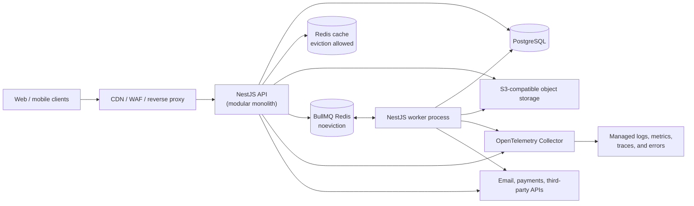
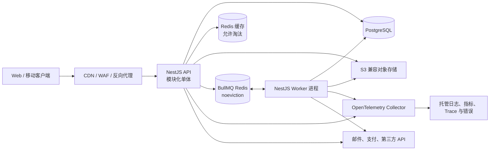

# A Production-Minded NestJS Backend Scaffold

This document is a blueprint for a backend you can grow with for years. Its aim is not to introduce every backend technology at once; it is to give you a sensible path from a well-built modular monolith to a service-oriented system when that is actually justified.

The central idea: start with one codebase and one versioned artifact containing two independently deployed process types—API and Worker—with clear module boundaries, strong automation, and observable operations. A “microservice architecture” is not the goal. The goal is software that stays understandable while it gains users, features, integrations, and teammates.

## What this scaffold should provide

- A TypeScript-first NestJS API, with clear HTTP, asynchronous-job, and domain boundaries.
- Authentication, authorization, tenant isolation, rate limits, audit trails, and secret management.
- PostgreSQL-backed transactional data, migrations, Redis-backed cache/queues, and object storage.
- Structured logs, metrics, tracing, error reporting, health checks, dashboards, and alerts.
- Repeatable local development, test environments, CI/CD, containers, and infrastructure-as-code.
- A route for background work and events without prematurely splitting into microservices.
- Documentation and operational playbooks that make the project workable by one person.

## Architecture at a glance



Run the API and Worker from the same codebase and immutable image, but as different deployments with separate entry points and scaling. The API should finish requests quickly. A dependency call may remain synchronous only when the response cannot be completed without its result—for example, an authorization or payment confirmation. Email, outbound webhooks, file processing, exports, scheduled work, and other non-immediate side effects go through the queue and Worker.

## Recommended technology choices

| Concern             | Start with                                                                               | Why                                                                                                                            |
| ------------------- | ---------------------------------------------------------------------------------------- | ------------------------------------------------------------------------------------------------------------------------------ |
| Runtime / framework | Node.js LTS, TypeScript, NestJS                                                          | Familiar language with strong conventions and dependency injection.                                                            |
| HTTP API            | REST + OpenAPI/Swagger                                                                   | Easy to debug, cache, document, and consume from a frontend. Add GraphQL only for a real client-data need.                     |
| Validation          | `class-validator` + `class-transformer`, or Zod at boundaries                            | Reject malformed input before it reaches business logic.                                                                       |
| Database            | PostgreSQL                                                                               | Durable relational data, transactions, JSONB, full-text search, and excellent ecosystem.                                       |
| ORM                 | Prisma for the shortest learning curve; Drizzle/Kysely later if SQL control is important | Prisma migrations and types are particularly approachable for frontend engineers.                                              |
| Cache               | Redis with bounded TTLs and an eviction policy                                           | Disposable acceleration, rate-limit support, and carefully scoped locks.                                                       |
| Job queue           | BullMQ on a dedicated Redis deployment configured with `noeviction`                      | Delayed, retried, observable, and horizontally processed jobs without cache eviction endangering queue data.                   |
| Files               | S3/R2/MinIO                                                                              | Keep blobs out of Postgres; use pre-signed upload/download URLs.                                                               |
| Auth                | Verified local credentials plus OIDC/OAuth providers through a NestJS BFF session        | Supports email, phone, and external sign-in while keeping credentials and provider tokens behind a controlled server boundary. |
| Logging             | Pino                                                                                     | Fast structured JSON logs, suitable for production aggregation.                                                                |
| Telemetry           | OpenTelemetry SDK/Collector + one managed observability backend                          | A complete pipeline for structured logs, metrics, and traces without self-hosting several stateful tools.                      |
| Errors              | Sentry, or the chosen observability backend's error product                              | Stack traces, release tracking, and alerting; avoid paying for two overlapping tracing systems.                                |
| Tests               | Jest/Vitest, Supertest, Testcontainers                                                   | Unit tests for rules; integration tests against real ephemeral dependencies.                                                   |
| Containers          | Docker, Docker Compose                                                                   | Reproducible local services and deployment artifacts.                                                                          |
| CI                  | GitHub Actions                                                                           | Lint, typecheck, tests, image build, migration checks, and deploy gates.                                                       |
| Infrastructure      | Terraform or Pulumi                                                                      | Versioned, reviewable cloud resources.                                                                                         |

Keep the first stack intentionally boring. PostgreSQL + Redis + S3 covers a remarkable amount of product work.

## Reference product and non-functional requirements

A scaffold becomes useful when it is tested against a concrete imagined product. Use a multi-tenant B2B SaaS—for example, a project/work-management service with organizations, members, projects, files, notifications, exports, and third-party webhooks—as the reference product. It exercises the concerns that toy CRUD apps do not: authorization, tenant isolation, background work, files, auditability, and external failures.

Before implementation, write the following values down. They are product decisions, not infrastructure details:

| Decision          | First practical target                                                                  | Why it matters                                                                |
| ----------------- | --------------------------------------------------------------------------------------- | ----------------------------------------------------------------------------- |
| Users and traffic | Hundreds to low thousands of active users; start with one region                        | Prevents inventing global-distributed complexity before it is needed.         |
| Availability      | 99.9% monthly for the API                                                               | Defines whether an outage is acceptable and how much redundancy is warranted. |
| Latency           | p95 reads under 300 ms; p95 writes under 700 ms, excluding explicitly asynchronous work | Gives performance work a measurable purpose.                                  |
| RTO               | Recover the service within 4 hours                                                      | Drives incident playbooks and restore exercises.                              |
| RPO               | Lose no more than 15 minutes of committed data                                          | Drives backup frequency and point-in-time recovery choices.                   |
| Data              | Classify public, internal, personal, and sensitive data                                 | Governs access, log redaction, retention, and deletion.                       |
| Budget            | Prefer managed services while they fit a small, explicit monthly budget                 | Keeps solo-operation cost and toil visible.                                   |

Revise these targets from actual usage data. Do not add multi-region deployments, read replicas, Kubernetes, Kafka, or a service mesh merely because they sound mature.

## Default implementation baseline

The earlier table lists alternatives for context. The scaffold should nevertheless have one default path so that implementation does not become a chain of fresh decisions:

```text
Node.js LTS + TypeScript + pnpm
NestJS + REST + OpenAPI
class-validator/class-transformer for HTTP DTOs; Zod for environment configuration
PostgreSQL + Prisma
Redis cache + dedicated noeviction Redis for BullMQ
S3-compatible object storage (MinIO locally)
Pino + OpenTelemetry SDK/Collector + one managed telemetry backend
Jest + Supertest + Testcontainers
Docker Compose + GitHub Actions + Terraform
Verified local credentials and OIDC/OAuth providers through a NestJS BFF with PostgreSQL-backed sessions
Managed container, PostgreSQL, Redis, and object storage in production
```

The exact identity provider and cloud may vary by region, cost, and product requirements; choose one before Milestone 2 and capture the choice in an Architecture Decision Record (ADR). Every ADR should record context, decision, alternatives, consequences, and the condition that would cause reconsideration.

## Codebase shape

Use a modular monolith. Modules own their use cases and persistence interfaces; other modules communicate through exported application services or typed domain events, not by reaching into each other’s repositories.

```text
apps/
  api/                        # HTTP bootstrap and API-specific composition
  worker/                     # job-worker bootstrap and worker composition
  cli/                        # safe, audited operational commands
libs/
  platform/                   # config, auth, errors, logging, database, telemetry
  modules/
    identity/
      api/                    # controllers, DTOs, response mappers
      application/            # use cases / commands / queries
      domain/                 # entities, policies, events, repository ports
      infrastructure/         # Prisma repositories, provider adapters
    organizations/
    projects/
    notifications/
  contracts/                  # versioned API/event schemas shared internally
prisma/
  schema.prisma
  migrations/
test/
  integration/
  e2e/
docs/
infra/
docker-compose.yml
```

This can be a pnpm workspace without introducing Nx. Do not force every tiny CRUD feature into elaborate Domain-Driven Design. Use the layered structure where business rules matter; simple modules can remain straightforward. The non-negotiable boundary is: controllers translate HTTP, application services coordinate use cases, domain code holds rules, and infrastructure talks to external systems.

Each module must expose a deliberate public entry point. Enforce import boundaries with ESLint: a module may not import another module's `infrastructure` folder or database repository directly. Keep `platform/` small and generic; it is not a dumping ground for feature code.

## Core request path

For every endpoint, make the lifecycle consistent:

1. A global validation pipe parses and rejects invalid DTOs.
2. Authentication middleware or a guard creates an `ActorContext` containing the authenticated user, session, requested tenant scope, and request identity. The use case still verifies access to that tenant/resource.
3. A guard may reject obviously forbidden calls early, but the application use case performs the authoritative resource-level policy check. Workers and CLI commands call the same policy rather than bypassing it.
4. The controller calls one application use case—no database logic in controllers.
5. The use case opens one transaction/Unit of Work shared by all participating repositories when multiple writes must succeed together.
6. Domain events are collected during the transaction. Durable side effects are recorded in the transactional outbox; they are never sent before commit.
7. After a successful commit, non-durable in-process notifications may run. A failed transaction publishes nothing externally.
8. An exception filter maps known domain errors to stable problem responses.
9. The response includes a generated request ID; logs, traces, and error reports use that same ID. Do not blindly trust an arbitrary inbound ID.

Adopt a stable error format such as RFC 9457 Problem Details. Clients should never need to parse error-message prose to understand an error.

## API contract conventions

The API is a product surface, not an implementation detail. Publish OpenAPI from the application in CI and treat breaking changes as failures. Define the following conventions once and apply them everywhere:

- Use plural resource URLs and predictable nesting only where the parent scope is essential: `/api/organizations/{organizationId}/projects`.
- Use cursor pagination with a documented response envelope: `data`, `nextCursor`, and optional `meta`. Put filtering and sorting in named query parameters with explicit allowlists.
- Define the difference between omitted fields, `null`, and empty values. Prefer dedicated request DTOs for create and update rather than exposing database models.
- Serialize timestamps as ISO 8601 UTC strings. Use integer minor units or explicit decimal strings for money; never JavaScript floating-point values.
- Give enums stable string values. Document `PATCH` behavior, response status codes, and which mutations accept an idempotency key.
- Return machine-readable stable error codes alongside RFC 9457 fields. Never expose ORM errors or stack traces.
- Add a resource `version` field or ETag for records that can be edited concurrently; reject conflicting writes with `409 Conflict` or `412 Precondition Failed`.
- Treat an API as public when independently released clients or third parties depend on its compatibility. Put those endpoints under `/v1`; a first-party web UI released with the backend may use `/api` until that boundary exists.

Generate an API client for the frontend if it helps, but do not share server database types with clients. The API schema—not the ORM model—is the contract.

## Identity, authorization, and multi-tenancy

Authentication answers “who are you?” Authorization answers “may you do this?” Keep them distinct.

The browser model is a NestJS Backend-for-Frontend (BFF) that converts every successful authentication method into the same opaque server-side session. Standards-compliant OIDC providers use Authorization Code flow with PKCE and validate `state`, `nonce`, issuer, audience, expiration, signatures, and provider key rotation. OAuth profile providers use their documented code flow and authenticated profile endpoint. Verified email/phone credentials follow the registration and recovery state machines in `docs/USER_AUTH_MODULE.md`. Provider tokens and application session secrets never enter browser JavaScript.

Store server-side sessions in PostgreSQL initially; store a hash of the opaque cookie value rather than the raw secret. Sessions have expiration, rotation after login/privilege changes, per-device visibility, logout, administrative revocation, and “revoke all sessions.” Move sessions to a dedicated Redis only after a measured need and a durability/failover ADR. Apply CSRF protection to cookie-authenticated state changes. Mobile and machine clients use separate OAuth flows and audiences. If the product deliberately chooses SPA bearer tokens instead, record a replacement ADR covering token storage, short access-token lifetime, refresh-token rotation/reuse detection, logout, and XSS defenses.

For a B2B app, model tenancy explicitly:

```text
organizations
memberships (organization_id, user_id, role)
projects (organization_id, ...)
```

Every tenant-owned query and job receives an organization scope. Never accept an organization ID from the client or job payload and trust it without verifying membership or a system-actor grant. Start with role-based access control (owner/admin/member/viewer), then add policy checks for resource ownership or state when roles are insufficient. Pass the same `ActorContext` and policies through HTTP, Worker, and CLI entry points. Record security-sensitive actions—role changes, exports, login/security events, destructive actions—in an append-only audit log.

Security baseline:

- Local authentication supports verified email or E.164 phone identifiers plus Argon2id-hashed passwords, alongside OIDC identities. See `docs/USER_AUTH_MODULE.md` and ADR 0003 for the account model, recovery, linking, and MFA boundaries.
- Apply HTTPS, CORS allowlists, secure headers, body-size limits, and rate limits.
- Use idempotency keys for retryable write endpoints such as payments or provisioning.
- Verify webhook signatures and use idempotent webhook event records.
- Scan dependencies, lock versions, rotate secrets, and use a secret manager in deployed environments.
- Add authorization tests specifically for cross-tenant access attempts.

Also maintain a lightweight threat model for each sensitive feature: assets, actors, trust boundaries, plausible abuse, and mitigations. Cover SSRF, injection, path traversal, object-level authorization failures, account recovery abuse, and privilege escalation. Service-to-service calls should use machine identities and least-privilege permissions—not an end-user token copied into configuration.

Audit logs are not normal application logs: define their actor, action, target, tenant, timestamp, request ID, retention period, access controls, and tamper-evidence strategy. Give administrators a carefully authorized way to search them.

## Data design and database discipline

PostgreSQL is the source of truth. Cache Redis is disposable acceleration. BullMQ Redis holds durable operational state and must use persistence, monitoring, backups/failover appropriate to the workload; critical side effects should still be recoverable from PostgreSQL/outbox records rather than existing only in a queue.

- Use foreign keys, `NOT NULL`, unique constraints, check constraints, and indexes to encode facts the application must not violate.
- Prefer `timestamptz`, UTC, UUID/ULID identifiers, and explicit columns over a single unstructured JSON blob.
- Give important tables `created_at`, `updated_at`, and, where needed, `deleted_at`.
- Treat migrations as production code: reviewed, forward-only, testable, and compatible with rolling deploys.
- For large changes, use expand → backfill → switch reads/writes → contract rather than one destructive migration.
- Paginate list endpoints using cursor pagination; avoid unrestricted offsets and unbounded exports.
- Back up automatically, test restore procedures, and define retention and deletion rules for customer data.

Concurrency is a data-design concern. Use transactions for invariants spanning multiple rows; use unique constraints as the final protection against duplicates; and use optimistic locking or conditional updates for user-edited records. Define transaction isolation deliberately for workflows such as quotas, reservations, and billing. Monitor slow queries, prevent N+1 access patterns, size the database connection pool for the deployed instance, and test migrations from a copy/snapshot of the preceding production schema—not only from an empty database.

Soft deletion is not a free default: it complicates unique constraints, authorization, indexes, and retention. Use it only when product recovery or legal retention requires it, and schedule eventual physical deletion according to the data-retention policy.

For events that must be emitted reliably after a write, use the transactional outbox pattern: write the domain change and an `outbox_events` row through the same transaction/Unit of Work; a worker claims, publishes, and marks it delivered. This prevents “database committed but job/message was lost.” In-process events are suitable only for non-durable behavior after commit, or for synchronous rules whose failure is intentionally part of the transaction.

Use the cache Redis through an explicit cache-aside policy. Namespace keys by environment and tenant where appropriate, set bounded TTLs with jitter, invalidate/update after mutations, and design for cache loss and cache stampedes. Do not make authorization decisions depend solely on cached data. Keep BullMQ on a separate Redis deployment with `maxmemory-policy=noeviction`; a cache eviction policy must never remove queue state.

## File and object-storage security

Treat a successful upload as untrusted input, not as an available file. Use a state machine such as:

```text
PendingUpload → Quarantined → Scanning → Available → Deleted
                              ↘ Rejected
```

- Keep buckets private and issue short-lived pre-signed URLs only after tenant/resource authorization. Object keys are generated identifiers, never raw user filenames or paths.
- Constrain upload size and declared type when issuing the upload URL. After upload, verify actual size, content magic number, allowed format, and checksum; never trust the browser-provided MIME type.
- Scan untrusted content for malware. Put image, archive, document, and media processing behind strict CPU, memory, decompression, pixel/dimension, and timeout limits.
- Serve untrusted active formats with safe `Content-Disposition` and a separate origin/domain where appropriate. Do not allow uploaded HTML/SVG to inherit the application origin without a deliberate security policy.
- Record tenant, owner, checksum, storage key, classification, scan result, lifecycle state, and retention in PostgreSQL. A file becomes downloadable only in `Available` state.
- Clean abandoned multipart uploads and database/object-store orphans. Define encryption, versioning, backup, retention, legal hold, and physical deletion behavior.

Direct-to-object-storage uploads bypass NestJS request pipes, so the Worker performs the authoritative post-upload validation and scanning before changing the state to `Available`.

The concrete flow is: the API creates a `PendingUpload` record and returns a constrained pre-signed URL; an authenticated completion request or trusted object-store event records the uploaded object and enqueues scanning through the outbox; the Worker performs a metadata `HEAD`, checksum/type/size validation, and malware/content processing; then it atomically records `Available` or `Rejected`. Downloads always authorize against the database record before issuing a new short-lived URL.

## Background jobs, events, and future microservices

Create queues by workload: `emails`, `webhooks`, `media`, `exports`, and `maintenance`. Each job must have a named payload schema, a retry policy with exponential backoff, timeout, dead-letter/failed-job visibility, and idempotent execution.

BullMQ provides at-least-once delivery: a job may execute more than once, and “exactly once” should not be claimed. Give every job an idempotency key/job ID, use a business unique constraint or inbox/deduplication record where needed, and make retries safe. Version event and job payloads; do not put secrets or unnecessary personal data in them. Define ordering requirements explicitly, because most queues do not provide global ordering.

Failed jobs need an operational lifecycle: alert threshold, inspection UI, retry/replay procedure, poison-message handling, and retention/cleanup. Scheduled jobs running in multiple worker replicas require a leader/lock or a queue-native repeatable-job mechanism to avoid duplicate execution. Outbox publishers likewise need locking, batching, metrics, and cleanup.

Use internal events for loose coupling inside the monolith. For example, `OrganizationCreated` can schedule onboarding email and analytics setup without the organization use case knowing either detail.

For idempotent HTTP mutations, scope the idempotency key by tenant, actor/client, and operation. Store a normalized request hash, execution state, and final status/response for a bounded retention period. Reusing the same key with a different payload is a conflict; concurrent requests with the same key must not execute the operation twice.

For inbound webhooks, verify the signature over the raw request bytes, enforce a timestamp/replay window, and persist the provider event ID before processing. For outbound webhooks, persist each logical event and delivery attempt, sign the timestamp plus raw body with a rotatable per-subscription secret, apply bounded retries, and preserve one logical event ID across manual replays.

Only split a module into a separate service when there is a concrete pressure: independent scaling, different reliability/security boundary, separately owned release cadence, or a technology/runtime need. When that day arrives, extract through the existing interface/event boundary and introduce a message broker such as SQS, RabbitMQ, or Kafka based on delivery and throughput needs. Do not begin with Kafka just to look enterprise-grade.

After extraction, services must own their data; direct cross-service database access is forbidden. Add service-to-service authentication, versioned message contracts, consumer-driven contract tests, trace-context propagation, and compensating workflows (sagas) for multi-service operations. These are the actual costs of microservices.

## Reliability patterns and graceful shutdown

Every outbound dependency must have a named timeout and a bounded failure policy. Use retries only for transient failures and idempotent operations; apply exponential backoff with jitter, a retry budget, and circuit breaking when a dependency is persistently unhealthy. Apply concurrency limits/bulkheads to expensive routes and worker queues so that an export storm cannot starve ordinary requests.

On shutdown, first fail readiness checks, stop accepting new work, allow in-flight HTTP requests and active jobs a bounded drain period, then close queue consumers and database/Redis connections. Job processors should support cancellation/timeout boundaries and record enough state to resume safely. Protect the service under overload with body-size limits, rate limits, pagination, queue limits, and explicit backpressure rather than allowing memory or database connections to exhaust.

## Observability and operations

“It runs” is not an operational state. Build three complementary signals:

| Signal  | Answers                          | Examples                                                                       |
| ------- | -------------------------------- | ------------------------------------------------------------------------------ |
| Logs    | What happened to this request?   | JSON logs: request ID, route, actor ID, organization ID, duration, error code. |
| Metrics | Is the system healthy overall?   | request rate/error/latency, queue depth, job failures, DB pool usage.          |
| Traces  | Where did time or failure occur? | HTTP request → SQL query → queue publish → external API.                       |

Expose `/health/live` (process is alive) and `/health/ready` (can accept traffic: dependencies checked). Keep metrics on a protected endpoint or private network. Define service-level indicators precisely: which routes/statuses count, the measurement window, treatment of planned maintenance and dependency failures, and whether availability is request- or time-based. For the reference service, target 99.9% monthly API availability, p95 reads below 300 ms, and p95 writes below 700 ms. Track the resulting error budget and pause risky releases when it is exhausted.

Alert on user-impacting symptoms: elevated 5xx rate, sustained latency, old/stuck jobs, full resources, telemetry-pipeline failure, or backup/restore failure. Add an external synthetic check for the critical read/write path. Every alert must have an owner, severity, deduplication/window rule, and linked runbook; avoid alerting on every noisy CPU spike.

Create runbooks for the first incidents: API unavailable, elevated errors, stuck queue, bad deployment rollback, database connection exhaustion, and a suspected secret leak.

Send OTLP telemetry from API and Worker to an OpenTelemetry Collector, then export it to one chosen managed backend for storage and querying. The backend must cover logs, metrics, and traces; use Sentry only if its error/release workflow adds value without duplicating the tracing bill. In local development, a small optional Collector plus compatible local backends may be provided, but it must not be required for the basic edit/test loop.

Define observability hygiene as well: redact tokens, credentials, cookies, and personal data before logs/traces leave the process; avoid high-cardinality metric labels such as user IDs; document trace sampling and retention; and set cost budgets for telemetry. Propagate W3C trace context across HTTP and jobs and include trace/request identifiers in Pino records. Dashboard the SLO signals—availability, latency, queue age/failure rate, and backup health—not merely infrastructure CPU. Monitor the Collector's own rejected/dropped/export-failure signals so the absence of telemetry is not mistaken for a healthy service.

## Environments, configuration, and deployment

Use four environments: local, test/CI, staging, production. Staging should resemble production enough to validate migrations, workers, integrations, and deployment behavior.

Configuration belongs in environment variables and is validated once on boot (for example with Zod). Check in an `.env.example` with variable names and safe example values; never check in real secrets. Build one immutable Docker image and promote the same image through staging to production.

Local `docker-compose.yml` should provide PostgreSQL, a cache Redis, a dedicated BullMQ Redis, MinIO, Mailpit, and optional observability tooling. The application itself may run on the host with hot reload or in Docker—both should work. Production can begin with a managed container service plus managed PostgreSQL/Redis/object storage; managed services reduce solo-operator burden substantially.

Use the same immutable image for API and Worker, with distinct entry points and independent replicas/autoscaling. Run containers as a non-root user, with minimal runtime dependencies and no writable application filesystem. Store production secrets in a managed secret store and grant each process the least privileges it needs.

CI pipeline:

1. Install from lockfile; run formatting, linting, and TypeScript type checks.
2. Run unit and integration tests, including dependency-backed tests.
3. Check migrations against both an empty database and the preceding production schema/data shape.
4. Build the immutable container, generate an SBOM, run secret/dependency/image scans, and publish the versioned artifact.
5. Deploy to staging; run smoke tests; require a deliberate production promotion.
6. Apply only the migration phase compatible with both the old and new application versions.
7. Promote through a controlled/canary rollout and verify health, SLO signals, jobs, and migration progress.

Application rollback and database rollback are different operations. Prefer backward-compatible schema changes and forward fixes; automatically running a destructive down-migration is often less safe than leaving an additive column in place. Use feature flags or kill switches to disable risky behavior quickly.

An expand/contract change spans releases: expand the schema; deploy code compatible with old and new shapes; perform an observable, rate-limited, resumable backfill; switch reads/writes; observe through the rollback window; and only then contract the old shape in a later release. Backfills need checkpoints, progress/failure metrics, bounded batches, and a pause/resume procedure.

Disaster recovery is a tested capability, not a backup checkbox: document ownership, RTO/RPO, backup encryption and retention, point-in-time recovery, restore validation, and the procedure for restoring a new environment. Run restore exercises on a schedule.

## Administrative and operational control plane

Production operation requires controlled actions beyond normal product endpoints. Provide audited CLI commands first; add a protected internal admin UI only when repeated operations justify it. Support:

- inspecting, retrying, replaying, or discarding failed jobs and poison messages;
- inspecting outbound webhook attempts and replaying a delivery with its original logical event ID;
- revoking sessions, disabling users, and applying a documented break-glass administrator procedure;
- viewing outbox lag, pausing a workload, and activating scoped feature flags or emergency kill switches;
- fulfilling authorized data export/deletion requests and searching audit records;
- running resumable backfills and maintenance commands with dry-run, confirmation, idempotency, and progress reporting.

Administrative routes must live on a private network or separately protected origin, use stronger authorization/MFA, and record actor, reason, target, request ID, before/after state where safe, and outcome. A queue dashboard is diagnostic tooling, not an authorization system; never expose it publicly.

## Testing strategy

Aim for confidence, not a vanity coverage percentage.

- Unit tests: domain policies, permissions, input normalization, pure transformations.
- Integration tests: repository queries, transactions, migrations, queue adapters, auth adapters. Use Testcontainers when feasible.
- End-to-end tests: the few critical user journeys through real HTTP—sign-in, tenant boundary, primary write/read flow, webhook verification.
- Contract tests: critical API schemas and third-party adapters.
- Load tests: a small k6 scenario before major launches and for known expensive endpoints.
- Migration tests: upgrade from the previous production schema/data shape, not only a fresh database.
- Resilience tests: timeout, retry, duplicate delivery, dependency outage, graceful shutdown, and failed-job replay.
- Security tests: a role/tenant permission matrix, malformed input, webhook signature failure, and object-level authorization attempts.
- Entry-point parity tests: prove that HTTP, Worker, and CLI calls cannot bypass application authorization or tenant scoping.
- File-pipeline tests: invalid magic numbers, oversize/decompression cases, failed scans, unauthorized downloads, and orphan cleanup.
- Session tests: login callback state/nonce validation, CSRF, rotation, expiration, logout, and administrative revocation.

Every production bug should result in a regression test where practical. Test authorization failures as deliberately as success paths.

Use deterministic clocks, ID generators, and data factories in tests. Add property/fuzz tests for parsers and high-risk validation rules where useful. Check generated OpenAPI changes in CI so accidental breaking API changes are visible in code review.

## Suggested milestones

### Milestone 0 — Foundation

Initialize the default implementation baseline, strict TypeScript, ESLint/Prettier, commit hooks, Docker Compose, configuration validation, a `/health` endpoint, Pino logs, OpenAPI, and CI. Pin Node and pnpm versions in the repository, commit the lockfile, and automate controlled dependency updates. Write the reference-product constraints, first ADRs, API conventions, and threat model before coding. Deliver non-root API and Worker containers that start locally with PostgreSQL, cache Redis, and queue Redis.

### Milestone 1 — One vertical product slice

Build one real resource end-to-end: migration, repository, use case, controller, validation, tests, OpenAPI, pagination, and error contract. Resist creating generic abstractions until this slice exposes a repeated need.

### Milestone 2 — Identity and tenancy

Add the OIDC BFF flow, verified email/phone registration and password sign-in, server-side sessions, users/organizations/memberships, RBAC/policies enforced by application use cases, tenant-scoped repositories/jobs, audit logging, and authorization E2E tests across HTTP/Worker/CLI. Implement `docs/USER_AUTH_MODULE.md` and its account-linking, recovery, and abuse controls before enabling public registration. This is the point at which the scaffold becomes safe for a multi-user product.

### Milestone 3 — Async and integrations

Add the dedicated BullMQ Redis and Worker processes, retries, idempotency, transactional outbox, cache policy, email, the quarantine/scan file pipeline, and signed inbound/outbound webhooks. Surface queue failures in logs and dashboards, and verify duplicate delivery/replay behavior.

### Milestone 4 — Production readiness

Add the complete OpenTelemetry Collector/backend pipeline, SLO/error-budget dashboards, alerts, an audited operational CLI, graceful shutdown, backup/restore exercises, dependency/SBOM/image scanning, staging, infrastructure-as-code, feature flags, and deployment/incident runbooks.

### Milestone 5 — Scale only from evidence

Profile slow paths, add indexes/cache/rate limits, introduce read replicas or search only when measured needs arise, and extract services only at established module boundaries.

## Habits that make a solo backend sustainable

- Keep an architectural decision record (ADR) for meaningful choices: why Prisma, why OIDC, why a queue, why an extraction.
- Maintain `README.md` instructions that a future you can follow from a fresh clone in under 30 minutes.
- Add API versioning only when you have external consumers and a compatibility policy.
- Prefer managed infrastructure until its cost or constraint is demonstrably unacceptable.
- Schedule dependency updates and restore drills. Reliability work is product work.
- Keep a small backlog of operational debt alongside feature work.
- Design the API as if another developer will use it—because future you will.

## A practical first implementation order

Start with the following packages/services, then build one vertical feature before expanding:

```text
NestJS + TypeScript + Prisma + PostgreSQL
Pino + OpenAPI + Zod/config validation
Docker Compose (Postgres, cache Redis, BullMQ Redis, MinIO, Mailpit)
Jest/Supertest + GitHub Actions
Local/external authentication + BFF sessions + organizations/memberships/policies
BullMQ Worker + transactional outbox
Quarantined object-storage upload pipeline
OpenTelemetry Collector + one managed telemetry backend
Terraform + managed production services
```

At each stage, ask three questions: What can fail? How will I observe it? How will I safely retry or recover? Those questions are the difference between a demo API and a service you can operate with confidence.

---

# 面向生产的 NestJS 后端脚手架（中文版）

本文是一份可以伴随后端多年成长的蓝图。它的目标不是一次性引入所有后端技术，而是提供一条合理路径：从构建良好的模块化单体出发，只有在确有依据时，才演进到面向服务的系统。

核心思想是：从一个代码库和一个版本化制品开始，其中包含 API 和 Worker 两种可独立部署的进程类型，并具备清晰的模块边界、强自动化和可观测的运维能力。“微服务架构”不是目标；真正的目标是让软件在用户、功能、集成和团队成员不断增加时，依然可以理解和维护。

## 本脚手架应提供什么

- 以 TypeScript 为先的 NestJS API，并明确划分 HTTP、异步任务和领域边界。
- 认证、授权、租户隔离、速率限制、审计轨迹和 Secret 管理。
- 由 PostgreSQL 支撑的事务数据与 Migration、Redis 缓存/队列，以及对象存储。
- 结构化日志、指标、Trace、错误报告、健康检查、Dashboard 和告警。
- 可重复的本地开发、测试环境、CI/CD、容器和基础设施即代码。
- 在不过早拆分微服务的情况下处理后台工作和事件的路径。
- 让一名开发者也能维护项目的文档和运维 Playbook。

## 架构概览



API 和 Worker 使用同一代码库和不可变镜像，但作为不同部署运行，拥有各自的入口和扩缩容策略。API 应快速结束请求。只有当缺少某个依赖调用结果就无法完成响应时，该调用才保持同步，例如授权或支付确认。邮件、出站 Webhook、文件处理、导出、定时任务和其他非即时副作用都进入队列，由 Worker 执行。

## 推荐技术选择

| 关注点              | 起步选择                                                             | 原因                                                                           |
| ------------------- | -------------------------------------------------------------------- | ------------------------------------------------------------------------------ |
| Runtime / Framework | Node.js LTS、TypeScript、NestJS                                      | 使用熟悉的语言，并获得强约定和依赖注入。                                       |
| HTTP API            | REST + OpenAPI/Swagger                                               | 易于调试、缓存、记录和供前端消费。只有真实客户端数据需求出现时才添加 GraphQL。 |
| 校验                | 边界处使用 `class-validator` + `class-transformer`，或 Zod           | 在错误输入到达业务逻辑前拒绝它。                                               |
| 数据库              | PostgreSQL                                                           | 提供持久关系数据、事务、JSONB、全文搜索和优秀生态。                            |
| ORM                 | 初期用 Prisma 降低学习成本；需要更多 SQL 控制时再考虑 Drizzle/Kysely | Prisma Migration 和类型系统对前端工程师尤其友好。                              |
| 缓存                | 设置有界 TTL 和淘汰策略的 Redis                                      | 用于可丢失的加速、限流支持和范围明确的锁。                                     |
| 任务队列            | 在独立 Redis 部署上运行 BullMQ，并配置 `noeviction`                  | 支持延迟、重试、可观测和水平处理，且缓存淘汰不会危及队列数据。                 |
| 文件                | S3/R2/MinIO                                                          | 不在 Postgres 中保存 Blob；使用预签名上传/下载 URL。                           |
| 认证                | 通过 NestJS BFF Session 支持已验证本地凭据和 OIDC/OAuth Provider     | 支持邮箱、手机和外部登录，同时将凭据和 Provider Token 保留在受控服务端边界内。 |
| 日志                | Pino                                                                 | 快速的结构化 JSON 日志，适合生产聚合。                                         |
| 遥测                | OpenTelemetry SDK/Collector + 一个托管可观测性后端                   | 无需自行托管多个有状态工具，即可形成日志、指标和 Trace 的完整管道。            |
| 错误                | Sentry，或选定可观测性后端的错误产品                                 | 提供 Stack Trace、版本跟踪和告警；避免为两个重叠 Trace 系统付费。              |
| 测试                | Jest/Vitest、Supertest、Testcontainers                               | 使用单元测试验证规则，使用真实临时依赖执行集成测试。                           |
| 容器                | Docker、Docker Compose                                               | 提供可重复的本地服务与部署制品。                                               |
| CI                  | GitHub Actions                                                       | 执行 Lint、类型检查、测试、镜像构建、Migration 检查和部署 Gate。               |
| 基础设施            | Terraform 或 Pulumi                                                  | 基础设施可版本化、可 Review。                                                  |

第一套技术栈应刻意保持朴素。PostgreSQL + Redis + S3 足以覆盖非常多的产品工作。

## 参考产品与非功能需求

只有针对一个具体的假想产品验证脚手架，它才真正有价值。参考产品采用多租户 B2B SaaS，例如包含组织、成员、项目、文件、通知、导出和第三方 Webhook 的项目/工作管理服务。它能覆盖玩具 CRUD 不会触及的问题：授权、租户隔离、后台工作、文件、可审计性和外部故障。

实现前先记录以下数值。它们是产品决策，而不是基础设施细节：

| 决策       | 首个务实目标                                                   | 重要性                                 |
| ---------- | -------------------------------------------------------------- | -------------------------------------- |
| 用户与流量 | 数百至数千名活跃用户；从单一区域开始                           | 避免在需要之前就引入全球分布式复杂度。 |
| 可用性     | API 每月 99.9%                                                 | 定义何种停机可接受，以及需要多少冗余。 |
| 延迟       | 读取 p95 低于 300 ms；写入 p95 低于 700 ms，不含明确异步的工作 | 为性能工作提供可测量目标。             |
| RTO        | 4 小时内恢复服务                                               | 决定事故 Playbook 和恢复演练。         |
| RPO        | 最多丢失 15 分钟已提交数据                                     | 决定备份频率和时间点恢复能力。         |
| 数据       | 将数据分类为公开、内部、个人和敏感                             | 决定访问、日志脱敏、保留和删除策略。   |
| 预算       | 在较小且明确的月度预算内优先使用托管服务                       | 让单人运维成本和杂务保持可见。         |

根据真实使用数据修订这些目标。不要仅仅因为多区域部署、只读副本、Kubernetes、Kafka 或 Service Mesh 听起来成熟就引入它们。

## 默认实现基线

前面的表格为了提供上下文列出了备选方案，但脚手架仍应提供一条默认路径，避免实现过程变成连续不断的临时决策：

```text
Node.js LTS + TypeScript + pnpm
NestJS + REST + OpenAPI
HTTP DTO 使用 class-validator/class-transformer；环境配置使用 Zod
PostgreSQL + Prisma
Redis 缓存 + 用于 BullMQ 的独立 noeviction Redis
S3 兼容对象存储（本地使用 MinIO）
Pino + OpenTelemetry SDK/Collector + 一个托管遥测后端
Jest + Supertest + Testcontainers
Docker Compose + GitHub Actions + Terraform
通过 NestJS BFF 和 PostgreSQL 服务端 Session 支持已验证本地凭据及 OIDC/OAuth Provider
生产使用托管容器、PostgreSQL、Redis 和对象存储
```

具体身份提供商和云平台会因区域、成本和产品要求而变化；在 Milestone 2 前选定，并通过 Architecture Decision Record（ADR）记录。每份 ADR 都应记录背景、决策、替代方案、后果和重新评估条件。

## 代码库形态

使用模块化单体。模块拥有自己的 Use Case 和持久化接口；其他模块通过公开的应用服务或类型化领域事件通信，不能直接访问彼此的 Repository。

```text
apps/
  api/                        # HTTP Bootstrap 与 API 专用组合
  worker/                     # Job Worker Bootstrap 与 Worker 组合
  cli/                        # 安全且经过审计的运维命令
libs/
  platform/                   # 配置、认证、错误、日志、数据库、遥测
  modules/
    identity/
      api/                    # Controller、DTO、Response Mapper
      application/            # Use Case / Command / Query
      domain/                 # Entity、Policy、Event、Repository Port
      infrastructure/         # Prisma Repository、Provider Adapter
    organizations/
    projects/
    notifications/
  contracts/                  # 内部共享的版本化 API/Event Schema
prisma/
  schema.prisma
  migrations/
test/
  integration/
  e2e/
docs/
infra/
docker-compose.yml
```

它可以是 pnpm Workspace，无需引入 Nx。不要强迫每个小型 CRUD 功能采用复杂的领域驱动设计。业务规则重要时使用分层结构；简单模块可以保持直接。不可妥协的边界是：Controller 翻译 HTTP，应用服务协调 Use Case，领域代码保存规则，基础设施负责与外部系统通信。

每个模块都必须公开一个经过设计的入口。使用 ESLint 强制 Import Boundary：模块不能导入其他模块的 `infrastructure` 目录或直接导入其数据库 Repository。保持 `platform/` 小而通用；它不是存放功能代码的杂物间。

## 核心请求路径

为每个 Endpoint 保持一致的生命周期：

1. 全局 Validation Pipe 解析 DTO 并拒绝无效输入。
2. 认证 Middleware 或 Guard 创建 `ActorContext`，其中包含已认证用户、Session、请求的租户作用域和请求身份。Use Case 仍需验证对该租户/资源的访问权限。
3. Guard 可以提前拒绝明显禁止的调用，但应用 Use Case 执行权威的资源级 Policy 检查。Worker 和 CLI 命令调用同一 Policy，不能绕过它。
4. Controller 调用一个应用 Use Case；Controller 中不能包含数据库逻辑。
5. 当多项写操作必须共同成功时，Use Case 打开一个由所有参与 Repository 共享的事务/Unit of Work。
6. 在事务期间收集 Domain Event。持久副作用记录到 Transactional Outbox 中，绝不能在 Commit 前发送。
7. Commit 成功后，可以执行非持久的进程内通知。失败事务不会向外发布任何内容。
8. Exception Filter 将已知 Domain Error 映射为稳定的 Problem Response。
9. 响应包含生成的 Request ID；日志、Trace 和错误报告使用相同 ID。不要盲目信任任意传入 ID。

采用 RFC 9457 Problem Details 等稳定错误格式。客户端不应通过解析错误消息文案来理解错误。

## API 契约约定

API 是产品入口，而不是实现细节。在 CI 中从应用发布 OpenAPI，并将破坏性变更视为失败。一次定义以下约定，然后在所有位置保持一致：

- 使用复数资源 URL，只有父级作用域确实必要时才进行可预测的嵌套，例如 `/api/organizations/{organizationId}/projects`。
- 使用游标分页和有文档记录的响应 Envelope：`data`、`nextCursor` 和可选 `meta`。过滤与排序使用命名 Query Parameter，并设置明确白名单。
- 定义字段缺失、`null` 和空值的区别。为创建和更新使用专用 Request DTO，而不是暴露数据库模型。
- 时间戳序列化为 ISO 8601 UTC 字符串。金额使用整数最小货币单位或明确的十进制字符串，绝不使用 JavaScript 浮点数。
- Enum 使用稳定字符串值。记录 `PATCH` 行为、响应状态码和哪些写操作接受 Idempotency Key。
- 在 RFC 9457 字段之外返回机器可读的稳定错误码。绝不暴露 ORM Error 或 Stack Trace。
- 为可能并发编辑的记录添加资源 `version` 字段或 ETag；发生冲突时返回 `409 Conflict` 或 `412 Precondition Failed`。
- 当独立发布的客户端或第三方依赖兼容性时，将 API 视为公共 API，并把这些 Endpoint 放在 `/v1` 下。与后端同时发布的第一方 Web UI 在该边界出现前可以使用 `/api`。

如果有帮助，可以为前端生成 API Client，但不要与客户端共享服务端数据库类型。API Schema，而不是 ORM Model，才是契约。

## 身份、授权与多租户

认证回答“你是谁？”，授权回答“你能否执行此操作？”，必须将两者分开。

浏览器模型使用 NestJS Backend-for-Frontend（BFF），将每种成功认证方式转换为同一种不透明服务端 Session。符合标准的 OIDC Provider 使用带 PKCE 的 Authorization Code Flow，并校验 `state`、`nonce`、Issuer、Audience、过期时间、签名和 Provider Key Rotation。OAuth Profile Provider 使用其文档规定的 Code Flow 和经过认证的 Profile Endpoint。已验证邮箱/手机凭据遵循 `docs/USER_AUTH_MODULE.md` 中的注册与恢复状态机。Provider Token 和应用 Session Secret 永远不会进入浏览器 JavaScript。

初期将服务端 Session 存在 PostgreSQL，只保存不透明 Cookie 值的哈希，不保存原始 Secret。Session 具有过期、登录/权限变更后轮换、按设备可见、退出登录、管理员撤销和“撤销全部 Session”能力。只有在有实际测量需求，并完成持久性/故障切换 ADR 后，才将 Session 移到专用 Redis。使用 Cookie 认证的状态变更必须应用 CSRF 防护。移动端和机器客户端使用不同的 OAuth Flow 与 Audience。如果产品有意选择 SPA Bearer Token，则应编写一份替代 ADR，覆盖 Token 存储、短期 Access Token、Refresh Token 轮换/复用检测、退出登录和 XSS 防护。

对于 B2B 应用，应显式建模租户：

```text
organizations
memberships (organization_id, user_id, role)
projects (organization_id, ...)
```

每个租户拥有的 Query 和 Job 都接收组织作用域。绝不能直接信任来自客户端或 Job Payload 的 Organization ID；必须验证成员关系或 System Actor Grant。初期使用基于角色的访问控制（owner/admin/member/viewer）；当角色不足时，再增加资源所有权或状态 Policy。HTTP、Worker 和 CLI 入口传递相同的 `ActorContext` 与 Policy。将角色变更、导出、登录/安全事件和破坏性操作记录到仅追加的 Audit Log。

安全基线：

- 本地认证支持已验证 Email 或 E.164 Phone Identifier 加 Argon2id 密码，并同时支持 OIDC Identity。账号模型、恢复、绑定和 MFA 边界见 `docs/USER_AUTH_MODULE.md` 与 ADR 0003。
- 使用 HTTPS、CORS 白名单、安全 Header、Body 大小限制和速率限制。
- 为支付或资源配置等可重试写 Endpoint 使用 Idempotency Key。
- 验证 Webhook 签名，并使用幂等的 Webhook Event Record。
- 扫描依赖、锁定版本、轮换 Secret，并在部署环境使用 Secret Manager。
- 专门增加跨租户访问尝试的授权测试。

还要为每项敏感功能维护轻量级威胁模型：资产、Actor、信任边界、合理滥用方式和缓解措施。覆盖 SSRF、注入、路径遍历、对象级授权失败、账号恢复滥用和权限提升。服务间调用使用机器身份和最小权限，而不能把最终用户 Token 复制到配置中。

Audit Log 不是普通应用日志：定义 Actor、Action、Target、Tenant、时间戳、Request ID、保留期、访问控制和防篡改策略。为管理员提供经过严格授权的查询方式。

## 数据设计与数据库纪律

PostgreSQL 是事实来源。缓存 Redis 是可丢失的加速层。BullMQ Redis 保存持久的运维状态，必须按工作负载使用适当的持久化、监控、备份/故障切换；关键副作用仍应能从 PostgreSQL/Outbox 记录恢复，而不是只存在于队列中。

- 使用外键、`NOT NULL`、Unique Constraint、Check Constraint 和 Index 编码应用不可违反的事实。
- 优先使用 `timestamptz`、UTC、UUID/ULID 标识符和明确字段，而不是单个无结构 JSON Blob。
- 重要数据表包含 `created_at`、`updated_at`，并在需要时包含 `deleted_at`。
- 将 Migration 视为生产代码：需要 Review、只向前、可测试，并兼容滚动部署。
- 大型变更采用 Expand → Backfill → 切换读写 → Contract，而不是一次破坏性 Migration。
- 列表 Endpoint 使用游标分页；避免无限制 Offset 和无边界导出。
- 自动备份、测试恢复流程，并定义客户数据的保留和删除规则。

并发是数据设计问题。跨越多行的不变量使用事务；使用 Unique Constraint 作为防止重复的最终保护；对用户编辑的记录采用 Optimistic Lock 或 Conditional Update。为配额、预留和计费等工作流有意选择 Transaction Isolation。监控慢查询、防止 N+1、根据部署实例设置数据库连接池大小，并从上一生产 Schema 的副本/快照测试 Migration，而不是只从空数据库测试。

Soft Delete 不是免费默认值：它会让 Unique Constraint、授权、Index 和保留策略变复杂。只有产品恢复或法律保留需要时才使用，并根据数据保留 Policy 安排最终物理删除。

对于写入后必须可靠发送的事件，使用 Transactional Outbox Pattern：通过同一事务/Unit of Work 写入 Domain Change 和一行 `outbox_events`；Worker 领取、发布并标记已交付。这可以避免“数据库已 Commit，但 Job/Message 丢失”。进程内事件只适合 Commit 后的非持久行为，或失败本来就应成为事务一部分的同步规则。

通过明确的 Cache-aside Policy 使用缓存 Redis。必要时按环境和租户为 Key 设置 Namespace，使用带 Jitter 的有界 TTL，在写操作后失效/更新，并为缓存丢失和 Cache Stampede 做设计。授权决策不能只依赖缓存。BullMQ 使用独立 Redis 部署和 `maxmemory-policy=noeviction`；缓存淘汰策略绝不能删除队列状态。

## 文件与对象存储安全

成功上传的文件仍是不可信输入，而不是立即可用的文件。使用如下状态机：

```text
PendingUpload → Quarantined → Scanning → Available → Deleted
                              ↘ Rejected
```

- Bucket 保持私有；只有完成租户/资源授权后才签发短期预签名 URL。Object Key 使用生成的标识符，绝不使用原始文件名或路径。
- 签发上传 URL 时限制上传大小和声明类型。上传后校验真实大小、内容 Magic Number、允许格式和 Checksum；绝不信任浏览器提供的 MIME Type。
- 对不可信内容进行恶意软件扫描。图像、压缩包、文档和媒体处理必须受严格的 CPU、内存、解压、像素/尺寸和超时限制。
- 对不可信 Active Format 使用安全的 `Content-Disposition`，并在适当情况下使用独立 Origin/Domain。未经明确安全 Policy，不允许上传的 HTML/SVG 继承应用 Origin。
- 在 PostgreSQL 中记录 Tenant、Owner、Checksum、Storage Key、Classification、Scan Result、Lifecycle State 和 Retention。文件只有处于 `Available` 状态才可以下载。
- 清理被放弃的 Multipart Upload，以及数据库/对象存储中的孤儿。定义加密、版本、备份、保留、Legal Hold 和物理删除行为。

直接上传到对象存储会绕过 NestJS Request Pipe，因此 Worker 在将状态改为 `Available` 前负责权威的上传后校验和扫描。

具体流程是：API 创建 `PendingUpload` 记录并返回受限制的预签名 URL；经过认证的完成请求或受信任的对象存储事件记录已上传对象，并通过 Outbox 将扫描加入队列；Worker 执行 Metadata `HEAD`、Checksum/类型/大小校验，以及恶意软件/内容处理；随后原子记录 `Available` 或 `Rejected`。下载始终先根据数据库记录进行授权，再签发新的短期 URL。

## 后台任务、事件与未来微服务

按工作负载创建队列：`emails`、`webhooks`、`media`、`exports` 和 `maintenance`。每个 Job 必须有命名的 Payload Schema、指数退避重试策略、超时、Dead-letter/失败 Job 可见性和幂等执行能力。

BullMQ 提供 At-least-once Delivery：Job 可能执行多次，不能声称“Exactly Once”。为每个 Job 设置 Idempotency Key/Job ID；需要时使用业务 Unique Constraint 或 Inbox/Deduplication Record；确保重试安全。对 Event 和 Job Payload 进行版本管理，不要放入 Secret 或不必要的个人数据。明确规定顺序要求，因为大多数队列不提供全局顺序。

失败 Job 需要运维生命周期：告警阈值、检查界面、重试/重放流程、Poison Message 处理和保留/清理。在多个 Worker Replica 中运行的定时任务需要 Leader/Lock 或队列原生的 Repeatable-job 机制，避免重复执行。Outbox Publisher 同样需要锁、批处理、指标和清理。

使用内部 Event 在单体内部实现松耦合。例如，`OrganizationCreated` 可以安排 Onboarding Email 和 Analytics Setup，而 Organization Use Case 无需了解两者。

对于幂等 HTTP 写操作，按 Tenant、Actor/Client 和 Operation 划分 Idempotency Key 作用域。在有界保留期内保存规范化 Request Hash、执行状态和最终 Status/Response。使用同一 Key 但不同 Payload 属于冲突；相同 Key 的并发请求不能让操作执行两次。

对于入站 Webhook，基于原始请求字节验证签名，强制 Timestamp/Replay Window，并在处理前持久化 Provider Event ID。对于出站 Webhook，持久化每个逻辑 Event 和 Delivery Attempt，使用可轮换的每订阅 Secret 对 Timestamp 加 Raw Body 签名，应用有界重试，并在手动重放期间保留同一个逻辑 Event ID。

只有出现具体压力时才将模块拆成独立服务：需要独立扩缩容、不同可靠性/安全边界、独立所有者和发布节奏，或不同技术/Runtime。当这一天到来时，通过已有 Interface/Event Boundary 进行提取，并根据交付和吞吐需求选择 SQS、RabbitMQ 或 Kafka 等 Message Broker。不要为了看起来像企业系统而从 Kafka 开始。

拆分后，每个服务必须拥有自己的数据；禁止直接跨服务访问数据库。增加服务间认证、版本化消息契约、Consumer-driven Contract Test、Trace Context 传播和多服务操作的补偿工作流（Saga）。这些才是微服务的真实成本。

## 可靠性模式与优雅停机

每个出站依赖都必须设置具名超时和有界失败策略。只对暂时性故障和幂等操作进行重试；使用带 Jitter 的 Exponential Backoff、Retry Budget，并在依赖持续不健康时使用 Circuit Breaker。为昂贵 Route 和 Worker Queue 设置并发限制/Bulkhead，避免导出洪峰饿死普通请求。

停机时，首先使 Readiness Check 失败、停止接收新工作、让进行中的 HTTP Request 和活跃 Job 在有界时间内 Drain，然后关闭 Queue Consumer 和 Database/Redis Connection。Job Processor 应支持取消/超时边界，并记录足够状态以安全恢复。通过 Body 大小限制、速率限制、分页、队列限制和显式 Backpressure 保护过载中的服务，不能任由内存或数据库连接耗尽。

## 可观测性与运维

“能够运行”不是一种运维状态。建立三种互补信号：

| 信号  | 回答的问题                 | 示例                                                                            |
| ----- | -------------------------- | ------------------------------------------------------------------------------- |
| 日志  | 这个请求发生了什么？       | JSON 日志：Request ID、Route、Actor ID、Organization ID、Duration、Error Code。 |
| 指标  | 系统整体健康吗？           | 请求速率/错误/延迟、Queue Depth、Job Failure、DB Pool Usage。                   |
| Trace | 时间消耗或故障发生在哪里？ | HTTP Request → SQL Query → Queue Publish → External API。                       |

暴露 `/health/live`（进程存活）和 `/health/ready`（依赖检查通过，可以接收流量）。指标 Endpoint 位于受保护端点或私有网络。精确定义 Service-level Indicator：统计哪些 Route/Status、Measurement Window、如何处理计划维护和依赖故障，以及 Availability 基于请求还是时间。参考服务目标为 API 每月 99.9% 可用性、读取 p95 低于 300 ms、写入 p95 低于 700 ms。跟踪由此形成的 Error Budget，并在耗尽时暂停高风险发布。

针对影响用户的症状告警：5xx 比例上升、持续高延迟、陈旧/卡住 Job、资源耗尽、遥测管道故障或备份/恢复失败。为关键读写路径添加外部 Synthetic Check。每个告警必须有 Owner、Severity、Deduplication/Window Rule 和关联 Runbook；不要为每个嘈杂的 CPU 峰值告警。

为第一批事故创建 Runbook：API 不可用、错误率上升、队列卡住、错误部署回滚、数据库连接耗尽和疑似 Secret 泄露。

API 和 Worker 将 OTLP 遥测发送到 OpenTelemetry Collector，再导出到一个选定的托管后端进行存储与查询。后端必须覆盖日志、指标和 Trace；只有当 Sentry 的错误/发布工作流确有额外价值且不会重复产生 Trace 费用时才使用它。本地开发可以提供小型可选 Collector 和兼容本地后端，但基础编辑/测试循环不能依赖它。

还要定义可观测性卫生：Token、凭据、Cookie 和个人数据必须在日志/Trace 离开进程前脱敏；Metric Label 避免 User ID 等高基数值；记录 Trace Sampling 和 Retention；为遥测设置成本预算。在 HTTP 与 Job 之间传播 W3C Trace Context，并在 Pino Record 中包含 Trace/Request Identifier。Dashboard 展示 SLO 信号——可用性、延迟、Queue Age/Failure Rate 和 Backup Health——而不只是基础设施 CPU。监控 Collector 自身的 Reject/Drop/Export Failure 信号，避免把缺少遥测误认为系统健康。

## 环境、配置与部署

使用四个环境：Local、Test/CI、Staging、Production。Staging 应足够接近 Production，以验证 Migration、Worker、Integration 和部署行为。

配置放在环境变量中，并在启动时一次性校验，例如使用 Zod。提交包含变量名和安全示例值的 `.env.example`；绝不提交真实 Secret。构建一个不可变 Docker Image，并将同一镜像从 Staging 晋升到 Production。

本地 `docker-compose.yml` 应提供 PostgreSQL、缓存 Redis、专用 BullMQ Redis、MinIO、Mailpit 和可选可观测性工具。应用本身既可以在 Host 上 Hot Reload，也可以在 Docker 中运行，两者都应可用。生产初期可以使用托管容器服务加托管 PostgreSQL/Redis/对象存储；托管服务可以显著降低单人运维负担。

API 和 Worker 使用同一不可变镜像，但设置不同入口、Replica 和 Autoscaling。容器以非 root 用户运行，仅包含最小 Runtime Dependency，且应用文件系统不可写。生产 Secret 存储在托管 Secret Store 中，并为每个进程授予最小权限。

CI Pipeline：

1. 从 Lockfile 安装；运行格式、Lint 和 TypeScript Type Check。
2. 运行 Unit 和 Integration Test，包括依赖真实服务的测试。
3. 同时针对空数据库和上一生产 Schema/Data Shape 检查 Migration。
4. 构建不可变容器、生成 SBOM、运行 Secret/Dependency/Image Scan，并发布版本化制品。
5. 部署到 Staging，运行 Smoke Test，并要求有意执行 Production Promotion。
6. 只应用同时兼容旧版和新版应用的 Migration Phase。
7. 通过受控/Canary Rollout 晋升，并验证 Health、SLO Signal、Job 和 Migration Progress。

应用回滚和数据库回滚是不同操作。优先使用向后兼容的 Schema Change 和向前修复；自动运行破坏性的 Down Migration 往往不如保留一个新增字段安全。使用 Feature Flag 或 Kill Switch 快速禁用风险行为。

Expand/Contract 变更跨越多个版本：扩展 Schema；部署兼容新旧 Shape 的代码；执行可观测、限速、可恢复的 Backfill；切换读写；在回滚窗口内观察；最后才在后续版本中收缩旧 Shape。Backfill 需要 Checkpoint、Progress/Failure Metric、有界 Batch 和 Pause/Resume 流程。

灾难恢复是一项经过测试的能力，而不是勾选备份选项：记录 Owner、RTO/RPO、备份加密与保留、时间点恢复、Restore Validation 和恢复新环境的流程。定期进行恢复演练。

## 管理与运维控制面

生产运维需要正常产品 Endpoint 以外的受控操作。先提供经过审计的 CLI Command；只有重复操作足以证明价值时，才增加受保护的内部 Admin UI。支持：

- 检查、重试、重放或丢弃失败 Job 和 Poison Message；
- 检查出站 Webhook Attempt，并使用原始逻辑 Event ID 重放 Delivery；
- 撤销 Session、禁用用户和执行有文档记录的 Break-glass 管理员流程；
- 查看 Outbox Lag、暂停 Workload，以及启用范围明确的 Feature Flag 或紧急 Kill Switch；
- 处理经过授权的数据导出/删除请求和查询 Audit Record；
- 运行可恢复的 Backfill 和维护命令，并支持 Dry-run、确认、幂等和进度报告。

管理 Route 必须位于私有网络或单独受保护的 Origin，使用更强的授权/MFA，并记录 Actor、Reason、Target、Request ID、安全情况下的 Before/After State，以及 Outcome。Queue Dashboard 是诊断工具，不是授权系统；绝不能公开暴露。

## 测试策略

目标是建立信心，而不是追求虚荣的覆盖率百分比。

- Unit Test：Domain Policy、Permission、Input Normalization 和纯转换。
- Integration Test：Repository Query、Transaction、Migration、Queue Adapter、Auth Adapter；可行时使用 Testcontainers。
- End-to-end Test：通过真实 HTTP 覆盖少量关键用户旅程——登录、租户边界、主要写/读流程、Webhook 校验。
- Contract Test：关键 API Schema 和第三方 Adapter。
- Load Test：重要发布前以及已知昂贵 Endpoint 使用小型 k6 Scenario。
- Migration Test：从上一生产 Schema/Data Shape 升级，而不是只测试全新数据库。
- Resilience Test：Timeout、Retry、Duplicate Delivery、Dependency Outage、Graceful Shutdown 和 Failed-job Replay。
- Security Test：Role/Tenant Permission Matrix、Malformed Input、Webhook Signature Failure 和 Object-level Authorization Attempt。
- Entry-point Parity Test：证明 HTTP、Worker 和 CLI 调用不能绕过应用授权或租户作用域。
- File-pipeline Test：无效 Magic Number、超大文件/解压场景、扫描失败、未授权下载和孤儿清理。
- Session Test：Login Callback State/Nonce 校验、CSRF、轮换、过期、退出登录和管理员撤销。

实际可行时，每个生产 Bug 都应产生 Regression Test。像测试成功路径一样，有意识地测试授权失败。

测试中使用确定性的 Clock、ID Generator 和 Data Factory。在有价值的 Parser 和高风险 Validation Rule 上添加 Property/Fuzz Test。在 CI 中检查生成的 OpenAPI 变更，让意外的破坏性 API 变化能在 Code Review 中被发现。

## 建议里程碑

### Milestone 0 — 基础

初始化默认实现基线、严格 TypeScript、ESLint/Prettier、Commit Hook、Docker Compose、配置校验、`/health` Endpoint、Pino 日志、OpenAPI 和 CI。在仓库中固定 Node 与 pnpm 版本、提交 Lockfile，并自动化受控依赖更新。在编码前编写参考产品约束、首批 ADR、API 约定和威胁模型。交付使用非 root 用户的 API 与 Worker 容器，并能在本地与 PostgreSQL、缓存 Redis 和队列 Redis 一起启动。

### Milestone 1 — 一个垂直产品切片

端到端实现一个真实资源：Migration、Repository、Use Case、Controller、Validation、Test、OpenAPI、Pagination 和 Error Contract。在该切片揭示重复需求之前，不要创建通用抽象。

### Milestone 2 — 身份与租户

添加 OIDC BFF Flow、已验证邮箱/手机注册与密码登录、服务端 Session、User/Organization/Membership、由应用 Use Case 强制执行的 RBAC/Policy、租户范围 Repository/Job、Audit Log，以及跨 HTTP/Worker/CLI 的授权 E2E Test。在开放公共注册前实现 `docs/USER_AUTH_MODULE.md` 及其账号绑定、恢复和滥用控制。到这一阶段，脚手架才足以安全支持多用户产品。

### Milestone 3 — 异步与集成

添加专用 BullMQ Redis 和 Worker Process、Retry、Idempotency、Transactional Outbox、Cache Policy、邮件、隔离/扫描文件管道，以及带签名的入站/出站 Webhook。在日志和 Dashboard 中暴露 Queue Failure，并验证重复交付/重放行为。

### Milestone 4 — 生产就绪

添加完整的 OpenTelemetry Collector/Backend Pipeline、SLO/Error-budget Dashboard、告警、经过审计的运维 CLI、Graceful Shutdown、Backup/Restore 演练、Dependency/SBOM/Image Scan、Staging、Infrastructure-as-code、Feature Flag，以及部署/事故 Runbook。

### Milestone 5 — 只根据证据扩展

分析慢路径，根据需要增加 Index/Cache/Rate Limit；只有实际测量需求出现时才引入 Read Replica 或 Search；仅在已经建立的模块边界处拆分服务。

## 让单人后端可持续的习惯

- 为有意义的选择维护 ADR：为什么选择 Prisma、为什么选择 OIDC、为什么使用 Queue、为什么进行拆分。
- 维护 `README.md`，确保未来的你从 Fresh Clone 开始，能在 30 分钟内按说明运行项目。
- 只有存在外部 Consumer 和兼容性 Policy 时才增加 API Versioning。
- 优先使用托管基础设施，直到它的成本或限制被明确证明无法接受。
- 定期安排依赖更新和恢复演练。可靠性工作就是产品工作。
- 在 Feature Backlog 之外维护一个小型运维债务 Backlog。
- 像 API 会被另一个开发者使用一样进行设计——因为未来的你就是那个开发者。

## 第一阶段的务实实现顺序

从以下 Package/Service 开始，然后先完成一个垂直功能，再继续扩展：

```text
NestJS + TypeScript + Prisma + PostgreSQL
Pino + OpenAPI + Zod/配置校验
Docker Compose（Postgres、缓存 Redis、BullMQ Redis、MinIO、Mailpit）
Jest/Supertest + GitHub Actions
本地/外部认证 + BFF Session + Organization/Membership/Policy
BullMQ Worker + Transactional Outbox
隔离的对象存储上传管道
OpenTelemetry Collector + 一个托管遥测后端
Terraform + 托管生产服务
```

每个阶段都问三个问题：什么可能失败？我如何观察到它？我如何安全地重试或恢复？这些问题正是 Demo API 与可放心运维的服务之间的区别。
