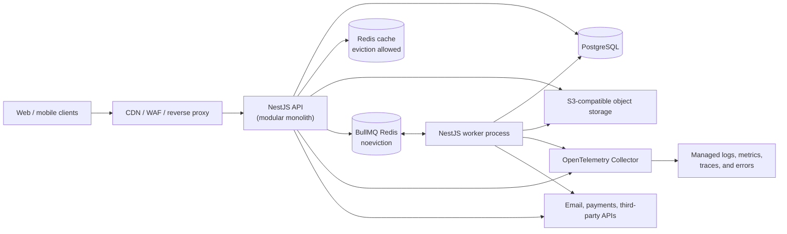

# A Production-Minded NestJS Backend Scaffold

This document is a blueprint for a backend you can grow with for years. Its aim is not to introduce every backend technology at once; it is to give you a sensible path from a well-built modular monolith to a service-oriented system when that is actually justified.

The central idea: start with one codebase and one versioned artifact containing two independently deployed process types—API and Worker—with clear module boundaries, strong automation, and observable operations. A “microservice architecture” is not the goal. The goal is software that stays understandable while it gains users, features, integrations, and teammates.

## What this scaffold should provide

- A TypeScript-first NestJS API, with clear HTTP, asynchronous-job, and domain boundaries.
- Authentication, authorization, tenant isolation, rate limits, audit trails, and secret management.
- PostgreSQL-backed transactional data, migrations, Redis-backed cache/queues, and object storage.
- Structured logs, metrics, tracing, error reporting, health checks, dashboards, and alerts.
- Repeatable local development, test environments, CI/CD, containers, and infrastructure-as-code.
- A route for background work and events without prematurely splitting into microservices.
- Documentation and operational playbooks that make the project workable by one person.

## Architecture at a glance



Run the API and Worker from the same codebase and immutable image, but as different deployments with separate entry points and scaling. The API should finish requests quickly. A dependency call may remain synchronous only when the response cannot be completed without its result—for example, an authorization or payment confirmation. Email, outbound webhooks, file processing, exports, scheduled work, and other non-immediate side effects go through the queue and Worker.

## Recommended technology choices

| Concern             | Start with                                                                               | Why                                                                                                                         |
| ------------------- | ---------------------------------------------------------------------------------------- | --------------------------------------------------------------------------------------------------------------------------- |
| Runtime / framework | Node.js LTS, TypeScript, NestJS                                                          | Familiar language with strong conventions and dependency injection.                                                         |
| HTTP API            | REST + OpenAPI/Swagger                                                                   | Easy to debug, cache, document, and consume from a frontend. Add GraphQL only for a real client-data need.                  |
| Validation          | `class-validator` + `class-transformer`, or Zod at boundaries                            | Reject malformed input before it reaches business logic.                                                                    |
| Database            | PostgreSQL                                                                               | Durable relational data, transactions, JSONB, full-text search, and excellent ecosystem.                                    |
| ORM                 | Prisma for the shortest learning curve; Drizzle/Kysely later if SQL control is important | Prisma migrations and types are particularly approachable for frontend engineers.                                           |
| Cache               | Redis with bounded TTLs and an eviction policy                                           | Disposable acceleration, rate-limit support, and carefully scoped locks.                                                    |
| Job queue           | BullMQ on a dedicated Redis deployment configured with `noeviction`                      | Delayed, retried, observable, and horizontally processed jobs without cache eviction endangering queue data.                |
| Files               | S3/R2/MinIO                                                                              | Keep blobs out of Postgres; use pre-signed upload/download URLs.                                                            |
| Auth                | OIDC provider through a NestJS BFF and server-side session                               | Avoids inventing password storage, recovery, MFA, and social login while keeping provider tokens out of browser JavaScript. |
| Logging             | Pino                                                                                     | Fast structured JSON logs, suitable for production aggregation.                                                             |
| Telemetry           | OpenTelemetry SDK/Collector + one managed observability backend                          | A complete pipeline for structured logs, metrics, and traces without self-hosting several stateful tools.                   |
| Errors              | Sentry, or the chosen observability backend's error product                              | Stack traces, release tracking, and alerting; avoid paying for two overlapping tracing systems.                             |
| Tests               | Jest/Vitest, Supertest, Testcontainers                                                   | Unit tests for rules; integration tests against real ephemeral dependencies.                                                |
| Containers          | Docker, Docker Compose                                                                   | Reproducible local services and deployment artifacts.                                                                       |
| CI                  | GitHub Actions                                                                           | Lint, typecheck, tests, image build, migration checks, and deploy gates.                                                    |
| Infrastructure      | Terraform or Pulumi                                                                      | Versioned, reviewable cloud resources.                                                                                      |

Keep the first stack intentionally boring. PostgreSQL + Redis + S3 covers a remarkable amount of product work.

## Reference product and non-functional requirements

A scaffold becomes useful when it is tested against a concrete imagined product. Use a multi-tenant B2B SaaS—for example, a project/work-management service with organizations, members, projects, files, notifications, exports, and third-party webhooks—as the reference product. It exercises the concerns that toy CRUD apps do not: authorization, tenant isolation, background work, files, auditability, and external failures.

Before implementation, write the following values down. They are product decisions, not infrastructure details:

| Decision          | First practical target                                                                  | Why it matters                                                                |
| ----------------- | --------------------------------------------------------------------------------------- | ----------------------------------------------------------------------------- |
| Users and traffic | Hundreds to low thousands of active users; start with one region                        | Prevents inventing global-distributed complexity before it is needed.         |
| Availability      | 99.9% monthly for the API                                                               | Defines whether an outage is acceptable and how much redundancy is warranted. |
| Latency           | p95 reads under 300 ms; p95 writes under 700 ms, excluding explicitly asynchronous work | Gives performance work a measurable purpose.                                  |
| RTO               | Recover the service within 4 hours                                                      | Drives incident playbooks and restore exercises.                              |
| RPO               | Lose no more than 15 minutes of committed data                                          | Drives backup frequency and point-in-time recovery choices.                   |
| Data              | Classify public, internal, personal, and sensitive data                                 | Governs access, log redaction, retention, and deletion.                       |
| Budget            | Prefer managed services while they fit a small, explicit monthly budget                 | Keeps solo-operation cost and toil visible.                                   |

Revise these targets from actual usage data. Do not add multi-region deployments, read replicas, Kubernetes, Kafka, or a service mesh merely because they sound mature.

## Default implementation baseline

The earlier table lists alternatives for context. The scaffold should nevertheless have one default path so that implementation does not become a chain of fresh decisions:

```text
Node.js LTS + TypeScript + pnpm
NestJS + REST + OpenAPI
class-validator/class-transformer for HTTP DTOs; Zod for environment configuration
PostgreSQL + Prisma
Redis cache + dedicated noeviction Redis for BullMQ
S3-compatible object storage (MinIO locally)
Pino + OpenTelemetry SDK/Collector + one managed telemetry backend
Jest + Supertest + Testcontainers
Docker Compose + GitHub Actions + Terraform
OIDC Authorization Code flow through a NestJS BFF with PostgreSQL-backed sessions
Managed container, PostgreSQL, Redis, and object storage in production
```

The exact identity provider and cloud may vary by region, cost, and product requirements; choose one before Milestone 2 and capture the choice in an Architecture Decision Record (ADR). Every ADR should record context, decision, alternatives, consequences, and the condition that would cause reconsideration.

## Codebase shape

Use a modular monolith. Modules own their use cases and persistence interfaces; other modules communicate through exported application services or typed domain events, not by reaching into each other’s repositories.

```text
apps/
  api/                        # HTTP bootstrap and API-specific composition
  worker/                     # job-worker bootstrap and worker composition
  cli/                        # safe, audited operational commands
libs/
  platform/                   # config, auth, errors, logging, database, telemetry
  modules/
    identity/
      api/                    # controllers, DTOs, response mappers
      application/            # use cases / commands / queries
      domain/                 # entities, policies, events, repository ports
      infrastructure/         # Prisma repositories, provider adapters
    organizations/
    projects/
    notifications/
  contracts/                  # versioned API/event schemas shared internally
prisma/
  schema.prisma
  migrations/
test/
  integration/
  e2e/
docs/
infra/
docker-compose.yml
```

This can be a pnpm workspace without introducing Nx. Do not force every tiny CRUD feature into elaborate Domain-Driven Design. Use the layered structure where business rules matter; simple modules can remain straightforward. The non-negotiable boundary is: controllers translate HTTP, application services coordinate use cases, domain code holds rules, and infrastructure talks to external systems.

Each module must expose a deliberate public entry point. Enforce import boundaries with ESLint: a module may not import another module's `infrastructure` folder or database repository directly. Keep `platform/` small and generic; it is not a dumping ground for feature code.

## Core request path

For every endpoint, make the lifecycle consistent:

1. A global validation pipe parses and rejects invalid DTOs.
2. Authentication middleware or a guard creates an `ActorContext` containing the authenticated user, session, requested tenant scope, and request identity. The use case still verifies access to that tenant/resource.
3. A guard may reject obviously forbidden calls early, but the application use case performs the authoritative resource-level policy check. Workers and CLI commands call the same policy rather than bypassing it.
4. The controller calls one application use case—no database logic in controllers.
5. The use case opens one transaction/Unit of Work shared by all participating repositories when multiple writes must succeed together.
6. Domain events are collected during the transaction. Durable side effects are recorded in the transactional outbox; they are never sent before commit.
7. After a successful commit, non-durable in-process notifications may run. A failed transaction publishes nothing externally.
8. An exception filter maps known domain errors to stable problem responses.
9. The response includes a generated request ID; logs, traces, and error reports use that same ID. Do not blindly trust an arbitrary inbound ID.

Adopt a stable error format such as RFC 9457 Problem Details. Clients should never need to parse error-message prose to understand an error.

## API contract conventions

The API is a product surface, not an implementation detail. Publish OpenAPI from the application in CI and treat breaking changes as failures. Define the following conventions once and apply them everywhere:

- Use plural resource URLs and predictable nesting only where the parent scope is essential: `/api/organizations/{organizationId}/projects`.
- Use cursor pagination with a documented response envelope: `data`, `nextCursor`, and optional `meta`. Put filtering and sorting in named query parameters with explicit allowlists.
- Define the difference between omitted fields, `null`, and empty values. Prefer dedicated request DTOs for create and update rather than exposing database models.
- Serialize timestamps as ISO 8601 UTC strings. Use integer minor units or explicit decimal strings for money; never JavaScript floating-point values.
- Give enums stable string values. Document `PATCH` behavior, response status codes, and which mutations accept an idempotency key.
- Return machine-readable stable error codes alongside RFC 9457 fields. Never expose ORM errors or stack traces.
- Add a resource `version` field or ETag for records that can be edited concurrently; reject conflicting writes with `409 Conflict` or `412 Precondition Failed`.
- Treat an API as public when independently released clients or third parties depend on its compatibility. Put those endpoints under `/v1`; a first-party web UI released with the backend may use `/api` until that boundary exists.

Generate an API client for the frontend if it helps, but do not share server database types with clients. The API schema—not the ORM model—is the contract.

## Identity, authorization, and multi-tenancy

Authentication answers “who are you?” Authorization answers “may you do this?” Keep them distinct.

The default browser model is an OIDC Authorization Code flow completed by the NestJS Backend-for-Frontend (BFF). The BFF validates `state`, `nonce`, issuer, audience, expiration, signatures, and provider key rotation, then maps the external subject to a local `identity` and `user`. The browser receives only an opaque session identifier in an `HttpOnly`, `Secure`, appropriately scoped `SameSite` cookie; provider access and refresh tokens never enter browser JavaScript.

Store server-side sessions in PostgreSQL initially; store a hash of the opaque cookie value rather than the raw secret. Sessions have expiration, rotation after login/privilege changes, per-device visibility, logout, administrative revocation, and “revoke all sessions.” Move sessions to a dedicated Redis only after a measured need and a durability/failover ADR. Apply CSRF protection to cookie-authenticated state changes. Mobile and machine clients use separate OAuth flows and audiences. If the product deliberately chooses SPA bearer tokens instead, record a replacement ADR covering token storage, short access-token lifetime, refresh-token rotation/reuse detection, logout, and XSS defenses.

For a B2B app, model tenancy explicitly:

```text
organizations
memberships (organization_id, user_id, role)
projects (organization_id, ...)
```

Every tenant-owned query and job receives an organization scope. Never accept an organization ID from the client or job payload and trust it without verifying membership or a system-actor grant. Start with role-based access control (owner/admin/member/viewer), then add policy checks for resource ownership or state when roles are insufficient. Pass the same `ActorContext` and policies through HTTP, Worker, and CLI entry points. Record security-sensitive actions—role changes, exports, login/security events, destructive actions—in an append-only audit log.

Security baseline:

- If local password authentication is ever intentionally added, hash passwords with Argon2id and design recovery/MFA separately. The default OIDC scaffold stores no passwords.
- Apply HTTPS, CORS allowlists, secure headers, body-size limits, and rate limits.
- Use idempotency keys for retryable write endpoints such as payments or provisioning.
- Verify webhook signatures and use idempotent webhook event records.
- Scan dependencies, lock versions, rotate secrets, and use a secret manager in deployed environments.
- Add authorization tests specifically for cross-tenant access attempts.

Also maintain a lightweight threat model for each sensitive feature: assets, actors, trust boundaries, plausible abuse, and mitigations. Cover SSRF, injection, path traversal, object-level authorization failures, account recovery abuse, and privilege escalation. Service-to-service calls should use machine identities and least-privilege permissions—not an end-user token copied into configuration.

Audit logs are not normal application logs: define their actor, action, target, tenant, timestamp, request ID, retention period, access controls, and tamper-evidence strategy. Give administrators a carefully authorized way to search them.

## Data design and database discipline

PostgreSQL is the source of truth. Cache Redis is disposable acceleration. BullMQ Redis holds durable operational state and must use persistence, monitoring, backups/failover appropriate to the workload; critical side effects should still be recoverable from PostgreSQL/outbox records rather than existing only in a queue.

- Use foreign keys, `NOT NULL`, unique constraints, check constraints, and indexes to encode facts the application must not violate.
- Prefer `timestamptz`, UTC, UUID/ULID identifiers, and explicit columns over a single unstructured JSON blob.
- Give important tables `created_at`, `updated_at`, and, where needed, `deleted_at`.
- Treat migrations as production code: reviewed, forward-only, testable, and compatible with rolling deploys.
- For large changes, use expand → backfill → switch reads/writes → contract rather than one destructive migration.
- Paginate list endpoints using cursor pagination; avoid unrestricted offsets and unbounded exports.
- Back up automatically, test restore procedures, and define retention and deletion rules for customer data.

Concurrency is a data-design concern. Use transactions for invariants spanning multiple rows; use unique constraints as the final protection against duplicates; and use optimistic locking or conditional updates for user-edited records. Define transaction isolation deliberately for workflows such as quotas, reservations, and billing. Monitor slow queries, prevent N+1 access patterns, size the database connection pool for the deployed instance, and test migrations from a copy/snapshot of the preceding production schema—not only from an empty database.

Soft deletion is not a free default: it complicates unique constraints, authorization, indexes, and retention. Use it only when product recovery or legal retention requires it, and schedule eventual physical deletion according to the data-retention policy.

For events that must be emitted reliably after a write, use the transactional outbox pattern: write the domain change and an `outbox_events` row through the same transaction/Unit of Work; a worker claims, publishes, and marks it delivered. This prevents “database committed but job/message was lost.” In-process events are suitable only for non-durable behavior after commit, or for synchronous rules whose failure is intentionally part of the transaction.

Use the cache Redis through an explicit cache-aside policy. Namespace keys by environment and tenant where appropriate, set bounded TTLs with jitter, invalidate/update after mutations, and design for cache loss and cache stampedes. Do not make authorization decisions depend solely on cached data. Keep BullMQ on a separate Redis deployment with `maxmemory-policy=noeviction`; a cache eviction policy must never remove queue state.

## File and object-storage security

Treat a successful upload as untrusted input, not as an available file. Use a state machine such as:

```text
PendingUpload → Quarantined → Scanning → Available → Deleted
                              ↘ Rejected
```

- Keep buckets private and issue short-lived pre-signed URLs only after tenant/resource authorization. Object keys are generated identifiers, never raw user filenames or paths.
- Constrain upload size and declared type when issuing the upload URL. After upload, verify actual size, content magic number, allowed format, and checksum; never trust the browser-provided MIME type.
- Scan untrusted content for malware. Put image, archive, document, and media processing behind strict CPU, memory, decompression, pixel/dimension, and timeout limits.
- Serve untrusted active formats with safe `Content-Disposition` and a separate origin/domain where appropriate. Do not allow uploaded HTML/SVG to inherit the application origin without a deliberate security policy.
- Record tenant, owner, checksum, storage key, classification, scan result, lifecycle state, and retention in PostgreSQL. A file becomes downloadable only in `Available` state.
- Clean abandoned multipart uploads and database/object-store orphans. Define encryption, versioning, backup, retention, legal hold, and physical deletion behavior.

Direct-to-object-storage uploads bypass NestJS request pipes, so the Worker performs the authoritative post-upload validation and scanning before changing the state to `Available`.

The concrete flow is: the API creates a `PendingUpload` record and returns a constrained pre-signed URL; an authenticated completion request or trusted object-store event records the uploaded object and enqueues scanning through the outbox; the Worker performs a metadata `HEAD`, checksum/type/size validation, and malware/content processing; then it atomically records `Available` or `Rejected`. Downloads always authorize against the database record before issuing a new short-lived URL.

## Background jobs, events, and future microservices

Create queues by workload: `emails`, `webhooks`, `media`, `exports`, and `maintenance`. Each job must have a named payload schema, a retry policy with exponential backoff, timeout, dead-letter/failed-job visibility, and idempotent execution.

BullMQ provides at-least-once delivery: a job may execute more than once, and “exactly once” should not be claimed. Give every job an idempotency key/job ID, use a business unique constraint or inbox/deduplication record where needed, and make retries safe. Version event and job payloads; do not put secrets or unnecessary personal data in them. Define ordering requirements explicitly, because most queues do not provide global ordering.

Failed jobs need an operational lifecycle: alert threshold, inspection UI, retry/replay procedure, poison-message handling, and retention/cleanup. Scheduled jobs running in multiple worker replicas require a leader/lock or a queue-native repeatable-job mechanism to avoid duplicate execution. Outbox publishers likewise need locking, batching, metrics, and cleanup.

Use internal events for loose coupling inside the monolith. For example, `OrganizationCreated` can schedule onboarding email and analytics setup without the organization use case knowing either detail.

For idempotent HTTP mutations, scope the idempotency key by tenant, actor/client, and operation. Store a normalized request hash, execution state, and final status/response for a bounded retention period. Reusing the same key with a different payload is a conflict; concurrent requests with the same key must not execute the operation twice.

For inbound webhooks, verify the signature over the raw request bytes, enforce a timestamp/replay window, and persist the provider event ID before processing. For outbound webhooks, persist each logical event and delivery attempt, sign the timestamp plus raw body with a rotatable per-subscription secret, apply bounded retries, and preserve one logical event ID across manual replays.

Only split a module into a separate service when there is a concrete pressure: independent scaling, different reliability/security boundary, separately owned release cadence, or a technology/runtime need. When that day arrives, extract through the existing interface/event boundary and introduce a message broker such as SQS, RabbitMQ, or Kafka based on delivery and throughput needs. Do not begin with Kafka just to look enterprise-grade.

After extraction, services must own their data; direct cross-service database access is forbidden. Add service-to-service authentication, versioned message contracts, consumer-driven contract tests, trace-context propagation, and compensating workflows (sagas) for multi-service operations. These are the actual costs of microservices.

## Reliability patterns and graceful shutdown

Every outbound dependency must have a named timeout and a bounded failure policy. Use retries only for transient failures and idempotent operations; apply exponential backoff with jitter, a retry budget, and circuit breaking when a dependency is persistently unhealthy. Apply concurrency limits/bulkheads to expensive routes and worker queues so that an export storm cannot starve ordinary requests.

On shutdown, first fail readiness checks, stop accepting new work, allow in-flight HTTP requests and active jobs a bounded drain period, then close queue consumers and database/Redis connections. Job processors should support cancellation/timeout boundaries and record enough state to resume safely. Protect the service under overload with body-size limits, rate limits, pagination, queue limits, and explicit backpressure rather than allowing memory or database connections to exhaust.

## Observability and operations

“It runs” is not an operational state. Build three complementary signals:

| Signal  | Answers                          | Examples                                                                       |
| ------- | -------------------------------- | ------------------------------------------------------------------------------ |
| Logs    | What happened to this request?   | JSON logs: request ID, route, actor ID, organization ID, duration, error code. |
| Metrics | Is the system healthy overall?   | request rate/error/latency, queue depth, job failures, DB pool usage.          |
| Traces  | Where did time or failure occur? | HTTP request → SQL query → queue publish → external API.                       |

Expose `/health/live` (process is alive) and `/health/ready` (can accept traffic: dependencies checked). Keep metrics on a protected endpoint or private network. Define service-level indicators precisely: which routes/statuses count, the measurement window, treatment of planned maintenance and dependency failures, and whether availability is request- or time-based. For the reference service, target 99.9% monthly API availability, p95 reads below 300 ms, and p95 writes below 700 ms. Track the resulting error budget and pause risky releases when it is exhausted.

Alert on user-impacting symptoms: elevated 5xx rate, sustained latency, old/stuck jobs, full resources, telemetry-pipeline failure, or backup/restore failure. Add an external synthetic check for the critical read/write path. Every alert must have an owner, severity, deduplication/window rule, and linked runbook; avoid alerting on every noisy CPU spike.

Create runbooks for the first incidents: API unavailable, elevated errors, stuck queue, bad deployment rollback, database connection exhaustion, and a suspected secret leak.

Send OTLP telemetry from API and Worker to an OpenTelemetry Collector, then export it to one chosen managed backend for storage and querying. The backend must cover logs, metrics, and traces; use Sentry only if its error/release workflow adds value without duplicating the tracing bill. In local development, a small optional Collector plus compatible local backends may be provided, but it must not be required for the basic edit/test loop.

Define observability hygiene as well: redact tokens, credentials, cookies, and personal data before logs/traces leave the process; avoid high-cardinality metric labels such as user IDs; document trace sampling and retention; and set cost budgets for telemetry. Propagate W3C trace context across HTTP and jobs and include trace/request identifiers in Pino records. Dashboard the SLO signals—availability, latency, queue age/failure rate, and backup health—not merely infrastructure CPU. Monitor the Collector's own rejected/dropped/export-failure signals so the absence of telemetry is not mistaken for a healthy service.

## Environments, configuration, and deployment

Use four environments: local, test/CI, staging, production. Staging should resemble production enough to validate migrations, workers, integrations, and deployment behavior.

Configuration belongs in environment variables and is validated once on boot (for example with Zod). Check in an `.env.example` with variable names and safe example values; never check in real secrets. Build one immutable Docker image and promote the same image through staging to production.

Local `docker-compose.yml` should provide PostgreSQL, a cache Redis, a dedicated BullMQ Redis, MinIO, Mailpit, and optional observability tooling. The application itself may run on the host with hot reload or in Docker—both should work. Production can begin with a managed container service plus managed PostgreSQL/Redis/object storage; managed services reduce solo-operator burden substantially.

Use the same immutable image for API and Worker, with distinct entry points and independent replicas/autoscaling. Run containers as a non-root user, with minimal runtime dependencies and no writable application filesystem. Store production secrets in a managed secret store and grant each process the least privileges it needs.

CI pipeline:

1. Install from lockfile; run formatting, linting, and TypeScript type checks.
2. Run unit and integration tests, including dependency-backed tests.
3. Check migrations against both an empty database and the preceding production schema/data shape.
4. Build the immutable container, generate an SBOM, run secret/dependency/image scans, and publish the versioned artifact.
5. Deploy to staging; run smoke tests; require a deliberate production promotion.
6. Apply only the migration phase compatible with both the old and new application versions.
7. Promote through a controlled/canary rollout and verify health, SLO signals, jobs, and migration progress.

Application rollback and database rollback are different operations. Prefer backward-compatible schema changes and forward fixes; automatically running a destructive down-migration is often less safe than leaving an additive column in place. Use feature flags or kill switches to disable risky behavior quickly.

An expand/contract change spans releases: expand the schema; deploy code compatible with old and new shapes; perform an observable, rate-limited, resumable backfill; switch reads/writes; observe through the rollback window; and only then contract the old shape in a later release. Backfills need checkpoints, progress/failure metrics, bounded batches, and a pause/resume procedure.

Disaster recovery is a tested capability, not a backup checkbox: document ownership, RTO/RPO, backup encryption and retention, point-in-time recovery, restore validation, and the procedure for restoring a new environment. Run restore exercises on a schedule.

## Administrative and operational control plane

Production operation requires controlled actions beyond normal product endpoints. Provide audited CLI commands first; add a protected internal admin UI only when repeated operations justify it. Support:

- inspecting, retrying, replaying, or discarding failed jobs and poison messages;
- inspecting outbound webhook attempts and replaying a delivery with its original logical event ID;
- revoking sessions, disabling users, and applying a documented break-glass administrator procedure;
- viewing outbox lag, pausing a workload, and activating scoped feature flags or emergency kill switches;
- fulfilling authorized data export/deletion requests and searching audit records;
- running resumable backfills and maintenance commands with dry-run, confirmation, idempotency, and progress reporting.

Administrative routes must live on a private network or separately protected origin, use stronger authorization/MFA, and record actor, reason, target, request ID, before/after state where safe, and outcome. A queue dashboard is diagnostic tooling, not an authorization system; never expose it publicly.

## Testing strategy

Aim for confidence, not a vanity coverage percentage.

- Unit tests: domain policies, permissions, input normalization, pure transformations.
- Integration tests: repository queries, transactions, migrations, queue adapters, auth adapters. Use Testcontainers when feasible.
- End-to-end tests: the few critical user journeys through real HTTP—sign-in, tenant boundary, primary write/read flow, webhook verification.
- Contract tests: critical API schemas and third-party adapters.
- Load tests: a small k6 scenario before major launches and for known expensive endpoints.
- Migration tests: upgrade from the previous production schema/data shape, not only a fresh database.
- Resilience tests: timeout, retry, duplicate delivery, dependency outage, graceful shutdown, and failed-job replay.
- Security tests: a role/tenant permission matrix, malformed input, webhook signature failure, and object-level authorization attempts.
- Entry-point parity tests: prove that HTTP, Worker, and CLI calls cannot bypass application authorization or tenant scoping.
- File-pipeline tests: invalid magic numbers, oversize/decompression cases, failed scans, unauthorized downloads, and orphan cleanup.
- Session tests: login callback state/nonce validation, CSRF, rotation, expiration, logout, and administrative revocation.

Every production bug should result in a regression test where practical. Test authorization failures as deliberately as success paths.

Use deterministic clocks, ID generators, and data factories in tests. Add property/fuzz tests for parsers and high-risk validation rules where useful. Check generated OpenAPI changes in CI so accidental breaking API changes are visible in code review.

## Suggested milestones

### Milestone 0 — Foundation

Initialize the default implementation baseline, strict TypeScript, ESLint/Prettier, commit hooks, Docker Compose, configuration validation, a `/health` endpoint, Pino logs, OpenAPI, and CI. Pin Node and pnpm versions in the repository, commit the lockfile, and automate controlled dependency updates. Write the reference-product constraints, first ADRs, API conventions, and threat model before coding. Deliver non-root API and Worker containers that start locally with PostgreSQL, cache Redis, and queue Redis.

### Milestone 1 — One vertical product slice

Build one real resource end-to-end: migration, repository, use case, controller, validation, tests, OpenAPI, pagination, and error contract. Resist creating generic abstractions until this slice exposes a repeated need.

### Milestone 2 — Identity and tenancy

Add the OIDC BFF flow, server-side sessions, users/organizations/memberships, RBAC/policies enforced by application use cases, tenant-scoped repositories/jobs, audit logging, and authorization E2E tests across HTTP/Worker/CLI. This is the point at which the scaffold becomes safe for a multi-user product.

### Milestone 3 — Async and integrations

Add the dedicated BullMQ Redis and Worker processes, retries, idempotency, transactional outbox, cache policy, email, the quarantine/scan file pipeline, and signed inbound/outbound webhooks. Surface queue failures in logs and dashboards, and verify duplicate delivery/replay behavior.

### Milestone 4 — Production readiness

Add the complete OpenTelemetry Collector/backend pipeline, SLO/error-budget dashboards, alerts, an audited operational CLI, graceful shutdown, backup/restore exercises, dependency/SBOM/image scanning, staging, infrastructure-as-code, feature flags, and deployment/incident runbooks.

### Milestone 5 — Scale only from evidence

Profile slow paths, add indexes/cache/rate limits, introduce read replicas or search only when measured needs arise, and extract services only at established module boundaries.

## Habits that make a solo backend sustainable

- Keep an architectural decision record (ADR) for meaningful choices: why Prisma, why OIDC, why a queue, why an extraction.
- Maintain `README.md` instructions that a future you can follow from a fresh clone in under 30 minutes.
- Add API versioning only when you have external consumers and a compatibility policy.
- Prefer managed infrastructure until its cost or constraint is demonstrably unacceptable.
- Schedule dependency updates and restore drills. Reliability work is product work.
- Keep a small backlog of operational debt alongside feature work.
- Design the API as if another developer will use it—because future you will.

## A practical first implementation order

Start with the following packages/services, then build one vertical feature before expanding:

```text
NestJS + TypeScript + Prisma + PostgreSQL
Pino + OpenAPI + Zod/config validation
Docker Compose (Postgres, cache Redis, BullMQ Redis, MinIO, Mailpit)
Jest/Supertest + GitHub Actions
OIDC BFF sessions + organizations/memberships/policies
BullMQ Worker + transactional outbox
Quarantined object-storage upload pipeline
OpenTelemetry Collector + one managed telemetry backend
Terraform + managed production services
```

At each stage, ask three questions: What can fail? How will I observe it? How will I safely retry or recover? Those questions are the difference between a demo API and a service you can operate with confidence.
