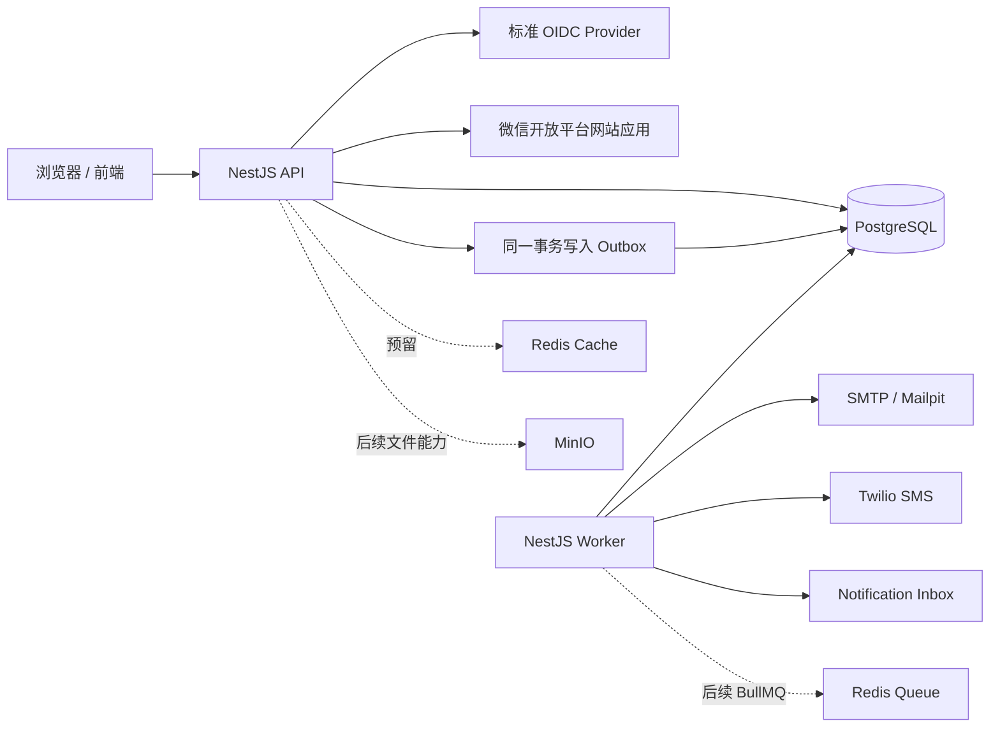

# 1. 先认识这套后端

> [返回教程首页](README.md)

## 1.1 它解决什么问题

这个仓库不是一个只有 `users` 表和几个 CRUD 接口的教学 Demo。它以多租户 B2B 项目管理 SaaS 为参考产品，已经实现了一条较完整的生产级主干：

- NestJS 11 + TypeScript 的 HTTP API；
- 独立运行的 NestJS Worker；
- PostgreSQL 17 + Prisma 7；
- 邮箱、手机号、OIDC 与微信网站扫码登录；
- 服务端不透明 Session Cookie；
- Origin + CSRF 双重写请求保护；
- Organization、Membership 和角色授权；
- 租户范围内的 Project；
- PostgreSQL 事务 Outbox；
- 邮件和短信异步投递；
- 持久化站内通知、未读数与 SSE 实时提醒；
- Pino 结构化日志、健康检查、限流和 Problem Details 错误格式；
- Jest 单元测试和 Supertest E2E 测试；
- Docker 多阶段构建和 Docker Compose 本地依赖。

它的核心架构决策是：**先做边界清楚的模块化单体，而不是过早拆微服务。** API 和 Worker 共用一个代码仓库与构建产物，但作为两个进程分别启动、扩容和停止。



## 1.2 已实现与尚未实现

学习现有项目时，必须区分“代码已经具备的能力”和“架构蓝图中的目标”。

| 能力                           | 当前状态                                  | 从哪里看                                      |
| ------------------------------ | ----------------------------------------- | --------------------------------------------- |
| HTTP API、OpenAPI 入口         | 已实现                                    | `apps/api/src/main.ts`                        |
| 邮箱/手机号注册、密码登录      | 已实现                                    | `apps/api/src/identity/`                      |
| OIDC Authorization Code + PKCE | 已实现，可选配置                          | `oidc.service.ts`                             |
| 微信网站扫码 OAuth             | 已实现，可选配置                          | `wechat-oauth.service.ts`                     |
| PostgreSQL Session             | 已实现                                    | `Session` 模型、`IdentityService`             |
| 多租户 RBAC                    | 已实现基础版                              | `authorization.service.ts`                    |
| Project 读写                   | 已实现                                    | `apps/api/src/projects/`                      |
| 审计事件                       | 已实现基础写入                            | `AuditEvent` 模型                             |
| PostgreSQL Outbox Worker       | 已实现                                    | `apps/worker/src/worker.service.ts`           |
| 邮件投递                       | 已实现                                    | Nodemailer + Mailpit/SMTP                     |
| 短信投递                       | 已实现，可选 Twilio                       | Worker 的 `sendSms`                           |
| 站内通知与 SSE                 | 已实现基础版                              | `notifications/`、Worker、`Notification` 模型 |
| Redis 缓存                     | Compose 已准备，业务尚未接入              | `redis-cache` 服务                            |
| BullMQ                         | Queue Redis 已准备，尚未接入              | `redis-queue` 服务                            |
| MinIO 私有头像对象存储         | Profile 已使用；通用文件上传/扫描仍待实现 | `minio` 服务、`ProfileModule`                 |
| OpenTelemetry、生产部署自动化  | 蓝图目标，尚未实现                        | `BACKEND_SCAFFOLD_BLUEPRINT.md`               |

这意味着你可以直接学习真实的认证、授权、事务、Worker 和私有头像对象存储；但不要把 Compose 中出现 Redis/MinIO 误认为通用文件上传、病毒扫描或 CDN 分发等能力已经实现。

## 1.3 为什么选择这套技术栈

技术选型不是“哪个库最流行”，而是约束、收益与成本的组合。下面把本项目的主要选择放在同一张决策表里。

| 关注点     | 当前选择                   | 为什么适合当前项目                                                    | 代价/替代方案                                                        | 什么时候重新评估                                                  |
| ---------- | -------------------------- | --------------------------------------------------------------------- | -------------------------------------------------------------------- | ----------------------------------------------------------------- |
| 应用架构   | 模块化单体                 | 一个团队、一个仓库、一个发布版本，事务和调试简单，同时保留模块边界    | 微服务能独立扩缩容，但引入网络、服务认证、消息一致性和独立运维       | 某模块出现真实的独立扩容、可靠性、安全或团队所有权需求            |
| 后端框架   | NestJS                     | 对熟悉 TypeScript 的团队友好；Module、DI、Guard、Filter 提供一致结构  | Express/Fastify 更轻但需要自己定规范；其他语言生态可能更适合特定团队 | 框架开销成为实测瓶颈，或团队/业务需要不同运行时                   |
| 事实数据库 | PostgreSQL                 | 事务、关系、约束、索引、JSONB 和成熟运维生态，适合 B2B 业务           | 文档库更灵活但跨实体一致性和复杂查询代价不同                         | 数据模型或吞吐特征明确不适合关系模型，而不是因为 Schema 会变      |
| 数据访问   | Prisma                     | 类型生成、Migration 和关系查询对 TypeScript 团队上手快                | SQL 控制不如 Kysely/原生 SQL 直接；复杂查询仍要懂 SQL                | 查询复杂度、性能或数据库特性需要更细控制                          |
| 边界校验   | Zod                        | 一套 Schema 同时做运行时校验和 TS 类型推导                            | class-validator 与 Nest 集成更原生；两套同时使用会重复               | OpenAPI/DTO 工具链需求使另一方案的总成本更低                      |
| 浏览器认证 | PostgreSQL 服务端 Session  | 可即时撤销、设备可见、密码变化后全量失效；浏览器不接触 Provider Token | 无状态 JWT 少一次查库，但撤销、轮换和权限变化更复杂                  | 实测 Session 规模需要专用 Store，并先写 durability ADR            |
| 后台副作用 | PostgreSQL Outbox + Worker | 业务写入与“需要投递”同事务提交，避免数据库成功但消息丢失              | 直接发邮件简单但不可靠；消息 Broker 仍解决不了 DB 与消息的原子提交   | 任务规模需要 BullMQ/Broker 的调度能力，但 Outbox 仍可作为可靠源头 |
| 日志       | Pino JSON                  | 高吞吐、结构化、易于集中查询；支持敏感字段脱敏                        | 文本日志本地直观，但机器聚合困难                                     | 通常不替换，只接入不同观测后端                                    |
| 本地环境   | Docker Compose             | PostgreSQL/Redis/MinIO/Mailpit 可重复启动，接近部署依赖               | 本机直接安装更快但容易版本漂移                                       | 团队需要更完整的临时环境或远程开发环境                            |
| 缓存       | 独立 Redis Cache           | 缓存可丢且允许 LRU 淘汰，不影响事实正确性                             | 进程内缓存更简单但多实例不一致                                       | 只有慢查询与命中率被测量后才接入                                  |
| 未来队列   | 独立 Redis Queue           | Queue 数据不能被 Cache 淘汰，故和 Cache 隔离                          | 共用 Redis 便宜但故障策略冲突                                        | 任务可靠性/规模需要托管 Broker 或其他语义                         |
| 文件       | S3 兼容存储/MinIO          | Blob 不挤占数据库，支持大文件和预签名 URL                             | 本地磁盘在多实例/容器重建时不可靠                                    | Provider、合规和地域要求变化                                      |

## 1.4 不要把选型结论脱离前提

同一个选择在不同产品里可能完全相反。例如：

- 本项目是浏览器优先，所以服务端 Session 合理；机器 API 可能更适合 OAuth Access Token；
- 本项目预期数百到数千活跃用户，所以 PostgreSQL Poller 足够；千万级任务吞吐需要不同设计；
- 本项目由小团队维护，所以模块化单体优先；几十个独立团队可能需要服务边界；
- Project 创建必须立即一致，而验证邮件允许数秒后到达；不能对所有数据套同一种一致性策略。

以后看到“最佳实践”时，先问：

```text
它在保护什么不变量？
它解决的是已经发生的问题，还是想象的问题？
失败时系统如何恢复？
团队是否有能力运维它？
它增加的复杂度是否小于它消除的风险？
```

---
