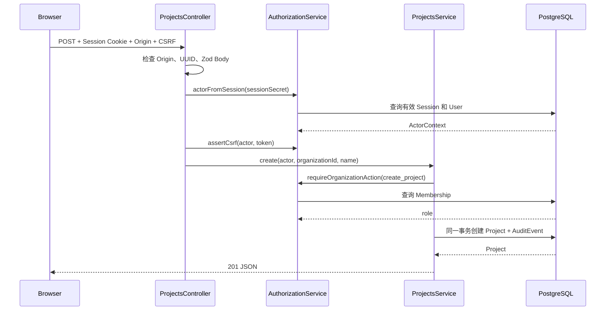

# 7. 跟踪一次真实 HTTP 请求

> [返回教程首页](README.md)

以创建 Project 为例：

```http
POST /api/organizations/{organizationId}/projects
Cookie: dev-session=<opaque-secret>
Origin: http://localhost:5173
X-CSRF-Token: <session-bound-token>
Content-Type: application/json

{ "name": "Backend Course" }
```

完整链路如下：



## 7.1 Controller 层

`ProjectsController.create()` 依次做：

1. `assertAllowedOrigin()`：阻止恶意站点发起 Cookie 写请求；
2. `z.string().uuid().parse()`：验证路径参数；
3. 从 Session Cookie 构造 `ActorContext`；
4. 校验 Session 绑定的 CSRF Token；
5. `projectSchema.parse(body)`：校验名称；
6. 调用 `ProjectsService.create()`。

它不做角色判断，也不直接写数据库。

## 7.2 Service 层

`ProjectsService.create()` 先要求 `create_project` 权限，然后在一个事务里：

1. 创建 Project；
2. 创建 `project.created` 审计事件；
3. 返回 Project。

如果审计写入失败，Project 也不会提交。这就是业务原子性。

## 7.3 错误如何离开系统

任何层抛出的 Zod、Prisma 或 Nest HTTP 异常，最终由 `ProblemDetailsFilter` 统一转换为 `application/problem+json`。例如：

```json
{
  "type": "about:blank",
  "title": "Invalid request",
  "status": 400,
  "detail": "One or more request values are invalid.",
  "instance": "/api/organizations/not-a-uuid/projects",
  "errors": [{ "path": "", "message": "Invalid UUID" }]
}
```

客户端应该依赖 HTTP 状态和稳定错误码，而不是解析自然语言。当前过滤器已经统一形状，但项目文档要求的“稳定机器错误码”还可继续完善。

## 7.4 对比 GET 与 POST 的安全要求

读取 Project：

```text
Session Cookie
→ Actor
→ Organization Membership + read 权限
→ 查询
```

创建 Project：

```text
合法 Origin
+ Session Cookie
+ Session 绑定 CSRF Token
→ Actor
→ Organization Membership + create_project 权限
→ 事务写入
```

为什么 GET 不要求 CSRF？CSRF 主要防止第三方站点借用浏览器自动携带的 Cookie 修改状态。按照 HTTP 语义，GET 必须是安全读取，不能在 GET 里执行删除、发邮件或改变角色。如果 GET 有副作用，你会同时破坏缓存、爬虫和 CSRF 假设。

## 7.5 四层输入不要混为一谈

创建 Project 的输入来自不同信任层：

| 输入             | 来源            | 校验方式              | 是否可信               |
| ---------------- | --------------- | --------------------- | ---------------------- |
| `organizationId` | URL Path        | UUID + Membership     | 否                     |
| `name`           | JSON Body       | Zod 长度/trim         | 否                     |
| Session Secret   | HttpOnly Cookie | HMAC 查询有效 Session | 只有查库后可信         |
| CSRF Token       | Header          | Session 绑定 HMAC     | 只有常量时间比较后可信 |
| Origin           | Header          | 精确标准化比较        | 只有 allowlist 后可信  |
| `actor.userId`   | 服务端 Session  | 服务端构造            | 是                     |

后端研发的一个基本习惯是：看到每个值时问“它从哪个信任边界进来，在哪里被验证过”。

## 7.6 自己跟踪一次请求

在 `ProjectsController.create()`、`AuthorizationService.requireOrganizationAction()` 和 `ProjectsService.create()` 临时设置 IDE 断点，然后发送一次请求。观察：

1. Request Cookie 如何被 `cookie-parser` 放进 `request.cookies`；
2. `actorFromSession()` 如何只用 Hash 查数据库；
3. 为什么 `ActorContext` 不采用 Body 中的用户 ID；
4. Viewer 在进入事务前就被拒绝；
5. Prisma Transaction Callback 中的 `tx` 与普通 `database` 的区别；
6. 返回对象如何被 Nest 序列化成 JSON。

调试后删除临时日志，特别是 Cookie、Token 和 Body 日志。断点比打印 Secret 更安全。

---
