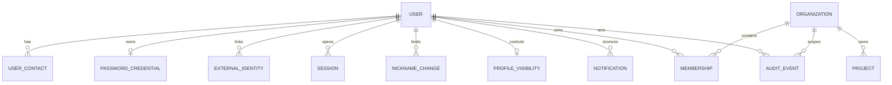

# 8. 使用 Prisma 和 PostgreSQL

> [返回教程首页](README.md)

## 8.1 三个关键部分

1. `prisma/schema.prisma`：声明模型、关系、索引和约束；
2. `prisma/migrations/`：真正执行到数据库的版本化 SQL；
3. `libs/platform/src/database/generated/`：生成的 Prisma Client，**不要手改**。

`DatabaseService` 继承生成的 `PrismaClient`，使用 Prisma 的 PostgreSQL Adapter，并在应用关闭时断开连接。

## 8.2 从 Schema 到数据库的研发流程

修改 `schema.prisma` 后，在本地开发数据库上创建 Migration：

```bash
pnpm exec prisma migrate dev --name add_tasks
```

这个命令通常会：

- 比较当前数据库和 Schema；
- 在 `prisma/migrations/<timestamp>_add_tasks/` 生成 SQL；
- 执行 Migration；
- 重新生成 Prisma Client。

如果只需要重新生成 Client：

```bash
pnpm prisma:generate
```

部署环境使用：

```bash
pnpm prisma:migrate:deploy
```

`migrate deploy` 只执行已经提交的 Migration，不自动设计新 Migration，因此适合 CI/CD。

## 8.3 如何设计一个可靠模型

观察现有 `Project`：

```prisma
model Project {
  id             String       @id @default(uuid()) @db.Uuid
  organizationId String       @map("organization_id") @db.Uuid
  name           String
  createdAt      DateTime     @default(now()) @map("created_at") @db.Timestamptz(6)
  updatedAt      DateTime     @updatedAt @map("updated_at") @db.Timestamptz(6)
  organization   Organization @relation(fields: [organizationId], references: [id], onDelete: Cascade)

  @@index([organizationId, createdAt])
  @@map("projects")
}
```

你可以学到：

- ID 在应用层是 `string`，数据库层明确为 UUID；
- TypeScript 使用 camelCase，数据库使用 snake_case；
- 时间使用带时区的 `timestamptz`；
- 外键编码真实关系；
- 租户 ID + 排序字段有组合索引；
- 删除 Organization 时级联删除 Project 是明确决策。

## 8.4 常用 Prisma 查询

```ts
// 唯一键查询
await database.user.findUnique({ where: { id: userId } });

// 带租户条件的列表
await database.project.findMany({
  where: { organizationId },
  orderBy: { createdAt: 'desc' },
});

// 只选择 API 真正需要的字段
await database.user.findMany({
  select: { id: true, displayName: true, status: true },
});

// 原子地执行多次写入
await database.$transaction(async (tx) => {
  const project = await tx.project.create({ data: { organizationId, name } });
  await tx.auditEvent.create({ data: {/* ... */} });
  return project;
});
```

## 8.5 数据库约束是最后一道防线

应用先检查“成员是否已经存在”可以返回友好错误，但真正防并发重复的是：

```prisma
@@unique([userId, organizationId])
```

两个请求可能同时通过“尚不存在”的查询，唯一约束仍能保证只插入一条。`ProblemDetailsFilter` 会把 Prisma `P2002` 转成 409。

## 8.6 Migration 生产纪律

- Migration 和业务代码一起评审、提交；
- 不要修改已经在共享环境执行过的旧 Migration；
- 先检查生成 SQL，再执行；
- 大表变更采用 expand → backfill → switch → contract；
- 不要在一次滚动发布中先删旧列，再部署仍读取旧列的代码；
- 生产发布前备份，并验证恢复流程；
- 对常用 `where + orderBy` 组合设计索引；
- 避免无界 `findMany()` 和大 offset 分页。

## 8.7 当前数据模型全景

| 模型                      | 主要职责                          | 关键约束/关系                                                                          |
| ------------------------- | --------------------------------- | -------------------------------------------------------------------------------------- |
| `User`                    | 用户主体、状态与 Profile 基础字段 | 关联 Contact、Credential、Session、Membership、ExternalIdentity；保存 bio/私有头像引用 |
| `UserContact`             | 已验证邮箱/手机号                 | `(type, normalizedValue)` 唯一，可 retired                                             |
| `PasswordCredential`      | Argon2id 密码凭据                 | 与 User 一对一，主键就是 `userId`                                                      |
| `ExternalIdentity`        | OIDC/微信外部身份                 | `(issuer, providerSubject)` 唯一，不按邮箱隐式合并                                     |
| `Session`                 | 服务端浏览器会话                  | `secretHash` 唯一，绝对/空闲过期，可撤销                                               |
| `Organization`            | 租户根实体                        | 拥有 Membership、Project、AuditEvent                                                   |
| `Membership`              | 用户和组织的角色关系              | `(userId, organizationId)` 唯一                                                        |
| `Project`                 | 租户内项目                        | 外键 `organizationId`，按租户和时间索引                                                |
| `RegistrationIntent`      | 邮箱注册状态机                    | 邮箱/Token Hash 唯一，一次性消费                                                       |
| `PhoneRegistrationIntent` | 手机 OTP 状态机                   | 挑战、失败次数、发送窗口、完成 Token                                                   |
| `PasswordResetIntent`     | 密码重置状态机                    | 每用户一条有效记录，一次性 Token                                                       |
| `OidcTransaction`         | OIDC 临时事务                     | State Hash、浏览器绑定、加密 PKCE/Nonce                                                |
| `OAuthProfileTransaction` | 微信 OAuth 临时事务               | State Hash、浏览器绑定、Return URL、过期和一次性消费                                   |
| `NicknameChange`          | 昵称滚动窗口配额事实              | `(userId, changedAt)` 索引；不保存历史昵称文本                                         |
| `ProfileVisibility`       | Profile 字段隐私策略              | 与 User 一对一；四个字段默认 `PRIVATE`                                                 |
| `Notification`            | 用户站内收件箱                    | `(userId, dedupeKey)` 唯一；用户范围分页/未读/过期索引                                 |
| `AuditEvent`              | 安全/业务审计                     | 按租户、Actor 和时间索引                                                               |
| `OutboxEvent`             | 可靠异步副作用                    | 状态、尝试次数、可用/锁定/投递时间                                                     |

主要关系可以画成：



Intent 与 Outbox 没有强制外键，是因为它们代表跨步骤状态和通用事件。没有外键不等于可以随意存任意 Payload；Service 和 Worker Schema 必须维持语义。

`OidcTransaction` 和 `OAuthProfileTransaction` 被有意拆开。前者必须保存加密的 PKCE Verifier 与 Nonce，后者用于微信这类“用 Code 换 Access Token，再读取 Profile”的非 OIDC 流程，并不具备 ID Token、Discovery、Issuer/Audience/Nonce 等标准语义。如果为了少一张表而把两者硬塞进同一个通用模型，字段会大量可空，代码也容易误以为微信完成了 OIDC 等价校验。

`OAuthProfileTransaction` 只保存 State、浏览器绑定和 Return URL 的服务端状态，不保存微信 Access Token/Refresh Token。Token 只在 Callback 内存中短暂存在，解析出持久身份后立即丢弃。登录身份最终落在 `ExternalIdentity`：Issuer 使用网站 AppID 形成作用域，Subject 使用 `openid:<OpenID>`。

Profile 的两次 Migration 展示了一个安全上线技巧：先给 `users` 增加可空的 `bio`、`avatar_object_key` 和 `avatar_updated_at`，再新建带 `PRIVATE` 默认值的一对一可见性表。旧用户没有 `profile_visibility` Row 时，Service 也按全私有解释。这样可以先发布读路径，而无需为了“每用户一行默认设置”进行一次大规模同步回填。详细的行锁、配额和对象存储一致性见 [Profile 专题](profiles/README.md)。

## 8.8 `select`、`include` 和 N+1

`include` 会加载关系：

```ts
await database.membership.findMany({
  where: { organizationId },
  include: { user: true },
});
```

但直接 `user: true` 可能把未来新增的敏感字段也取进内存。当前 Organization Service 更谨慎：

```ts
include: {
  user: {
    select: { id: true, displayName: true },
  },
}
```

N+1 的典型错误：

```ts
const memberships = await database.membership.findMany({ where: { organizationId } });
for (const membership of memberships) {
  await database.user.findUnique({ where: { id: membership.userId } });
}
```

如果有 100 个成员，就执行 101 次查询。应使用 Relation `include/select`，或批量 `findMany({ where: { id: { in: ids } } })`。

## 8.9 游标分页的具体写法

以 Project 为例，第一版可以使用按 `createdAt + id` 稳定排序的游标。仅用时间可能在多条记录同一时间时不稳定。

概念响应：

```json
{
  "data": [{ "id": "...", "name": "Project A" }],
  "nextCursor": "opaque-encoded-cursor"
}
```

最简单的 Prisma ID Cursor 示例：

```ts
const take = 21;
const rows = await this.database.project.findMany({
  where: { organizationId },
  orderBy: [{ createdAt: 'desc' }, { id: 'desc' }],
  take,
  ...(cursor ? { cursor: { id: cursor }, skip: 1 } : {}),
});

const hasMore = rows.length === take;
const data = hasMore ? rows.slice(0, -1) : rows;
return {
  data,
  nextCursor: hasMore ? (data.at(-1)?.id ?? null) : null,
};
```

生产公共 API 不应把数据库实现细节直接当游标，可把 `{ id, createdAt }` JSON 进行 Base64URL 编码并签名/严格校验。无论如何，页大小必须有上限。

## 8.10 Migration 练习：从失败中理解流程

可以在学习分支完成一次可恢复练习：

1. 给 `Project` 增加一个可空 `description String?`；
2. 运行 `prisma migrate dev --name add_project_description`；
3. 查看 SQL 是否是 `ALTER TABLE ... ADD COLUMN`；
4. `pnpm typecheck`，观察生成 Client 类型变化；
5. 在 Service 中只选择需要字段；
6. 创建旧数据和新数据，确认旧 Row 的 description 是 null；
7. 不再需要时新建反向 Migration，而不是改已经共享的历史文件。

再思考：如果直接增加 `description String` 非空列，已有百万行数据该填什么？正确过程通常是先可空/带安全默认值、回填、切换应用，最后再加非空约束。

## 8.11 为什么关系数据库不是一个“大 JSON Store”

假设把 Organization 的成员全部塞进一列 JSON：

```json
{
  "id": "org-1",
  "members": [
    { "userId": "u1", "role": "OWNER" },
    { "userId": "u2", "role": "MEMBER" }
  ]
}
```

开始很方便，但很快会遇到：

- 如何保证 User 真实存在；
- 如何保证同一 User 不重复；
- 如何高效查询“某用户加入的所有组织”；
- 两个管理员同时加成员时如何避免覆盖整个 JSON；
- 如何按 Role 建索引；
- User 删除时关系如何处理；
- 如何只更新一个 Membership 并记录审计。

所以本项目把关系建模为独立 `Membership`：

```text
User 1 ──< Membership >── 1 Organization
```

这种规范化减少重复事实，并让 Foreign Key、Unique Constraint、Index 和 Transaction 可以工作。

反规范化并非永远错误。为读取性能保存汇总计数或快照是常见做法，但要明确：

- 哪份是 Source of Truth；
- 派生数据如何更新；
- 不一致时如何重建；
- 并发更新如何保护。

## 8.12 用本项目理解 ACID

数据库事务常用 ACID 描述：

- **Atomicity 原子性**：创建 Project 和 AuditEvent 要么都成功，要么都失败；
- **Consistency 一致性**：事务前后都满足 Foreign Key、Unique 等约束；
- **Isolation 隔离性**：并发事务不能随意看到彼此未提交的中间状态；
- **Durability 持久性**：Commit 成功后，即使进程崩溃，数据仍应由数据库持久化机制保留。

注意“Consistency”不是数据库替你理解所有业务。数据库知道 `organization_id` Foreign Key，却不知道 Viewer 不能创建 Project；这部分仍由 Policy 保护。好的设计是把能编码进数据库的事实尽量编码，剩余规则由应用层负责。

## 8.13 Index 为什么能加速，也为什么不能乱加

没有合适 Index 时，PostgreSQL 可能扫描整表。`Project` 常见查询是：

```sql
SELECT *
FROM projects
WHERE organization_id = $1
ORDER BY created_at DESC;
```

因此 Schema 有：

```prisma
@@index([organizationId, createdAt])
```

组合 Index 的顺序来自访问模式：先按 Tenant 等值过滤，再按时间排序。它不是“把所有可能字段都加进去”。

每个 Index 都有成本：

- Insert/Update/Delete 要同步维护；
- 占磁盘和内存 Cache；
- Migration 建大 Index 可能锁表或消耗 I/O；
- 多余 Index 会让 Planner 选择更复杂；
- 低选择性字段的单列 Index 未必有收益。

设计流程：

1. 从真实 Query 的 `WHERE/JOIN/ORDER BY` 出发；
2. 看数据量、选择性和 p95；
3. 使用 `EXPLAIN`/慢查询证据；
4. 添加或调整 Index；
5. 同时测读取收益和写入成本；
6. 生产大表使用适当的在线/并发建索引策略。

## 8.14 数据库连接也是有限资源

每个 API/Worker 实例都会建立数据库连接池。假设：

```text
20 个 API Replica × 每个池 20 连接
+ 10 个 Worker Replica × 每个池 10 连接
= 500 个潜在连接
```

数据库可能根本承受不了。连接过多会消耗内存并增加调度，连接过少又会让请求排队。

因此扩 API 实例时不能只看 CPU，还要一起预算：

- 数据库最大连接；
- 每进程 Pool 上限；
- API 与 Worker 的配额；
- 查询/事务耗时；
- 部署滚动时新旧实例短暂重叠；
- Migration/Admin 预留连接；
- 是否需要 PgBouncer 等连接代理。

慢事务会长时间占连接，所以不要在 Transaction 内等待 SMTP、HTTP Provider 或重型计算。

## 8.15 时间、金额和删除为什么都是数据设计题

### 时间

数据库使用 `timestamptz`，API 使用 ISO 8601 UTC。用户时区只在展示/业务规则边界转换。不要把“2026-08-14 09:00”这种无时区字符串当绝对时刻。

周期性日程还需要保存“当地时区 + 本地规则”，不能只保存一次 UTC 后永远加 24 小时，因为夏令时会变化。

### 金额

不要用 JS 浮点数保存货币：`0.1 + 0.2 !== 0.3`。使用最小单位整数，例如人民币分，或数据库 Decimal + API 十进制字符串，并明确币种和舍入规则。

### 删除

Soft Delete 会影响所有查询、Unique Constraint、索引、权限、恢复和数据保留。不要默认给每张表加 `deletedAt`。如果业务不需要恢复/法律保留，物理删除可能更简单；如果需要软删，还要定义最终物理清理和关联行为。

---
