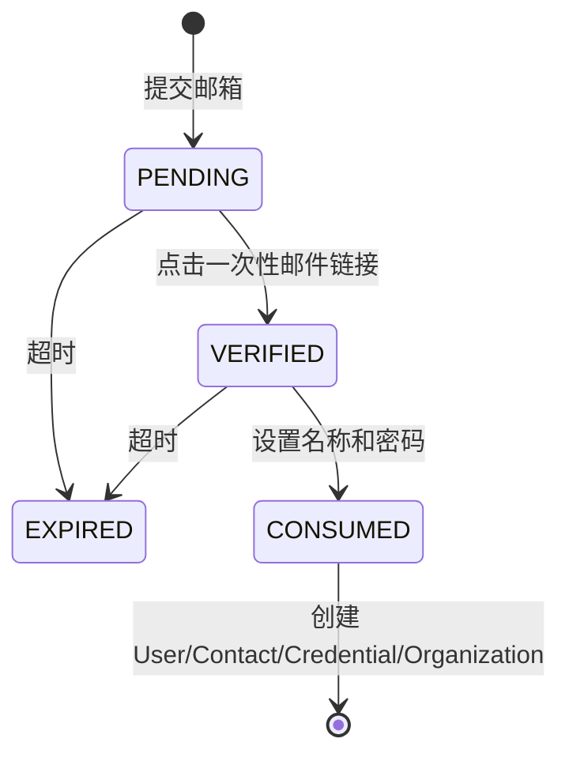

# 9. 掌握认证：用户是谁

> [返回教程首页](README.md)

## 9.1 认证和授权不要混在一起

- 认证 Authentication：这个请求代表哪个用户？
- 授权 Authorization：这个用户能否对这个租户/资源执行该动作？

本项目由 `IdentityService` 管认证，由 `AuthorizationService` 管授权。

## 9.2 邮箱注册状态机



实际流程：

1. `POST /api/auth/registrations/email`；
2. API 标准化邮箱，生成随机 Token，只保存 HMAC；
3. 同一事务写 `RegistrationIntent` 和 `OutboxEvent`；
4. Worker 把验证链接发到 Mailpit/SMTP；
5. 浏览器访问 Callback，Intent 变成 `VERIFIED`；
6. API 设置短期 `registration` HttpOnly Cookie；
7. 前端读取一次性的 registration CSRF Token；
8. `POST /registrations/complete`；
9. 同一事务消费 Intent，创建 User、Contact、Credential、Organization、OWNER Membership 和 AuditEvent；
10. 创建服务端 Session，并只把不透明 Secret 放进 Cookie。

## 9.3 密码为什么不直接 Hash 一下就结束

当前实现使用 Argon2id，并且：

- 限制同时最多 4 个密码计算，防止 CPU/内存被压垮；
- 未知账号也验证 Dummy Hash，降低计时枚举；
- 登录成功后检查 `needsRehash`，参数升级时自动更新；
- 注册/重置公共响应隐藏账号是否存在；
- 密码变更和重置会撤销现有 Session。

这些都比“把密码用 SHA-256 存起来”重要。通用哈希速度太快，不适合密码。

## 9.4 服务端 Session 模型

浏览器 Cookie 保存随机 `sessionSecret`；数据库只保存：

```text
HMAC(AUTH_SECRET, sessionSecret)
```

Session 同时有：

- 7 天绝对过期时间；
- 30 分钟空闲过期时间；
- 最多每 5 分钟刷新一次 `lastSeenAt`，避免每个请求都写库；
- 撤销时间和原因；
- User-Agent 摘要和 IP 前缀哈希；
- 绑定 Session 的 CSRF Secret Hash。

这比无状态 JWT Cookie 更容易实现即时登出、设备列表、单设备撤销和密码修改后全量撤销。

## 9.5 前端如何正确使用 Cookie Session

登录后浏览器不会拿到可读 Token。前端请求必须允许携带 Cookie：

```ts
const session = await fetch('http://localhost:3000/api/auth/session', {
  credentials: 'include',
}).then((response) => response.json());

await fetch(`http://localhost:3000/api/organizations/${organizationId}/projects`, {
  method: 'POST',
  credentials: 'include',
  headers: {
    'Content-Type': 'application/json',
    'X-CSRF-Token': session.csrfToken,
  },
  body: JSON.stringify({ name: 'My project' }),
});
```

写请求还必须带合法 `Origin`。浏览器会自动发送；用 curl/Supertest 测试时需要显式设置。

## 9.6 OIDC 登录

OIDC 流程使用 Authorization Code + PKCE，并校验或保护：

- Provider Key 和 Issuer；
- `state`；
- `nonce`；
- PKCE Code Verifier；
- 浏览器绑定 Cookie；
- 事务过期与一次性消费；
- 安全的相对 `returnTo`；
- Provider Subject 唯一关系。

OIDC Provider 的邮箱 Claim 不会自动把账号合并到同邮箱本地账号，这是为了避免不安全的隐式绑定。

## 9.7 微信网站扫码登录：相同入口，不同协议

微信开放平台网站扫码使用专用的 `WeChatOAuthService`，不能当成标准 OIDC 配置。它与 OIDC 共用：

```text
POST /api/auth/external/:provider/start
GET  /api/auth/external/:provider/callback
```

但两者的验证语义不同：

- OIDC 验证 ID Token、Issuer、Audience、Nonce 和 PKCE；
- 微信由服务端用 Code 换短期 Access Token，再读取 Profile；
- 持久身份使用 AppID 作用域 Issuer + `openid:<OpenID>`；
- UnionID 只做一致性检查，不机会式切换身份主键；
- State 与独立 Browser Binding 只以 HMAC 形式存入数据库；
- Callback 使用 Compare-and-set 保证 Transaction 只消费一次；
- 微信 Token 不进入浏览器、Session、数据库或日志；
- Nickname 只作为显示默认值，不能证明联系方式或触发账号合并；
- 最终仍创建本项目自己的不透明 Session。

完整的配置、前端接入、Callback 时序、数据库模型、Provider 响应边界、OpenID/UnionID 设计和攻击测试，单独拆在：

- [微信开放平台网站扫码登录深度教程](authentication/09-01-wechat-website-oauth.md)

## 9.8 四种 Cookie 及其用途

| Kind                   | Development 名称           | 用途                        | SameSite |
| ---------------------- | -------------------------- | --------------------------- | -------- |
| `session`              | `dev-session`              | 已登录用户 Session          | strict   |
| `registration`         | `dev-registration`         | 已验证但未完成的注册事务    | strict   |
| `password-reset`       | `dev-password-reset`       | 已验证的密码重置事务        | strict   |
| `external-transaction` | `dev-external-transaction` | OIDC/微信外部登录浏览器绑定 | lax      |

Staging/Production 使用 `__Host-` 前缀，并设置：

- `Secure`：只通过 HTTPS；
- `HttpOnly`：前端 JavaScript 无法读取；
- `Path=/`；
- 不设置 Domain；
- Session、注册和重置使用 `SameSite=Strict`；
- OIDC/微信 Callback 需要跨站顶层导航，因此外部登录临时 Cookie 使用 `Lax`。

Cookie Secret 不是 CSRF Token。Session Cookie 由浏览器自动发送且不可被 JavaScript 读取；CSRF Token 由 `/auth/session` 返回，前端放到自定义 Header 中。

## 9.9 手工完成一次邮箱注册

本实验让你看见每个中间状态。

### 步骤 1：申请注册

```bash
curl -i -c cookies.txt -b cookies.txt \
  -H 'Origin: http://localhost:5173' \
  -H 'Content-Type: application/json' \
  -d '{"email":"learner@example.test"}' \
  http://localhost:3000/api/auth/registrations/email
```

预期 202，但 Cookie Jar 此时还没有登录 Session。数据库会出现：

- `registration_intents.status = PENDING`；
- `outbox_events.type = email.send`。

### 步骤 2：点击验证链接

打开 `http://localhost:8025`，进入最新邮件，复制完整验证 URL。不要使用 `curl -L` 跟随到尚未启动的前端；只请求 Callback：

```bash
curl -i -c cookies.txt -b cookies.txt \
  'http://localhost:3000/api/auth/registrations/email/callback?token=<邮件中的 token>'
```

预期 302，响应含 `Set-Cookie: dev-registration=...`。Intent 变成 `VERIFIED`。

### 步骤 3：获取临时 CSRF Token

```bash
curl -sS -c cookies.txt -b cookies.txt \
  http://localhost:3000/api/auth/registration-session
```

复制 JSON 中的 `csrfToken`。

### 步骤 4：完成注册

```bash
curl -i -c cookies.txt -b cookies.txt \
  -H 'Origin: http://localhost:5173' \
  -H 'X-CSRF-Token: <上一步 csrfToken>' \
  -H 'Content-Type: application/json' \
  -d '{"displayName":"Learner","password":"correct horse battery staple"}' \
  http://localhost:3000/api/auth/registrations/complete
```

预期 201，并设置 `dev-session`、清除 `dev-registration`。同一数据库事务内出现：

```text
User
+ verified UserContact
+ PasswordCredential
+ Organization
+ OWNER Membership
+ AuditEvent(auth.registration.completed)
```

### 步骤 5：读取当前 Session

```bash
curl -sS -c cookies.txt -b cookies.txt \
  http://localhost:3000/api/auth/session
```

响应中会有 User、Organization 列表和正式 Session CSRF Token。这个 Token 用于之后所有 Cookie 认证写请求。

### 步骤 6：验证安全拒绝

删掉 Origin 再登录，预期 403：

```bash
curl -i \
  -H 'Content-Type: application/json' \
  -d '{"identifier":"learner@example.test","password":"correct horse battery staple"}' \
  http://localhost:3000/api/auth/login/password
```

再把 Origin 改成 `https://evil.example`，仍应是 403。这些失败是正确的安全行为，不是需要“修掉”的 Bug。

## 9.10 Session 校验的逐步推导

假设浏览器 Cookie 是随机值 `S`：

```text
浏览器持有：S
数据库持有：HMAC(AUTH_SECRET, S)
```

每次请求：

1. 从 Cookie 读出 `S`；
2. 在服务端计算 Hash；
3. 查找 `secretHash` 相等、未撤销、绝对未过期、空闲未过期的 Session；
4. Include User 和 Membership；
5. User 必须为 ACTIVE；
6. 构造 ActorContext。

如果数据库泄漏，攻击者拿到 Hash 也不能直接当 Cookie 使用。如果 `AUTH_SECRET` 和数据库同时泄漏，保护会减弱，所以 Secret Manager、轮换和数据库安全都不可省略。

## 9.11 为什么写请求同时检查 Origin 和 CSRF

CSRF Token 绑定 Session，攻击站点通常无法读取；Origin 证明请求来自允许的前端 Origin。两者一起使用是纵深防御：

- 缺 Origin：403；
- Origin 格式非法：403；
- Origin 不等于配置的 Web Origin：403；
- CSRF 缺失或错误：403；
- Token 来自另一个 Session：403。

不要为了解决本地联调随意写 `origin: true` 或关闭 CSRF。正确做法是让 `.env` 中 `WEB_APP_ORIGIN`、`API_CORS_ORIGINS` 与前端真实 Origin 完全一致，并让 fetch 携带 Credentials。

## 9.12 Session 与 JWT：不要把 JWT 当成默认答案

前端研发常见的直觉是“登录后端返回 JWT，前端存起来”。JWT 只是一种签名 Token 格式，不自动解决安全和 Session 生命周期。

| 问题             | 服务端 Session          | 无状态 JWT Access Token                           |
| ---------------- | ----------------------- | ------------------------------------------------- |
| 每次请求查 Store | 通常需要                | 签名验证可不查 Store                              |
| 即时撤销单设备   | 直接更新 Session        | 通常要等过期或增加 Denylist                       |
| 密码修改后全撤销 | 更新 Session Row        | 需要版本号/Denylist/短过期                        |
| 查看设备列表     | 天然有记录              | 需额外记录，已不完全无状态                        |
| Token 内容泄漏   | Cookie 是不透明随机值   | Payload 可被读取，不能放 Secret                   |
| 浏览器存储       | HttpOnly Cookie         | 若交给 JS 存储，XSS 暴露面增加                    |
| CSRF             | Cookie 自动携带，需要防 | Authorization Header 通常不自动携带，但仍要防 XSS |
| 横向扩展         | 共享 PostgreSQL/Redis   | 验签简单，但权限变化与撤销复杂                    |

本项目浏览器优先、需要设备可见和撤销，所以 PostgreSQL Session 是有意识的选择。

JWT 合理场景包括短期服务间声明、OAuth Access Token、离线验证等，但仍要定义：Issuer、Audience、Key Rotation、过期、撤销、权限变化、重放和存储方式。JWT 不是“加密”，默认只是签名，Payload 不保密。

## 9.13 CORS、SameSite、CSRF 分别解决什么

这三个概念常被混在一起：

| 机制            | 主要解决                                                 | 不能替代什么                         |
| --------------- | -------------------------------------------------------- | ------------------------------------ |
| CORS            | 浏览器是否允许某 Origin 的 JS 读取/发起特定跨域请求      | 不是认证；非浏览器客户端不受它约束   |
| SameSite Cookie | 限制跨站场景自动携带 Cookie                              | 不能覆盖所有浏览器/导航/产品跨站需求 |
| CSRF Token      | 证明写请求来自能读取应用响应的合法上下文，并绑定 Session | 不能替代 XSS 防护或权限检查          |
| Origin Check    | 确认写请求来源 Origin 在 Allowlist                       | 不能证明用户有业务权限               |

重要结论：

- curl、服务端脚本和攻击者自己的客户端不受浏览器 CORS 阻挡；
- `Access-Control-Allow-Origin: *` 不是“开放后端权限”，但和 Credentials 配置错误会造成风险；
- 即使 CSRF 正确，Viewer 仍不能创建 Project；
- 即使权限正确，来自 Evil Origin 的 Cookie 写请求仍应拒绝；
- XSS 能以合法页面身份发请求，所以还需要 CSP、输出转义、依赖安全和 HttpOnly Cookie。

## 9.14 OAuth 与 OIDC 的区别

- OAuth 2.x 主要回答“某客户端被授权访问什么资源”；
- OIDC 在 OAuth 基础上增加身份层，回答“这个用户是谁”，包含 ID Token、Issuer、Subject、Nonce 等语义。

“使用 Google 登录”通常应按 OIDC Provider 的标准流程验证身份，而不是拿一个随意的 Profile JSON 就信任 Email。

本项目使用 Authorization Code + PKCE：

1. Browser 向 API 申请 Authorization URL；
2. API 生成 State、Nonce、PKCE Verifier 和浏览器绑定；
3. Browser 去 Provider 登录；
4. Provider Redirect 回 API Callback；
5. API 验证 State/Binding，用 Code + Verifier 换 Token；
6. 验证 Issuer/Audience/Nonce/Subject；
7. 在事务中消费 OIDC Transaction；
8. 查找/创建 ExternalIdentity；
9. 最终仍签发本项目自己的 Session。

Provider Token 不进入浏览器业务 JavaScript，也不直接成为本项目 Session。

微信网站扫码登录属于另一类 OAuth Profile Flow：API 用 Code 换取短期 Access Token，再获取 Profile，并执行 Provider 特定的 OpenID/UnionID 校验。它能安全地用于登录，不表示微信突然成为 OIDC Provider；协议名称必须反映实际验证语义。

## 9.15 密码与 Token 的 Hash 目的不同

密码熵低、用户可记忆，攻击者拿到数据库后可以离线猜测，所以使用故意昂贵、带 Salt 的 Argon2id。

Session/注册 Token 是服务端生成的 256-bit 随机值，本身高熵，使用带服务端 Secret 的 HMAC 做快速查找即可。两者不要混用：

- 用快速 SHA/HMAC 存用户密码，容易被暴力破解；
- 对每次 Session 请求跑 Argon2，成本过高且没必要；
- HMAC Secret 需要 Secret Manager 和轮换策略；
- 比较安全 Token 时使用常量时间比较，降低计时侧信道。

## 9.16 认证系统为什么使用状态机

注册、密码重置、OIDC 和微信 OAuth Transaction 都不是一个 Boolean，而是有明确状态和时间窗口的流程：

```text
开始 → 已发送 → 已验证 → 已消费
          ↘ 过期/失败/锁定
```

状态机能回答：

- 当前允许哪个动作；
- Token 是否已使用；
- 重复 Callback 会怎样；
- 超时后如何处理；
- 并发完成两次时谁成功；
- 如何审计和清理。

只在前端保存一个 `isVerified=true` 或只靠 URL 参数，无法成为权威安全状态。状态必须落在服务端，并通过条件 Update 原子推进。

---
