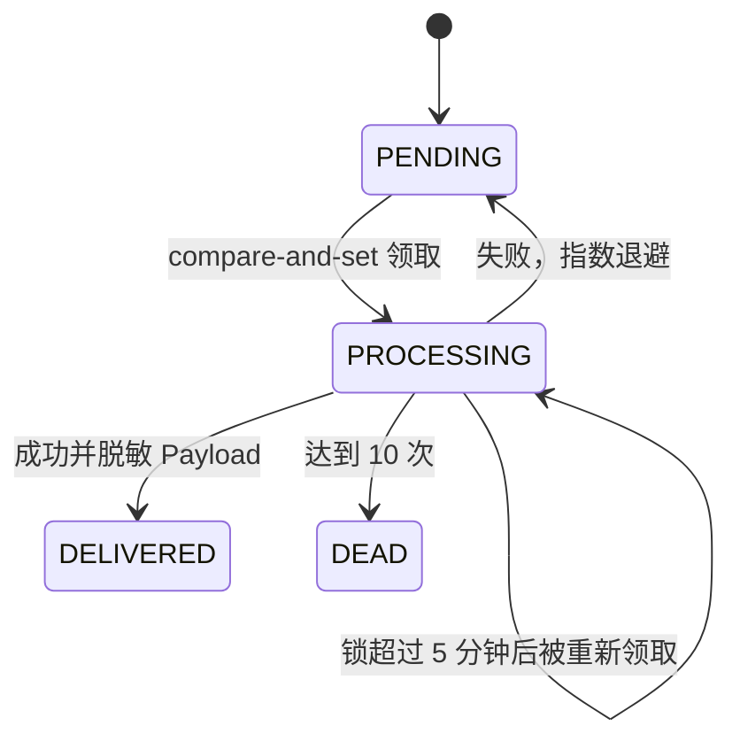
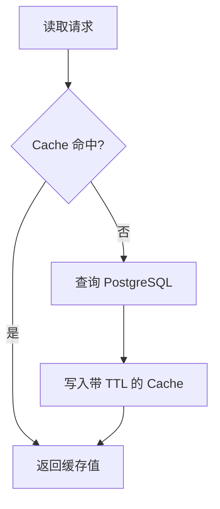

# 13. 异步任务与事务 Outbox

> [返回教程首页](README.md)

如果你第一次看到 Transaction、Outbox、Worker、事实源或幂等，先读[后端核心词汇](mindset/02-05-backend-vocabulary.md)。本章会在这些概念之上解释当前实现细节。

## 13.0 一句话理解 Outbox

Outbox 就是 PostgreSQL 中的一张“可靠待办表”：业务事务提交时，把“之后必须投递的邮件、短信或站内通知”也写进去；独立 Worker 稍后领取并执行。它解决的不是“异步更快”，而是“数据库已成功、进程却在调用外部服务前崩溃时，副作用不能丢”。

## 13.1 为什么不能在请求里直接发邮件

下面的代码有两个问题：

```ts
await database.user.create(...);
await mailer.send(...);
```

- 用户已创建、邮件失败：数据库提交了，但副作用丢失；
- 邮件发出、随后数据库回滚：用户收到一个无效消息。

本项目使用事务 Outbox：

```ts
await database.$transaction(async (tx) => {
  await tx.registrationIntent.upsert(...);
  await tx.outboxEvent.create({
    data: {
      type: 'email.send',
      payload: { to, subject, text },
    },
  });
});
```

业务状态与“需要投递”的事实一起提交。Worker 稍后可靠地处理。

## 13.2 Worker 状态机



当前 Worker：

- 每秒轮询；
- 每轮最多处理 20 条；
- 用 `updateMany` 做 Compare-and-set，减少多 Worker 重复领取；
- 5 分钟后恢复陈旧锁；
- 最多尝试 10 次；
- 使用有上限的指数退避，最多 1 小时；
- 成功或彻底失败后脱敏 Payload；
- 不把 Provider 的敏感错误原文写入数据库；
- 停机时等待当前轮询结束。

## 13.3 新增一种 Outbox Event

当前项目已经实现 `notification.create`：Organization 新成员在同一事务写入 Membership、AuditEvent 和 Outbox；Worker 用共享 Zod Contract 再次校验 Payload，以 `(userId, dedupeKey)` 唯一约束幂等写入 `Notification`，再将 Outbox 标记为 DELIVERED 并脱敏 Payload。完整收件箱与 SSE 语义见[通知专题](notifications/README.md)。

假设 Task 创建后要发通知：

1. 定义稳定类型，例如 `task.created.notify`；
2. 在业务事务内创建 Outbox；
3. 在 Worker 中为 Payload 建 Zod Schema；
4. 在 `deliver()` 增加处理分支；
5. 让处理幂等；
6. 测试成功、重试、DEAD、重复执行和敏感数据脱敏。

```ts
const taskNotificationSchema = z.object({
  taskId: z.string().uuid(),
  organizationId: z.string().uuid(),
  recipientUserId: z.string().uuid(),
});
```

Worker 不能把 Payload 当成可信数据。Event 可能来自旧版本、人工重放或错误写入，边界处仍需校验。

## 13.4 “至少一次”意味着必须幂等

Worker 可能在第三方已经成功、但写 `DELIVERED` 前崩溃，随后再次投递。邮件使用稳定 `messageId` 有助于 Provider 去重，但不能假设所有 Provider 都保证 exactly-once。

对支付、Webhook、资源创建等副作用，需要业务幂等键、唯一约束或 Inbox/Deduplication 表。

## 13.5 何时引入 BullMQ

当前 PostgreSQL Poller 足以学习并支撑小规模可靠投递。出现以下真实需求时，再把通用任务接到 BullMQ：

- 大量延迟任务和独立并发控制；
- 队列暂停、优先级、可视化管理；
- 多类任务需要不同重试/超时；
- PostgreSQL Polling 已产生可测量压力。

关键副作用仍应能从 PostgreSQL Outbox 恢复，不要让 Redis 成为唯一事实来源。

## 13.6 逐行理解 Event 领取算法

Worker 先找候选：

```text
status=PENDING 且 availableAt <= now
或
status=PROCESSING 且 lockedAt <= staleBefore
```

随后不是直接相信 `findFirst()`，而是执行带相同条件的 `updateMany()`：

```text
UPDATE ...
WHERE id=candidateId AND 仍然可领取
SET status=PROCESSING, lockedAt=now, attempts=attempts+1
```

只有 `count === 1` 才认为领取成功。如果两个 Worker 同时看到同一 Candidate，通常只有一个 Compare-and-set 更新成功，另一个得到 0 并继续下一轮。

这仍不能保证只执行一次：Worker 在 Provider 成功后、标记 DELIVERED 前崩溃，陈旧锁恢复后会再执行。因此领取原子性和业务幂等是两个不同问题。

## 13.7 如何计算当前重试时间

代码使用：

```ts
Math.min(60 * 60 * 1_000, 2 ** event.attempts * 1_000);
```

大致结果：

| attempts |                下次延迟 |
| -------: | ----------------------: |
|        1 |                    2 秒 |
|        2 |                    4 秒 |
|        3 |                    8 秒 |
|        5 |                   32 秒 |
|       10 | 达到最大尝试，进入 DEAD |

生产系统通常还要加随机 Jitter，避免 Provider 恢复时大量任务同一秒重试。还要区分：

- 429、5xx、网络超时：可能重试；
- Payload Schema 错误、永久无效地址：通常无需反复重试；
- Provider 明确的 Retry-After：应尊重其提示。

当前 Worker 把所有失败统一处理，是一个适合继续演进的教学基线。

## 13.8 一个完整 Event 设计清单

新增 Event 前写清：

```text
type: task.reminder.requested
version: 1
producer: TasksService
consumer: Worker
payload: 最小 ID，不包含 Secret
deduplication key: taskId + reminderAt
timeout: 10s
retryable errors: timeout/429/5xx
max attempts: 10
dead handling: 告警 + 审计重放
retention: delivered 30d / dead 90d（示例，需产品决定）
```

Payload 中优先放 ID，由 Worker 在执行时重新读取最新事实和权限/状态。不要复制一大份随时间失真的数据库实体，也不要放明文 Token，除非投递本身确实需要且已有严格保留/脱敏设计。

## 13.9 Cache 和 Queue 虽然都用 Redis，但语义完全不同

本项目准备了两个 Redis：

```text
redis-cache: allkeys-lru，可淘汰
redis-queue: appendonly + noeviction，不允许为省内存删除 Job
```

Cache 的正确性要求是“没有它系统仍然正确，只是更慢”；Queue 的要求是“等待执行的操作不能被当成冷 Cache 随意删掉”。把它们共用一个实例，会让容量和故障策略冲突。

| 维度     | Cache                      | Queue                        |
| -------- | -------------------------- | ---------------------------- |
| 目的     | 加速重复读取               | 调度/重试后台工作            |
| 丢失后   | 应回源数据库并继续正确运行 | 可能丢业务操作，需要恢复策略 |
| TTL      | 通常必须有                 | 由 Job 生命周期决定          |
| 淘汰     | 可以                       | 通常不允许                   |
| 数据来源 | PostgreSQL 等事实源        | Producer/Outbox              |
| 重建     | 回源即可                   | 可能从 Outbox 重放           |

## 13.10 Cache-aside 的标准读取流程



伪代码：

```ts
const key = `prod:${organizationId}:project:${projectId}`;
const cached = await cache.get(key);
if (cached) return projectCacheSchema.parse(JSON.parse(cached));

const project = await database.project.findFirst({
  where: { id: projectId, organizationId },
});
if (project) await cache.set(key, JSON.stringify(project), { EX: 60 });
return project;
```

注意：

- Key 必须包含 Environment 和 Tenant；
- Cache Value 也来自外部边界，反序列化后可校验版本/Schema；
- TTL 有上限，并可加 Jitter 防止同时过期；
- Redis 故障应回源，而不是让所有 API 500；
- 负缓存要短 TTL，避免刚创建资源仍被缓存为不存在。

## 13.11 写入后最难的是失效

创建/更新后常见策略：

```text
先提交 PostgreSQL
→ 再删除/更新相关 Cache Key
```

不能先删 Cache 再提交数据库，因为在事务完成前其他请求可能回源读到旧数据并重新写回 Cache。

即使“提交后删除”也可能在 DB Commit 后、Cache Delete 前崩溃，短暂保留旧值。因此需要根据业务选择：

- 短 TTL 接受短暂不一致；
- Outbox 驱动可靠失效；
- Versioned Key；
- 对强一致读取绕过 Cache；
- 写后读取直接返回写入结果。

这就是常说的“缓存失效是难题”。它不是加一个 `get/set` 就结束。

## 13.12 Cache Stampede、穿透与热 Key

- **Stampede/击穿**：热门 Key 到期，成百请求同时回源；可用单飞锁、早刷新、TTL Jitter；
- **穿透**：攻击者查询大量不存在 ID，每次都回源；可做短期负缓存和限流，但仍要授权；
- **热 Key**：一个 Key 集中在单个 Redis 分片；需要局部缓存、拆分或业务调整；
- **大 Key**：一次取数/序列化阻塞和占用网络；应限制大小；
- **缓存污染**：低价值查询挤掉热点；需要命名空间、容量和策略。

不要缓存无限列表，也不要用未经校验的 Query 直接拼 Key，否则会产生高基数和内存攻击面。

## 13.13 权限为什么不能只信 Cache

假设管理员把 User 从 Organization 移除，但 Membership Cache 还有效 5 分钟。如果 API 只看 Cache，用户仍可访问敏感数据。

选择包括：

- 高风险权限始终查事实 Store；
- 权限 Cache 使用很短 TTL；
- Membership 修改后可靠失效；
- Session/Permission Version 改变后旧缓存 Key 自动失效；
- 高风险动作再次进行权威校验。

性能优化不能改变安全语义。缓存丢失、陈旧或被清空时，系统必须退化为“更慢但正确”。

---
