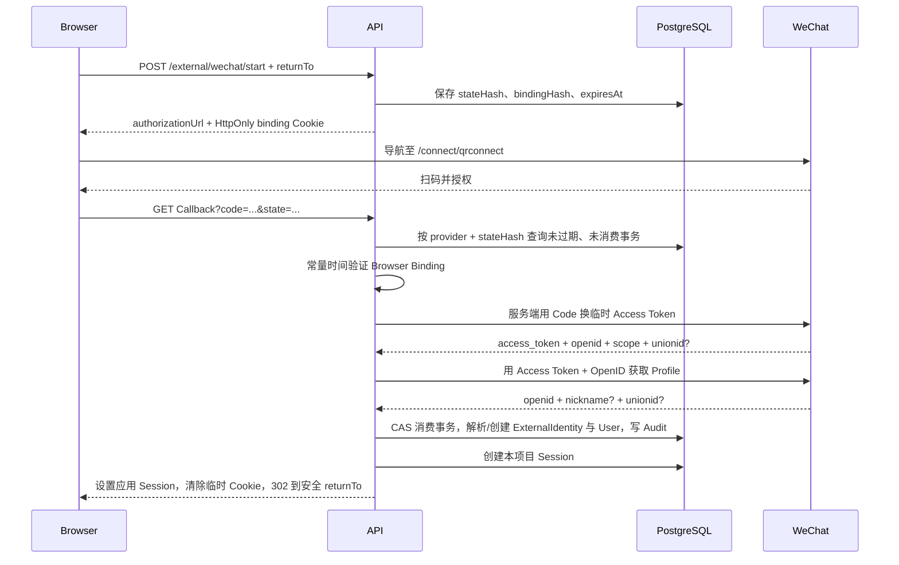

# 微信开放平台网站扫码登录深度教程

> [返回认证专题目录](README.md) · [返回认证主章](../09-authentication.md) · [返回教程首页](../README.md)

## 1. 为什么不能把微信配置成 OIDC

微信开放平台网站应用使用一种类似 OAuth Authorization Code 的流程，但它不是 OpenID Connect：

| 能力       | 标准 OIDC                        | 微信网站扫码 OAuth                 |
| ---------- | -------------------------------- | ---------------------------------- |
| Discovery  | 有标准 Discovery Document        | 没有 OIDC Discovery                |
| 身份证明   | 验证 ID Token                    | 用 Access Token 请求用户 Profile   |
| 身份 Claim | Issuer、Audience、Subject、Nonce | AppID 作用域 OpenID，可选 UnionID  |
| PKCE/Nonce | 当前实现使用并验证               | 当前微信网站流程没有等价 OIDC 语义 |
| Profile    | ID Token/UserInfo 标准 Claim     | 微信特定 JSON Response             |
| 错误格式   | OIDC/OAuth 标准错误              | `errcode`、`errmsg` 等微信格式     |

如果让微信复用 `OidcService`，就会出现两种坏结果：

1. 为了兼容微信而把 OIDC 的 ID Token、Issuer、Audience、Nonce 校验变成可选；
2. 代码名字仍叫 OIDC，但实际只信任一段没有经过 OIDC 验证的 Profile JSON。

本项目采用更诚实的边界：

```text
IdentityController
  ├─ OidcService          # 标准 OIDC Authorization Code + PKCE
  └─ WeChatOAuthService   # 微信专用 Code Exchange + Profile Adapter
```

Controller 复用 Start/Callback HTTP 契约和最终 Session 创建；每个 Adapter 分别维护自己的协议不变量。好的抽象不是“尽量只有一个类”，而是共享真正相同的部分，保留关键差异。

## 2. 配置是全有或全无

微信登录需要：

```dotenv
WECHAT_PROVIDER_KEY=wechat
WECHAT_APP_ID=<微信开放平台网站应用 AppID>
WECHAT_APP_SECRET=<从 Secret Manager 注入>
```

运行时 Schema 会拒绝：

- 只配置其中一部分；
- `WECHAT_PROVIDER_KEY` 与 `OIDC_PROVIDER_KEY` 相同；
- 空字符串被误当成已经启用的配置。

为什么 Provider Key 不能冲突？共享 Endpoint 使用 `:provider` 选择 Adapter：

```text
/api/auth/external/wechat/start
/api/auth/external/wechat/callback
```

如果两个 Adapter 声称支持同一个 Key，同一路径会产生歧义。配置校验把这类错误提前到进程启动，而不是等第一个用户扫码时才暴露。

还需要在微信开放平台审批网站应用与 Callback Domain，并登记：

```text
<API_PUBLIC_ORIGIN>/api/auth/external/<WECHAT_PROVIDER_KEY>/callback
```

例如：

```text
https://api.example.com/api/auth/external/wechat/callback
```

生产 `API_PUBLIC_ORIGIN` 必须是外部用户和微信真正能够访问的 HTTPS Origin，不能使用容器内部 Hostname。

## 3. 前端如何开始扫码登录

前端先向 BFF 请求 Authorization URL，而不是自己拼接微信 URL：

```ts
const result = await fetch('http://localhost:3000/api/auth/external/wechat/start', {
  method: 'POST',
  credentials: 'include',
  headers: {
    'Content-Type': 'application/json',
  },
  body: JSON.stringify({ returnTo: '/projects' }),
}).then(async (response) => {
  if (!response.ok) throw await response.json();
  return response.json() as Promise<{ authorizationUrl: string }>;
});

window.location.assign(result.authorizationUrl);
```

浏览器会自动添加正常的 `Origin` Header；Start Endpoint 会：

1. 校验 Origin；
2. 解析并限制 `returnTo` 长度；
3. 用 `safeWebReturnUrl` 阻止 Open Redirect；
4. 根据 Provider Key 选择微信或 OIDC Adapter；
5. 创建十分钟的一次性服务端 Transaction；
6. 设置短期 `external-transaction` HttpOnly Cookie；
7. 返回服务端生成的 Authorization URL。

前端只负责导航。它看不到 AppSecret，不负责换 Code，也不应该接触微信 Access Token。

## 4. State 与 Browser Binding 为什么都需要

微信 Start 生成两个相互独立的 256-bit 随机值：

```text
state    -> 放进微信 Authorization URL
binding  -> 放进 HttpOnly external-transaction Cookie
```

数据库只保存：

```text
HMAC(AUTH_SECRET, state)
HMAC(AUTH_SECRET, binding)
```

对应模型是 `OAuthProfileTransaction`：

```text
providerKey
stateHash
browserBindingHash
returnTo
expiresAt
consumedAt
createdAt
```

State 把 Callback 关联到后端发起的登录事务；Browser Binding 进一步证明 Callback 回到了发起登录的浏览器。攻击者即使拿到自己流程中的 Code/State，也不能让受害者浏览器无条件登录到攻击者账号，这类问题通常称为 Login CSRF 或 Session Swapping。

为什么数据库保存 HMAC 而不是原文？数据库泄漏时，攻击者不能直接把 `stateHash` 或 `browserBindingHash` 当成浏览器凭据重放。随机值虽然熵很高，减少静态泄漏后的直接可用性仍然是合理的纵深防御。

## 5. 完整 Callback 时序



最终浏览器拿到的是本项目自己的不透明 Session Cookie，不是微信 Token。之后的授权仍由本项目 `User`、`Membership` 和 Policy 决定。

## 6. Provider 是不可信网络边界

即使请求目标是微信官方 Endpoint，返回内容仍属于外部输入。当前实现包含：

- Token 与 Profile 只请求固定 HTTPS Host；
- `redirect: 'error'`，不跟随 Provider Redirect；
- 每次请求十秒 Timeout；
- 声明和实际响应体都限制在 64 KiB；
- JSON 解析失败返回稳定的 503；
- Provider `errcode` 被显式识别；
- Token/Profile 使用 Zod Schema 校验类型和长度；
- Scope 必须包含 `snsapi_login`；
- Token OpenID 与 Profile OpenID 必须相同；
- 两边都有 UnionID 时必须相同。

为什么限制响应大小？如果外部服务、代理或被劫持链路返回无限 Body，简单的 `response.json()` 可能在 JSON 解析前耗尽应用内存。为什么拒绝 Redirect？固定 URL 如果自动跟随 Redirect，就可能把请求、查询参数甚至凭据带到非预期 Host，并扩大 SSRF/凭据泄漏面。

注意 AppSecret 被用于服务端 Token Exchange，相关 URL、异常与 Provider Payload 不能写入日志。生产还应监控 Provider 错误率和延迟，但指标 Label 不能包含 Code、Token、OpenID 或完整 URL。

## 7. OpenID 与 UnionID 为什么不能随意互换

微信身份标识具有作用域：

- **OpenID**：在一个具体应用内稳定；
- **UnionID**：多个应用绑定到同一微信开放平台账号后可能共享，但可能暂时不存在。

当前持久身份键是：

```text
issuer          = https://open.weixin.qq.com/<AppID>
providerSubject = openid:<OpenID>
```

数据库使用 `(issuer, providerSubject)` 唯一约束定位 `ExternalIdentity`。

不要写成：

```ts
const subject = unionid ?? openid;
```

假设首次登录没有 UnionID，保存了 OpenID；几个月后应用绑定开放平台账号，开始返回 UnionID。同一个人会突然使用另一个 Subject，可能创建重复产品账号。更危险的是多个 AppID 和错误作用域配置下发生错误合并。

所以当前策略是：

- 永远使用 AppID 作用域 OpenID 作为登录主键；
- Token/Profile 都返回 UnionID 时只检查二者一致；
- 不因为后来出现 UnionID 而原地切换主键；
- 跨应用统一需要显式的 Platform Account/Identity Alias 模型和冲突恢复策略。

## 8. 已有用户与新用户路径

在一个数据库事务中，系统首先用条件更新消费 Transaction：

```ts
const consumed = await tx.oAuthProfileTransaction.updateMany({
  where: { id: transaction.id, consumedAt: null },
  data: { consumedAt: new Date() },
});

if (consumed.count !== 1) {
  throw new UnauthorizedException('already consumed');
}
```

这是一种 Compare-and-set。两个相同 Callback 并发到达时，只允许一个把 `consumedAt` 从 NULL 改成时间，另一个必须失败。

如果 `ExternalIdentity` 已存在：

1. 加载对应 User；
2. Disabled User 拒绝登录；
3. 更新 `lastLoginAt`；
4. 写 `auth.wechat.login_succeeded` AuditEvent。

如果身份首次出现：

1. 清洗 Nickname 中的控制字符并截断到 100 字符；
2. 创建 User；
3. 创建默认 Organization 与 OWNER Membership；
4. 创建 ExternalIdentity；
5. 写成功 AuditEvent。

微信 Nickname 只是显示默认值，不是唯一身份、不具有权限含义，也不能证明邮箱或手机号。即使某个本地账号显示名相同，也绝不自动合并。

## 9. 为什么不保存微信 Access Token

当前需求只有“确认登录身份”。Access Token 和可选 Refresh Token 在 Callback 内存中仅用于读取 Profile，随后立即丢弃。测试还会扫描数据库写入参数，确认没有 Token 被保存。

如果未来需要代表用户持续调用微信 API，应创建独立的加密授权模型，例如：

```text
ExternalConnection
  encryptedAccessToken
  encryptedRefreshToken
  scopes
  expiresAt
  revokedAt
  providerAccount
  audit metadata
```

它需要自己的刷新、撤销、轮换和泄漏响应。把长期 API Token 塞进 `ExternalIdentity` 会混淆“这个用户是谁”和“产品还能代表用户做什么”。

## 10. 当前支持范围

本 Adapter 只支持微信开放平台**网站应用的桌面浏览器扫码登录**。以下能力不是换一个 Scope 就能复用：

- 公众号网页授权；
- 小程序 `wx.login`；
- 原生移动 SDK 登录；
- 多个 AppID 的跨应用账号统一；
- 已登录用户主动绑定/解绑微信；
- 持续访问微信 API。

这些场景的入口、凭据、标识作用域、Callback 和风险不同，应该分别写 Adapter、数据模型、ADR 与测试。

没有审核通过的网站应用时，不应伪造生产配置绕过 Provider。日常开发使用单元测试 Mock `fetch`；发布验证需要专用测试账号、审核域名和 Runbook。

## 11. 怎样验证实现，而不是只验证“能扫码”

### 11.1 当前已经具备的自动化证据

`wechat-oauth.service.spec.ts` 当前验证了四条关键路径：

1. 未配置或 Provider Key 错误时，在创建 Transaction 前返回不可用；
2. Start 生成微信官方 QR Connect URL、`snsapi_login` Scope、Callback 和数据库 Transaction；
3. Callback 在服务端完成 Token/Profile 请求，并用 AppID 作用域 OpenID 找到已有用户；
4. Browser Binding 不匹配时，在联系微信前拒绝。

现有测试还检查数据库写入参数中没有出现模拟的 Access Token/Refresh Token。配置测试证明微信三项配置必须完整，且 Provider Key 不能与 OIDC 冲突；Cookie 测试证明只有外部登录临时 Cookie 使用 `SameSite=Lax`，正式 Session 仍是 `Strict`。

这些测试很重要，但不能得出“生产微信登录已经完全验证”的结论。真实 Provider 集成还涉及审核域名、TLS、微信账号状态、网络出口、Provider 限流和真实错误格式。

### 11.2 仍应补齐的拒绝路径

建议继续增加：

| 场景                      | 预期             | 额外断言                     |
| ------------------------- | ---------------- | ---------------------------- |
| 缺少 Code/State/Cookie    | 401              | 不请求 Provider              |
| Transaction 已过期        | 401              | 不请求 Provider、不写用户    |
| 相同 Callback 并发两次    | 只有一次成功     | 只创建一个 Session/Audit     |
| Provider Redirect         | 503              | 不跟随到第二个 Host          |
| 超时、非 2xx、非 JSON     | 503              | 错误不泄漏 Payload/Secret    |
| Body 超过 64 KiB          | 503              | 停止读取并取消 Reader        |
| 缺 `snsapi_login` Scope   | 401              | Transaction 不产生身份       |
| Token/Profile OpenID 不同 | 401              | 不创建/更新 ExternalIdentity |
| 两个 UnionID 不同         | 401              | 不进行账号合并               |
| Existing User 为 DISABLED | 401              | 不更新成功登录时间           |
| Nickname 含控制字符       | 成功但清洗显示名 | 不影响身份键和权限           |
| 恶意 `returnTo`           | Start 阶段拒绝   | 不创建 Transaction           |

拒绝测试不能只断言 HTTP 状态码，还应验证数据库没有残留 User、Organization、Membership、ExternalIdentity、Session 和成功 Audit。

### 11.3 集成测试为什么需要可控 Provider

单元测试直接 Mock `fetch` 很快，但 Controller → Cookie → Callback → Session 的完整链路还需要 E2E。不要让普通 CI 依赖微信公网和真实扫码，可以抽象一个仅在测试环境注入的 Provider HTTP Port，或使用本地 Mock Server：

```text
Nest Controller
  -> WeChatOAuthService
       -> ProviderHttpPort
            production: fixed WeChat HTTPS fetch
            test: local deterministic mock
```

测试版本仍需模拟：响应流、Content-Length、Redirect、Timeout、错误码和超大 Body，不能只返回一个永远成功的对象，否则真正危险的网络边界仍没有覆盖。

### 11.4 发布环境 Smoke Test

真实发布验证至少记录：

1. 微信开放平台应用和 Callback Domain 已审核；
2. Secret 由部署平台注入，容器镜像与日志中不存在；
3. Start 返回的 AppID、Callback、Scope 正确；
4. 测试账号扫码后只创建一个 ExternalIdentity；
5. 第二次登录复用同一个 User，并更新 `lastLoginAt`；
6. Session Cookie、跳转目标和退出流程正确；
7. Provider 拒绝/超时时用户得到可理解但不泄密的错误；
8. 指标能区分 Start、Callback、Provider Error、Timeout，但没有高基数身份 Label；
9. 有关闭微信入口、轮换 AppSecret 和 Provider 故障降级的 Runbook。

“扫码成功一次”只验证 Happy Path。生产验收必须同时证明身份稳定、拒绝路径无副作用、Secret 不泄漏、故障可观测且功能可以安全关闭。

---

[返回认证主章](../09-authentication.md) · [返回教程首页](../README.md)
