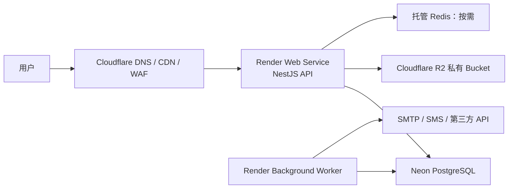
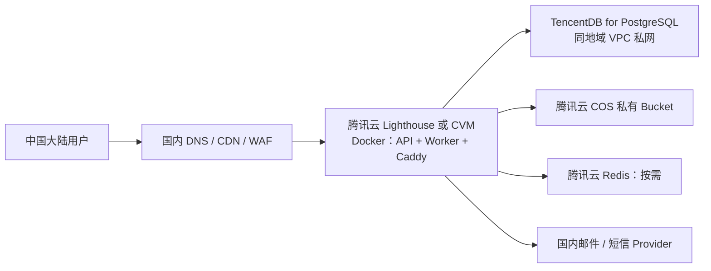

# 初创项目的低运维生产方案：大陆与海外

> [返回教程首页](../README.md)

当前项目已具备 Docker 化 API、独立 Worker、PostgreSQL、私有对象存储和健康检查。生产不应把本地 Compose 原样搬上云，而应遵循：**应用可容器化自管；数据库、对象存储、备份和 TLS 优先托管。**

## 1. 通用架构原则

| 组件                | 起步建议              | 原因                                     |
| ------------------- | --------------------- | ---------------------------------------- |
| NestJS API          | PaaS 或 VM 上的容器   | 无状态，能回滚和扩容                     |
| Worker              | 独立常驻容器          | 不与 API 抢资源，可单独重启/扩容         |
| PostgreSQL          | 托管服务              | 不把备份、磁盘、PITR、复制和恢复压给研发 |
| 头像/Object Storage | 托管 S3 兼容存储      | 不把 Blob 放进数据库或 VM 本地磁盘       |
| Redis               | 实际用到缓存/队列才开 | 当前可靠异步路径是 PostgreSQL Outbox     |
| Kubernetes          | 暂不上                | 没有规模证据时只会增加复杂度             |

至少隔离 `staging` 和 `production` 的 Database、Bucket、Secret 和域名。Profile 头像是个人数据；共享 Bucket/密钥会把测试误操作升级为生产事故。

## 2. 海外/全球用户：PaaS 优先



### 2.1 推荐组合

- **API + Worker**：Render Web Service 与 Background Worker，均直接从本项目 Dockerfile 构建；Worker 命令为 `node dist/apps/worker/src/main.js`。Render 的 Background Worker 不接收入站请求，适合 Outbox、媒体处理与第三方 API。[Render 服务类型](https://render.com/docs/service-types) [Background Worker](https://render.com/docs/background-workers)
- **PostgreSQL**：Neon。它按活跃计算资源计费并能在空闲时缩到零，适合访问量不稳定的早期产品；持续高流量后再评估固定规格实例。[Neon 说明](https://neon.com/faqs/managed-postgres-services-pay-active-compute)
- **对象存储**：Cloudflare R2。它提供 S3 兼容 API，可复用当前 `AvatarStorageService`；其免费额度和零公网下行流量费对头像等读多写少场景友好。[Cloudflare R2](https://www.cloudflare.com/products/r2/)
- **边缘**：Cloudflare 管 DNS、TLS、基础 WAF/限流和静态前端。不要因接入 CDN 就把 `/api/profile/avatar` 改成公开 Bucket URL。

### 2.2 发布步骤

1. 分别创建 staging/production 的 Neon Database 和 R2 Bucket；
2. 用平台 Secret 配置 `DATABASE_URL`、`AUTH_SECRET`、SMTP、R2 凭据和真实 HTTPS Origin；
3. 先运行一次 `pnpm prisma:migrate:deploy`；
4. 发布 API，等待 `/api/health/ready` 成功；
5. 发布 Worker，检查 Outbox 积压；
6. 在 staging 做登录、头像上传/读取、拒绝跨用户头像和邮件投递 smoke test。

## 3. 中国大陆用户：国内云区域组合



这是一种“少量自管计算 + 托管状态”的低成本平衡：一台同地域 Lighthouse/CVM 运行 API、Worker 和 Caddy/Nginx；数据库用 TencentDB；头像用 COS。已有阿里云经验的团队可替换为 ECS + RDS PostgreSQL + OSS，边界不变。

### 3.1 备案是上线依赖

中国大陆服务器对外提供网站/App 服务前，需要完成相关备案流程。腾讯云明确说明，使用中国大陆云服务器开办网站或 App 需先完成 ICP 备案；备案后还应按要求处理公安备案。[腾讯云 ICP 指引](https://cloud.tencent.com/document/product/243/39038) [备案介绍](https://intl.cloud.tencent.com/document/product/363/46921?lang=en)

因此排期应包含：实名主体、域名实名、符合备案条件的大陆云资源、备案、证书、隐私政策/用户协议。具体行业与法律义务由法务/合规确认，不能仅凭技术教程判断。

### 3.2 组件选择

- **计算**：早期一台 Lighthouse/CVM 足够；API/Worker 两个容器分别设置重启策略、资源限制和日志。数据库不开放公网端口。
- **PostgreSQL**：TencentDB for PostgreSQL，和 VM 放在相同地域/VPC，优先私网连接。平台负责数据库安装、存储、高可用复制与灾备备份。[TencentDB PostgreSQL](https://cloud.tencent.com/product/postgres)
- **对象存储**：COS 私有 Bucket。COS 提供 S3 兼容接口，当前 AWS SDK Client 可以适配。[COS S3 兼容说明](https://cloud.tencent.com/document/product/436/41284)
- **Redis**：只有当 Redis 真正承担缓存/BullMQ 时才开腾讯云 Redis；不要因为本地 Compose 有 Redis 就先增加生产成本。

### 3.3 COS 与本项目配置

本地 MinIO 是 path-style：

```text
OBJECT_STORAGE_FORCE_PATH_STYLE=true
```

但 COS 新 Bucket 通常使用虚拟主机风格；腾讯云说明 2024 年后新建 Bucket 不支持 path-style。生产 COS 应使用 Bucket 所在地域的 HTTPS Endpoint，通常设置 `OBJECT_STORAGE_FORCE_PATH_STYLE=false`，并先在 staging 做真实上传/读取验证。[COS 兼容配置说明](https://intl.cloud.tencent.com/document/product/436/34688?lang=en)

```dotenv
OBJECT_STORAGE_ENDPOINT=https://cos.ap-guangzhou.myqcloud.com
OBJECT_STORAGE_REGION=ap-guangzhou
OBJECT_STORAGE_ACCESS_KEY=<SecretId>
OBJECT_STORAGE_SECRET_KEY=<SecretKey>
OBJECT_STORAGE_BUCKET=<bucket-appid>
OBJECT_STORAGE_FORCE_PATH_STYLE=false
```

API 继续代理私有头像；不要把 Bucket 设为公共读来“解决图片加载”。

## 4. 两个地区都必须遵守的发布纪律

```text
Build immutable image
  → run pnpm prisma:migrate:deploy exactly once
  → deploy API
  → readiness + smoke test
  → deploy Worker
  → observe 5xx / outbox backlog
```

- 不要让每个 API 副本启动时自动 Migration；并发变更 Schema 是竞争条件；
- Migration 先向后兼容：expand → backfill → switch → contract；
- 镜像可以回滚，Migration 往往不能简单回滚；上线前先检查 SQL、备份与恢复路径；
- Profile 头像对象删除是 best effort，需定期做对象清单对账清理孤儿对象；
- 所有 Secret 只放平台 Secret Manager，不写入镜像、`.env`、日志或 CI 输出。

## 5. 最小运维清单

| 周期     | 必须完成                                                          |
| -------- | ----------------------------------------------------------------- |
| 每次发布 | Migration、readiness、登录、头像上传/读取、Worker 投递 smoke test |
| 每天     | API 5xx、ready 失败、Outbox 积压、数据库连接与对象存储失败告警    |
| 每周     | 备份任务、慢查询、存储增长、依赖安全更新                          |
| 每月     | 在独立环境恢复一次数据库与对象存储备份，并演练回滚                |
| 每季度   | 审查 Secret 权限、Bucket Policy、域名/证书、保留期和成本          |

告警不要只看 CPU：`/api/health/ready`、5xx 比例、P95 延迟、数据库连接耗尽、最老未处理 Outbox 事件年龄、头像上传 503、对象删除失败和备份失败，才更接近真实用户影响。

## 6. 何时升级

只有出现持续的 CPU/内存/延迟瓶颈、Outbox 积压、数据库连接瓶颈、明确容灾目标或多团队独立发布需求时，才升级多实例、跨可用区、带签名 URL/CDN 或微服务。先收集至少两周指标和瓶颈证据；没有证据的“为未来准备”通常只是提前支付复杂度。

---

[上一章：构建、容器化与上线](../17-build-deploy-operations.md) · [下一章：研发工作流与功能设计](../18-development-workflow-and-design.md)
