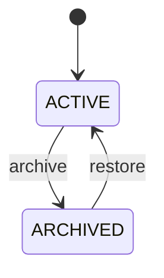

# 领域建模、不变量与状态机

> [返回专家训练目录](README.md)

## 1. 专家首先建模“事实”，不是先建 Controller

CRUD 思维从表单字段开始；领域建模从业务事实和状态变化开始。

以 Project 归档为例，需求可能只有一句：

> 管理员可以归档 Project。

真正要澄清：

- 哪些角色可以归档；
- 归档后是否可读；
- 是否还能创建 Task；
- 是否可恢复；
- 两个管理员同时归档会怎样；
- 归档和正在执行的导出/Worker 如何交互；
- 是否审计；
- API 重试应返回什么；
- 老客户端不知道 ARCHIVED 状态会怎样。

## 2. 写出状态机

第一版：



转换规则：

| From     | Action  | To       | Actor         | 失败语义               |
| -------- | ------- | -------- | ------------- | ---------------------- |
| ACTIVE   | archive | ARCHIVED | OWNER/ADMIN   | 成功                   |
| ARCHIVED | archive | ARCHIVED | OWNER/ADMIN   | 幂等成功或 409，需明确 |
| ARCHIVED | restore | ACTIVE   | OWNER/ADMIN   | 成功                   |
| 任意     | archive | -        | MEMBER/VIEWER | 403                    |

状态机比一个随意 Boolean 更容易扩展、审计和测试。

## 3. 写出不变量

```text
Project 始终属于一个 Organization。
只有 OWNER/ADMIN 能归档和恢复。
ARCHIVED Project 不允许创建新 Task。
状态变化和 AuditEvent 必须原子提交。
并发更新不能静默覆盖。
归档操作不能修改另一个 Organization 的 Project。
```

把保护分配到层：

| 不变量                    | 保护机制                     |
| ------------------------- | ---------------------------- |
| 合法状态值                | PostgreSQL Enum / API Schema |
| Project 属于 Organization | Foreign Key + Scoped Query   |
| 角色                      | Authorization Policy         |
| 状态转换                  | Service Conditional Update   |
| 不覆盖并发变更            | `version` 乐观锁             |
| 状态 + Audit 原子性       | Transaction                  |

## 4. Mandatory Lab：实现 Project 归档状态机

### 4.1 Schema

```prisma
enum ProjectStatus {
  ACTIVE
  ARCHIVED
}

model Project {
  // existing fields
  status  ProjectStatus @default(ACTIVE)
  version Int           @default(1)
}
```

创建 Migration：

```bash
pnpm exec prisma migrate dev --name add_project_lifecycle
```

检查 SQL：旧 Row 如何得到 ACTIVE？是否持有危险锁？回滚旧应用能否读取？

### 4.2 Policy

新增显式 Action：

```ts
type OrganizationAction = 'read' | 'create_project' | 'manage_project_lifecycle' | 'manage_members';
```

只允许 OWNER/ADMIN。

### 4.3 API Contract

选择之一：

```http
POST /api/organizations/:organizationId/projects/:projectId/archive
If-Match: "3"
```

或：

```http
PATCH /api/organizations/:organizationId/projects/:projectId
{"status":"ARCHIVED","version":3}
```

前者表达明确命令，后者是通用资源更新。写 ADR 说明你的选择。

### 4.4 Service 核心

```ts
const updated = await tx.project.updateMany({
  where: {
    id: projectId,
    organizationId,
    status: 'ACTIVE',
    version: expectedVersion,
  },
  data: {
    status: 'ARCHIVED',
    version: { increment: 1 },
  },
});
```

`count === 0` 可能表示：

- Project 不存在/跨租户；
- 已归档；
- Version 冲突。

专家设计要决定是否额外查询来区分 404、幂等 200 和 409，同时避免泄漏跨租户存在性。

### 4.5 Task 创建规则

创建 Task 的事务中读取 Scoped Project，并要求 `status=ACTIVE`。不能只在前端禁用按钮。

## 5. 必须完成的测试

- OWNER/ADMIN 可以归档；
- MEMBER/VIEWER 403；
- Organization A 不能归档 Organization B Project；
- 归档后创建 Task 被拒绝；
- 状态更新与 Audit 同事务；
- 两个相同 Version 并发更新，一个成功、一个冲突；
- 已归档重复请求符合你定义的幂等语义；
- 旧 Version 请求不会改变数据库；
- Migration 后旧 Project 都是 ACTIVE。

## 6. Failure Lab

故意先实现“读 Project → 普通 update”，再并发发送两个不同操作：归档与改名。记录 Lost Update，然后改为 Version Conditional Update，再次验证。

## 7. 设计评审问题

1. 为什么不用 `archivedAt !== null`？
2. 是否需要记录 `archivedByUserId`？它和 Audit 有何区别？
3. 归档是否应该级联修改 Task？
4. Worker 处理归档前创建的 Job 时读取哪个状态？
5. 恢复 Project 是否恢复以前的计划任务？
6. Public API 如何向旧客户端增加新 Enum 值？
7. 何时需要数据库 Check Constraint？

## 8. 交付物

- Project 生命周期 ADR；
- 状态机图；
- Migration SQL 评审；
- Unit + E2E + 并发测试；
- 一份失败复现记录；
- 一份 Rollout/Backward Compatibility 说明。
