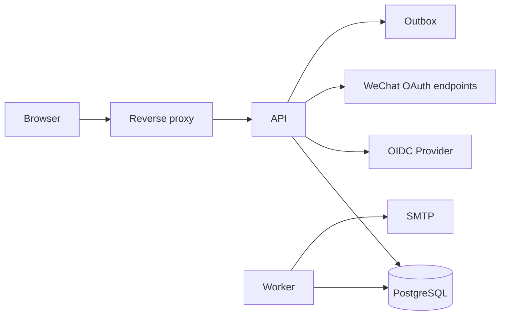

# 认证、授权、多租户与威胁建模

> [返回专家训练目录](README.md)

## 1. 目标

专家不是“会接登录”，而是能定义信任边界、攻击面和授权证明，并用攻击测试验证。

## 2. 画 Data Flow Diagram



为每条边标记：协议、身份、Secret、PII、TLS、Timeout 和日志。

## 3. 资产与攻击者

资产：

- Session、Reset/Registration Token；
- 用户、Tenant 数据；
- Provider Secret；
- 微信 AppSecret、短期 Code、Access Token、OpenID/UnionID；
- Audit 和 Outbox；
- 服务可用性。

攻击者：匿名互联网用户、普通成员、恶意 Tenant Admin、被盗 Session、受损 Provider、内部运维账号。

## 4. STRIDE 快速威胁建模

| 类别                   | 本项目示例                         |
| ---------------------- | ---------------------------------- |
| Spoofing               | 伪造 Session/OIDC Callback         |
| Tampering              | 修改 Tenant ID、Role、Webhook Body |
| Repudiation            | 敏感操作无 Audit                   |
| Information Disclosure | 跨租户读取、日志泄漏 Token         |
| Denial of Service      | Argon2、OTP、导出耗尽资源          |
| Elevation of Privilege | MEMBER 提交 OWNER Role             |

每个威胁写：入口、影响、当前控制、缺口、测试、负责人。

## 5. Mandatory Lab A：跨租户攻击矩阵

对 Project/Task/Membership 的每个 Endpoint 测：

```text
无 Session
已撤销 Session
Outsider
Viewer
Member
Admin
Owner
Organization A Actor + Organization B Resource ID
Session A Cookie + Session B CSRF
Evil Origin
```

拒绝测试还要断言数据库、Audit 和 Outbox 无副作用。

## 6. Mandatory Lab B：Mass Assignment

先写一个故意危险的测试，提交额外字段：

```json
{
  "email": "attacker@example.test",
  "role": "OWNER",
  "organizationId": "victim",
  "userId": "attacker"
}
```

确认 Strict Schema/显式参数不会接受或传播未允许字段。Response Mapper 也只输出 Allowlist。

## 7. Session 安全评审

检查：

- Secret 有 256-bit 随机性；
- 数据库只存 HMAC；
- Production Cookie 是 `__Host-`、Secure、HttpOnly；
- SameSite 符合 OIDC Callback；
- 绝对/空闲过期；
- 撤销与 Password Change；
- CSRF 绑定 Session；
- Session Fixation 时 Login 后轮换；
- AUTH_SECRET 轮换方案；
- 日志脱敏。

## 8. OIDC Review

用测试证明：

- State 缺失/错误拒绝；
- Browser Binding 错误拒绝；
- Nonce/PKCE 验证；
- Transaction 只能消费一次；
- Return URL 防 Open Redirect；
- Provider Subject 唯一；
- Provider Email 不隐式合并账号；
- Disabled User 不能登录。

## 9. WeChat OAuth Profile Review

不要把这部分当作“OIDC Review 换一个 Provider 名称”。逐项证明：

- Start 只接受完整且 Provider Key 不冲突的配置；
- `returnTo` 只能落在允许的 Web Origin；
- State 与独立 Browser Binding 都具备高熵，数据库只存 HMAC；
- `external-transaction` Cookie 为 HttpOnly，部署环境 Secure，跨站顶层 Callback 使用 SameSite=Lax；
- Callback 缺 Code、State 或 Binding 时，在访问 Provider 前拒绝；
- Transaction 过期、Binding 不匹配或已消费时拒绝；
- Code Exchange 和 Profile Request 只访问固定 HTTPS Endpoint、拒绝 Redirect，并有 Timeout/Response Size 上限；
- Token/Profile Schema、Scope、OpenID、可选 UnionID 都经过一致性校验；
- 持久身份是 AppID 作用域 Issuer + `openid:<OpenID>`；
- Nickname 只作为有界显示值，不成为授权或账号合并证据；
- Provider Token 不进入数据库、Session、日志或前端；
- Disabled User 不能登录；成功路径写 Audit，并创建本项目自己的不透明 Session。

### Mandatory Lab C：微信 Callback 攻击矩阵

使用 Mock Provider/Fetch，不要依赖真实微信生产账号。至少覆盖：

```text
State 缺失 / 错误 / 过期
Binding Cookie 缺失 / 来自另一浏览器
同一 Callback 并发消费两次
Provider 返回 302 Redirect
Token/Profile 非 JSON、超大 Body、超时、非 2xx
Scope 缺少 snsapi_login
Token OpenID 与 Profile OpenID 不同
Token UnionID 与 Profile UnionID 不同
Nickname 含控制字符或超长
已有 ExternalIdentity 指向 Disabled User
新 OpenID 与已有本地邮箱同名/同展示名
恶意绝对 returnTo 或协议相对 URL
```

每个拒绝用例同时断言：没有创建 User/ExternalIdentity/Session/Audit，没有持久化 Provider Token，并且错误响应不泄漏 AppSecret、Code 或完整 Provider Payload。

## 10. Account Enumeration

注册/重置接口应对存在与不存在邮箱返回相同公开结果，并尽量降低明显计时差。测试不应要求毫秒完全相等，但要验证响应 Shape 和最小延迟策略。

## 11. Password/OTP Abuse

- Argon2 并发上限；
- Dummy Hash；
- 登录多维限流；
- OTP 冷却、窗口、失败上限；
- SMS Provider 未配置时禁用；
- 不把 SMS 当抗钓鱼 MFA；
- Password Reset 撤销旧 Session。

## 12. Tenant Isolation 的三层

1. Policy 验证 Actor Membership；
2. 每个 Query 带 Tenant Scope；
3. 数据库 Relation/Constraint 保证归属。

进阶评估 PostgreSQL RLS：它可以提供数据库防线，但会增加连接 Session Context、Migration、调试和后台任务复杂度。写 ADR 比较应用级隔离与 RLS，不要盲目启用。

## 13. Secret Rotation Design

AUTH_SECRET 直接替换会让所有 Session/Token 失效。设计 Key Ring：

```text
active key id + active key
previous verification keys
新数据使用 active
读取按 key id/候选验证
观察旧 key 使用量
超过最大生命周期后删除旧 key
```

需要考虑 OIDC 加密事务和 HMAC Token 的兼容窗口。

## 14. 安全测试工具思维

自动化测试重点不是扫描器数量，而是业务越权：

- IDOR/BOLA；
- Role Escalation；
- 重放一次性 Token；
- 竞争条件；
- Open Redirect；
- 日志/错误泄漏；
- SSRF/文件边界；
- Rate Limit 绕过。

## 15. 交付物

- Data Flow/Trust Boundary 图；
- STRIDE Threat Model；
- 跨租户攻击 E2E Matrix；
- Session/OIDC/WeChat Security Review；
- Secret Rotation ADR；
- Residual Risk 和优先级列表。
