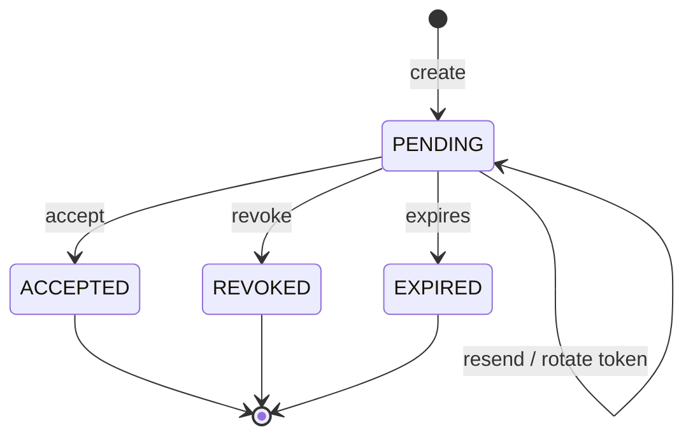

# 毕业项目：生产级 Organization Invitation

> [返回专家训练目录](README.md)

## 1. 项目目标

实现“管理员邀请尚未注册或已注册用户加入 Organization”。不是只做三个 Endpoint，而是完成数据、权限、并发、可靠投递、安全、测试、观测和发布闭环。

## 2. 业务需求

- OWNER/ADMIN 可邀请；
- 可邀请 ADMIN/MEMBER/VIEWER，不能邀请 OWNER；
- 邀请通过 Email 发送，7 天过期；
- 接受者必须登录，且有匹配的已验证 Active Email Contact；
- 同一 Organization + Email 同时最多一个 Pending Invitation；
- 已是成员不能邀请；
- 可撤销、可重发，重发有限流；
- 接受、撤销、重发都审计；
- 网络重试不能创建重复邀请或重复 Membership；
- Email Provider 故障不回滚 Invitation；
- 所有跨租户访问拒绝且不泄漏资源存在性。

## 3. Non-goals

第一版不做：

- 邀请 OWNER/Owner Transfer；
- 邀请手机号；
- 自定义角色；
- 批量 CSV 导入；
- 跨 Organization 通用邀请；
- 未登录时自动注册并隐式接受。

## 4. 状态机



每个转换写 Actor、前置条件、事务写入、Audit 和错误语义。

## 5. 建议数据模型

你必须自行评审并调整：

```prisma
enum OrganizationInvitationStatus {
  PENDING
  ACCEPTED
  REVOKED
  EXPIRED
}

model OrganizationInvitation {
  id                 String                       @id @default(uuid()) @db.Uuid
  organizationId     String                       @map("organization_id") @db.Uuid
  invitedByUserId    String                       @map("invited_by_user_id") @db.Uuid
  acceptedByUserId   String?                      @map("accepted_by_user_id") @db.Uuid
  normalizedEmail    String                       @map("normalized_email")
  role               OrganizationRole
  status             OrganizationInvitationStatus @default(PENDING)
  tokenHash          String                       @unique @map("token_hash")
  expiresAt          DateTime                     @map("expires_at") @db.Timestamptz(6)
  lastSentAt         DateTime                     @map("last_sent_at") @db.Timestamptz(6)
  sendCount          Int                          @default(1) @map("send_count")
  acceptedAt         DateTime?                    @map("accepted_at") @db.Timestamptz(6)
  revokedAt          DateTime?                    @map("revoked_at") @db.Timestamptz(6)
  createdAt          DateTime                     @default(now()) @map("created_at") @db.Timestamptz(6)
  updatedAt          DateTime                     @updatedAt @map("updated_at") @db.Timestamptz(6)
  organization       Organization                 @relation(...)
  invitedBy          User                         @relation("InvitationCreator", ...)
  acceptedBy         User?                        @relation("InvitationAcceptor", ...)

  @@index([organizationId, status, createdAt])
  @@index([normalizedEmail, status])
  @@map("organization_invitations")
}
```

Prisma 可能无法声明 Partial Unique Index。Migration SQL 增加：

```sql
CREATE UNIQUE INDEX organization_invitations_one_pending_idx
ON organization_invitations (organization_id, normalized_email)
WHERE status = 'PENDING';
```

讨论 Resend 是否更新原 Row、Token Rotation 与旧 Token 失效。

## 6. API Contract

### 创建

```http
POST /api/organizations/:organizationId/invitations
Idempotency-Key: <uuid>
X-CSRF-Token: ...

{"email":"invitee@example.test","role":"MEMBER"}
```

### 列表

```http
GET /api/organizations/:organizationId/invitations?status=PENDING&limit=20&cursor=...
```

响应不得暴露 Token Hash。

### 撤销

```http
POST /api/organizations/:organizationId/invitations/:invitationId/revoke
```

### 重发

```http
POST /api/organizations/:organizationId/invitations/:invitationId/resend
```

### 验证链接与接受

选择安全流程：Callback 验证 Token 后设置短期 HttpOnly Invitation Cookie，再由登录用户读取临时 CSRF 并接受；或者使用另一种有明确 CSRF/重放保护的流程。写 ADR。

## 7. Milestone 0：设计评审

提交：

- User Story/Non-goals；
- 状态机；
- 不变量；
- API Contract；
- Schema/Index；
- Threat Model；
- Failure Matrix；
- Rollout Plan。

未通过评审不要编码。

## 8. Milestone 1：Schema 与 Migration

验收：

- 空数据库迁移；
- 从上一 Schema 带数据升级；
- Foreign Key 行为明确；
- Partial Unique 生效；
- Index 匹配列表/Token 查询；
- 不存明文 Token；
- Rollback/Forward-fix 说明。

## 9. Milestone 2：创建邀请

流程：

```text
Origin + CSRF + Session
→ Actor
→ manage_members
→ Normalize Email
→ Role Allowlist
→ Membership/Invitation Check
→ Transaction:
    Invitation
    Audit
    Outbox email.send
    Idempotency result
```

不要在事务中发 SMTP。

## 10. Milestone 3：接受邀请

必须同时证明：

- Token Hash 匹配 Pending + 未过期；
- 当前 User 有匹配 verified non-retired Contact；
- User Active；
- Invitation 与 URL Organization 一致；
- 条件 Update 只消费一次；
- Membership Unique；
- Invitation Accepted、Membership、Audit 同事务；
- 其他 Session/用户不能接受。

并发两个 Accept：只有一个成功；最终一条 Membership。

## 11. Milestone 4：撤销、重发、过期

### 撤销

- 只有 OWNER/ADMIN；
- Scoped Invitation；
- Pending 才可转换；
- Audit；
- Token 立即失效。

### 重发

- Cooldown/窗口上限；
- 旋转 Token；
- 旧 Token 失效；
- Invitation Update + Outbox + Audit 原子；
- Provider 失败可重试。

### 过期

决定：读取时视为过期、定时批处理标记，或两者组合。多 Worker 调度需避免重复；状态转换幂等。

## 12. Milestone 5：安全

Mandatory Tests：

- Outsider/Viewer；
- 跨租户 ID；
- Evil Origin/无 CSRF；
- Token 重放/过期/旋转；
- 接受者 Email 不匹配；
- Mass Assignment OWNER；
- 日志/Problem/Audit 无 Token；
- 账号存在性响应；
- 重发滥用；
- 已 Disabled User；
- Open Redirect。

## 13. Milestone 6：可靠性

- SMTP Down；
- Worker Crash Window；
- Duplicate Event；
- DEAD Replay；
- Stable Message ID；
- Idempotency Key 并发；
- Provider 429/5xx/Permanent Error 分类；
- Queue/Worker 积压指标。

## 14. Milestone 7：测试

至少：

```text
Unit: state transitions, role matrix, schemas, token helpers
Integration: partial unique, transaction rollback, cursor
E2E: full create→email→accept
Concurrency: duplicate create/accept/resend
Failure: SMTP/DB/Audit crash points
Contract: Outbox payload and OpenAPI
Migration: previous schema upgrade
Load: invitation list and resend abuse
```

## 15. Milestone 8：观测与运维

Metrics：

- Created/Accepted/Revoked/Expired；
- Acceptance Rate/Time；
- Resend Count；
- Delivery Success/Latency/Dead；
- Rate Limited；
- Invalid Token（低基数、安全聚合）。

Runbook：邮件延迟、Dead Event、错误邀请撤销、Token 泄漏响应。

## 16. Milestone 9：发布

- Consumer-first Event Version；
- Migration 风险；
- Feature Flag；
- Canary；
- 新旧 API/Worker 兼容；
- Rollback；
- Secret/Token Rotation；
- 数据保留和清理。

## 17. 禁止的捷径

- Token 明文存库；
- Body 直接传 Prisma；
- Email 匹配但未验证；
- 前端隐藏按钮代替权限；
- SMTP 放事务；
- `find then create` 无 Unique；
- 只写 Happy Path；
- 用 Sleep 修并发；
- 手工改 Production Row 重放；
- 无指标就上线。

## 18. 最终演示脚本

1. Admin 创建邀请；
2. Outbox/Worker 投递；
3. 新用户注册并接受；
4. 展示 Membership/Audit；
5. 重放 Token 被拒；
6. 演示跨租户拒绝；
7. 并发 Accept；
8. 停 SMTP 后重试恢复；
9. 展示指标/日志/Request ID；
10. 演示 Migration 和 Rollback 决策。

## 19. Definition of Done

- 所有不变量有权威测试；
- 所有写路径有 Tenant Scope；
- 并发与重试安全；
- 失败可恢复；
- Secret/PII 处理明确；
- OpenAPI/事件契约完整；
- 指标、告警、Runbook 就绪；
- Migration/发布/回滚评审通过；
- 能回答评审量表中的专家问题。
