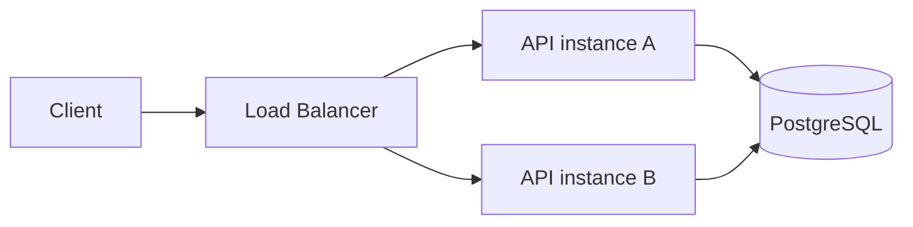

# API 契约、安全、可运维性与多实例

> [返回教程首页](../README.md) · [本模块目录](README.md)

## 2.13 API 是长期契约，不是函数调用

前端调用本地函数时，调用方和实现通常一起编译；HTTP API 可能被这些客户端依赖：

- 已打开数小时的旧 Web 页面；
- 尚未升级的移动 App；
- 第三方集成；
- 旧 Worker/Event；
- 自动化脚本；
- 另一个独立发布的服务。

所以后端变更要问：

- 删除字段会不会破坏旧客户端；
- Enum 增加新值，旧前端是否有 exhaustive switch；
- `null`、省略和空字符串是否含义不同；
- 修改错误状态码会不会改变重试策略；
- 分页排序是否稳定；
- 时间和金额是否无歧义；
- 新旧应用实例能否同时运行；
- Event Consumer 能否处理旧版本 Payload。

API Contract 应独立于 Prisma Model。数据库为了存储演进，API 为客户端兼容演进，两者不应被一个自动序列化绑死。

## 2.14 后端安全的默认姿态：最小权限与拒绝优先

前端隐藏按钮只是体验，不是权限控制。攻击者可以直接构造 HTTP 请求。后端应：

- 没有明确允许就拒绝；
- 每次用可信 Actor 做权限决策；
- 每次查询带 Tenant Scope；
- 只接受允许修改的字段，防 Mass Assignment；
- Secret 和敏感数据最少暴露、最少记录、最短保留；
- 写请求防 CSRF、重放和越权；
- 外部 URL 防 SSRF，文件视为恶意输入；
- 高风险动作审计并考虑 Step-up Authentication；
- 依赖和 Provider 都有 Timeout 与最小凭据权限。

“前端不会传这个字段”不是安全设计；“正常用户不会这么操作”也不是。

## 2.15 可运维性是功能的一部分

一个功能在你电脑上返回正确 JSON，只完成了一半。生产功能还需要回答：

```text
如何知道它成功率下降？
如何找到一次失败请求？
数据库变更如何安全上线？
进程中途退出会怎样？
依赖不可用时如何降级？
积压和 Dead Job 谁处理？
数据误删如何恢复？
谁能执行重放/修复，是否审计？
回滚旧版本还能读新数据吗？
```

因此健康检查、结构化日志、Request ID、指标、告警、Migration、备份恢复、优雅关闭和运维手册都属于后端交付物，不是“以后运维再补”。

## 2.16 多实例思维：不要依赖“这台进程记得”

生产 API 常有多个 Replica：



请求 1 可能到 A，请求 2 到 B。因此这些设计通常错误：

- 把登录 Session 只存在 `Map`；
- 把上传文件只存容器本地磁盘；
- 用进程内布尔值当全局分布式锁；
- 只在一个实例内做全局限额；
- 假设下一个请求一定到相同进程；
- 假设发布时所有实例瞬间切换版本。

本项目 Session 和 Outbox 放 PostgreSQL，正是为了所有实例共享持久状态。`pollPromise` 只防当前 Worker 实例重入；跨 Worker 竞争仍靠数据库 Compare-and-set。

## 2.17 前端经验可以迁移，但不要机械类比

| 前端经验                 | 可迁移的思想           | 后端差异                               |
| ------------------------ | ---------------------- | -------------------------------------- |
| Component Boundary       | Module 应有清晰责任    | Module 还拥有数据、权限与事务边界      |
| State Management         | 明确状态来源和更新路径 | 后端状态跨用户、持久且并发             |
| Form Validation          | 尽早给出输入反馈       | 服务端必须再次权威校验                 |
| Error Boundary           | 集中处理异常表现       | 后端还要稳定状态码、日志、告警和隐私   |
| React Query Cache        | TTL、失效和请求去重    | 服务端缓存跨用户，错误可泄漏租户数据   |
| Optimistic UI            | 改善交互               | 服务端仍需 Version/Conflict 保护事实   |
| E2E Test                 | 验证真实用户流程       | 还要断言数据库、不变量、拒绝路径和恢复 |
| Bundle/API Compatibility | 版本与兼容             | 后端新旧实例和客户端长期并存           |

最有价值的前端优势是：你已经理解契约、状态和用户体验。后端学习要在此基础上加入权威性、并发、持久化、失败恢复和安全边界。

## 2.18 设计一个后端功能时的固定问题

以后接到任何需求，先写下这些答案：

1. 用户真正要完成什么，而不是要几个接口？
2. 哪些事实必须一直成立？
3. 权威数据放在哪里，谁拥有它？
4. Actor、Tenant、Action、Resource 分别是什么？
5. 哪些输入来自不可信边界？
6. 哪些结果必须同步成立，哪些可最终一致？
7. 多请求并发会发生什么？
8. 客户端重试会不会重复执行？
9. 第三方或数据库超时会留下什么中间状态？
10. 需要哪些 Unique、Foreign Key、Index、Transaction、Version？
11. 记录普通日志还是 Audit，敏感数据能否出现？
12. 如何测试成功、拒绝、并发、重试和依赖失败？
13. 如何 Migration、滚动发布和回滚？
14. 如何通过指标、日志和告警知道它正在坏？
15. 未来什么证据会让我们重新设计？

这 15 个问题就是后端设计的骨架。NestJS 只是把答案组织成 Module、Controller、Service、Guard、Worker 等代码形态。

---
