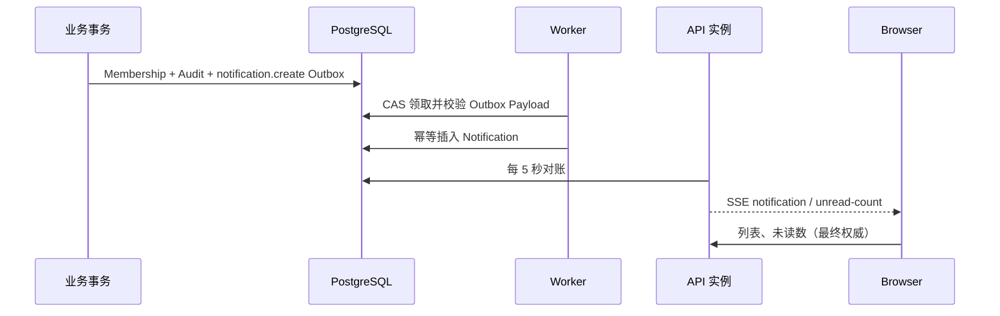

# 站内通知专题：Outbox、幂等收件箱与 SSE

> [返回教程首页](../README.md)

通知看起来像前端右上角的红点，实际上是一个跨越业务事务、后台投递、数据库幂等和实时连接的可靠性问题。本项目实现的是**持久化站内通知**，不是聊天、营销群发、邮件/SMS 引擎或移动 Push。

第一次接触 Transaction、Outbox、Worker 和幂等时，先读[后端核心词汇](../mindset/02-05-backend-vocabulary.md)；本专题默认这些概念已经建立。

源码入口：`apps/api/src/notifications/`、`libs/platform/src/notifications/`、`apps/worker/src/worker.service.ts`；产品契约见 `docs/USER_NOTIFICATIONS_MODULE.md`。

## 1. 三层职责：事实、低延迟、恢复



- **PostgreSQL Notification 表是事实源**：浏览器断线、API 重启、SSE 丢事件后，列表和未读数仍可恢复正确状态。
- **SSE 只是低延迟提示**：让 UI 少等一次轮询，不等于可靠消息队列。
- **Outbox 是业务原子性**：把用户加入组织时，Membership、AuditEvent 和 `notification.create` 在同一事务提交；不能“成员已加入，但通知请求因为进程崩溃而丢失”。

这三个层次不可互相替代。只用内存 `Subject` 会在多副本/重启后丢消息；只用 SSE 不会保存收件箱；请求中直接创建通知会破坏业务变更和通知意图的原子性。

## 2. 数据模型为何这样设计

```text
notifications
  user_id + dedupe_key UNIQUE     # 投递最终幂等防线
  kind / severity                 # 机器可读类型与展示等级
  title / body                    # 有长度上限的纯文本
  action_url                      # 仅站内相对路径
  read_at / expires_at / created_at
```

索引匹配主要查询：

- `(user_id, created_at, id)`：某用户从新到旧游标分页；
- `(user_id, read_at, created_at)`：未读数和未读列表；
- `(expires_at)`：未来保留清理任务。

过期通知是“不可见”而非“立刻删除”：查询总带 `expiresAt IS NULL OR expiresAt > now`，物理删除交给单独 retention job。这样读路径语义稳定，也不会在请求路径里做不可预测的大批量清理。

## 3. At-least-once 如何不产生重复通知

Worker 可能已经插入通知、但在标记 Outbox `DELIVERED` 前崩溃。重试时一定会再次处理同一 Event，所以不能依赖“Worker 应该只跑一次”。

Producer 为业务事件生成稳定 Key：

```text
organization.member.added:<membershipId>
```

Consumer 使用 `createMany({ skipDuplicates: true })`，而数据库的 `(userId, dedupeKey)` 唯一约束才是最后防线。标题、正文和时间都不是可靠的去重依据；它们会变，也不具备唯一性。

只在“不需要与其他业务事实原子提交”的内部用例中直接调用 `NotificationsService.create()`。只要通知表达“某个已提交业务事件”，就写 Outbox。

## 4. API 与授权边界

| Route                                 | 用途              | 安全要求                |
| ------------------------------------- | ----------------- | ----------------------- |
| `GET /api/notifications`              | 游标列表 + 未读数 | Active Session          |
| `GET /api/notifications/unread-count` | 轻量未读数        | Active Session          |
| `GET /api/notifications/stream`       | SSE               | Active Session          |
| `PATCH .../:id/read` / `read-all`     | 标记已读          | Session + Origin + CSRF |
| `DELETE .../:id` / `read`             | 清除              | Session + Origin + CSRF |

每个数据库读写都带服务端解析出的 Actor `userId`。一个属于别人的有效 Notification ID 返回 `404`，不泄露其存在。通知属于用户范围的 Resource：这里的隔离 Scope 是当前 Actor，而不是 Organization Tenant。不存在公开“给某用户发通知”的 Controller；创建能力只在内部 Service/Outbox 中。Actor、Tenant、Action、Resource 的完整解释见[授权与多租户](../10-authorization-and-multitenancy.md)。

分页 Cursor 是 Base64URL 编码的 `{ createdAt, id }`，不是数据库 offset。按 `(createdAt DESC, id DESC)` 排序能在同一时间多条记录时保持稳定；Cursor 无效、过长或篡改返回 `400`。

## 5. SSE：把它看作可丢的增量提示

SSE 事件包括：

| Event             | 客户端动作                     |
| ----------------- | ------------------------------ |
| `snapshot`        | 保存初始未读数，并主动拉取列表 |
| `notification`    | 增量插入/刷新 UI               |
| `unread-count`    | 更新红点                       |
| `heartbeat`       | 保持连接，不改业务状态         |
| `resync-required` | 重新请求列表和未读数           |

浏览器 `EventSource` 会重连，并携带 `Last-Event-ID`。服务端最多回放 100 条新记录；超过上限、Cursor 不可用、初始化/对账失败时发 `resync-required`。这不是失败，而是明确告诉客户端：“不要猜，回到数据库权威读取。”

当前实时服务用进程内 Subject 做本实例即时通知，并每 5 秒查数据库对账。对账覆盖 Worker 插入和另一 API 副本执行已读操作；它降低了单机内存广播在多实例环境的不一致，但不是毫秒级全局 Pub/Sub。高连接数或更低实时性目标出现后，再基于指标引入 Redis Pub/Sub、专用网关或消息总线。

前端最小模式：

```ts
const source = new EventSource('/api/notifications/stream', { withCredentials: true });
source.addEventListener('notification', () => refreshNotifications());
source.addEventListener('resync-required', () => refreshNotifications());
window.addEventListener('focus', () => refreshNotifications());
```

实际 UI 应合并增量数据而不是每条都全量刷新，但重连、页面聚焦和可疑计数时必须回源。

## 6. 内容安全与隐私

- title/body 是纯文本，前端按文本渲染，不能插 `innerHTML`；
- `actionUrl` 只允许 `/` 开头、非 `//`、不含反斜杠的站内路径，防止开放重定向；
- 不在正文或 dedupeKey 中放密码、OTP、Session、Provider Secret 和不必要的 PII；
- SSE 禁止代理缓冲和内容转换；写响应为 `private, no-store`；
- 到期、已读和删除各自不同：到期隐藏、已读保留、删除才物理移除。

## 7. 测试与运维证据

`test/notifications.e2e-spec.ts` 应覆盖：用户范围隔离、Cursor 稳定性、已读/清除幂等、过期过滤、SSE 首快照与重连、跨用户 404、缺 CSRF 拒绝，以及 Outbox 重复投递只产生一条通知。

生产监控至少包括：Outbox `PENDING/DEAD`、通知插入失败、最老未投递事件年龄、SSE 活跃连接/断开/`resync-required` 比例、列表与 count 延迟、Retention Job 成功率。通知量增长前确定“已读保留多久”“过期保留多久”与删除权/合规规则。

## 8. 后续演进

Web Push、APNs、Android Push、微信订阅消息、邮件和 SMS 都应消费同一个领域事件或用户 channel preference；它们各自需要授权、退订、Token 生命周期、静默时间、频率限制、Provider 重试和隐私审查。外部渠道不能取代数据库中的站内收件箱。

---

[上一章：Outbox、Worker、Queue 与 Cache](../13-outbox-workers-and-cache.md) · [下一章：日志、健康检查与排错](../16-observability-and-debugging.md)
