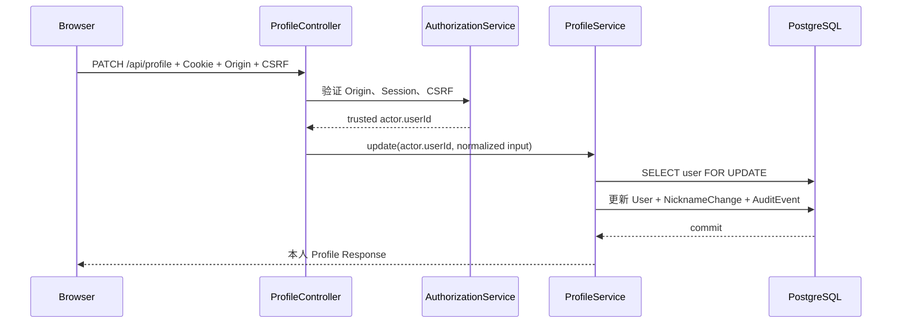

# 用户 Profile 专题：隐私、并发配额与私有头像

> [返回教程首页](../README.md)

这一册用当前项目的 Profile 模块学习一个很典型、却常被低估的后端功能。前端看起来只是“编辑昵称、简介、头像”，后端实际上要同时守住身份、隐私、并发、文件安全、缓存和存储一致性。

源码入口：`apps/api/src/profile/`；完整产品契约：`docs/USER_PROFILE_MODULE.md`。

## 1. 先建立正确的问题模型

不要把 Profile 理解成“给 `users` 表多加几个可编辑字段”。它至少有三种不同的视图：

| 视图       | 读取者                       | 可以得到什么                           | 为什么                   |
| ---------- | ---------------------------- | -------------------------------------- | ------------------------ |
| 本人视图   | 当前 Active Session 的用户   | 私有资料、可见性设置、昵称配额         | 让用户管理自己的数据     |
| 共享视图   | 另一位 Active Session 的用户 | 始终共享的昵称，加上用户明确开放的字段 | 避免默认泄漏             |
| 头像字节流 | 本人或被授权的登录用户       | 处理后的 WebP 二进制                   | 不泄露 Bucket/Object Key |

真正重要的边界不是“前端传了哪个 `userId`”，而是：**写入目标只能来自服务器验证后的 Session Actor**。因此本项目没有 `PATCH /profiles/:userId`；`PATCH /api/profile` 永远更新当前登录人。即使调用方在 JSON 中塞入 `userId`，Zod 的 `.strict()` 也会拒绝它。



这与前端“隐藏编辑按钮”不是同一层防护。前端负责体验；Controller 和 Service 负责即使攻击者手工构造 HTTP 请求也无法越权。

## 2. 数据如何建模

`User` 仍是账户唯一主体，没有另建一个会失去现有身份关系的“profile user”。新增字段包括：

```text
users
  display_name          # API 叫 nickname，保持既有身份消费者兼容
  bio
  avatar_object_key     # 私有存储引用，绝不直接返回 API
  avatar_updated_at     # 用于 avatarUrl 版本化

nickname_changes
  user_id, changed_at   # 只记录配额事实，不保存旧昵称内容

profile_visibility
  user_id (1:1), bio/avatar/email/phone, updated_at
```

`profile_visibility` 缺失时，Service 把它解释为全 `PRIVATE`。这让功能上线前的已有用户默认安全，而不必用一条风险较高的大规模回填 Migration 才能发布。

`nickname_changes` 的索引是 `(user_id, changed_at)`：业务查询总是“某一个用户在最近 30 天的变更”，索引顺序与这个 where/order 场景一致。它是配额审计事实，不是昵称历史产品功能；不要悄悄扩大收集的数据量。

## 3. 字段可见性：Allowlist，而不是删除字段

共享 Profile Response 只构造这六个字段：

```ts
{
  (id, nickname, bio, avatarUrl, email, phone);
}
```

未共享字段返回 `null`，而不是省略或返回“你没有权限”。这样不会向读取者透露“该用户是否真的存在手机号/邮箱”。Object Key、账号状态、审计记录、登录身份、昵称历史和配额都不属于共享契约。

每个可选字段独立使用 `PRIVATE | AUTHENTICATED`：

- `PRIVATE`：只有本人 API 可见；
- `AUTHENTICATED`：其他 Active 登录用户可通过共享路由读取；
- 它不是“公开到互联网”；匿名请求仍是 `401`；
- 只有已验证且未 retired 的邮箱/手机可能展示，优先 primary 联系方式。

把“资料是否可见”与“登录/找回/通知使用哪一个联系方式”分离，是避免功能互相污染的关键。把邮箱改成可见不应该改变登录方式；退役联系方式也不应该继续被共享。

## 4. 昵称配额为何需要数据库锁

规则是：昵称先经过 NFKC、空白合并和 trim，再限制为 1–16 个 Unicode code point；任意滚动 30 天最多成功改三次。

天真的实现会先 `count()`，再 `update()`。四个请求并发读到“还可以改 3 次”时，可能四个都写成功。这叫 **check-then-act race**。

项目的事务顺序是：

1. `SELECT id FROM users ... FOR UPDATE` 锁定这位用户；
2. 查询 30 × 24 小时窗口内的 `nickname_changes`；
3. 若已有 3 条，返回 `429`、`NICKNAME_CHANGE_LIMIT`、`retryAt` 与 `Retry-After`；
4. 否则更新 `display_name`、插入 Change Record、插入 Audit Event，并一起提交。

同一个用户的昵称变更因此串行化；不同用户仍可并行。提交与当前规范化昵称相同的值是 no-op，不消耗配额。这里使用“滚动 30 × 24 小时”而非自然月，避免时区和月份长度让规则不稳定。

前端应先读取 `nicknameChangeQuota` 来解释限制，但不能把它当作授权依据；最终裁决永远在后端事务中。

## 5. 上传头像：文件不是可信输入

浏览器提供的文件名、扩展名和 `Content-Type` 都可伪造。当前头像管线是：

```text
multipart file (≤ 5 MiB)
  → Sharp 解码真实字节
  → 仅 JPEG / PNG / WebP，单页，≤ 25 MP
  → 自动旋转、裁剪/缩放至 512×512、移除 metadata
  → 重新编码成 ≤ 1 MiB WebP
  → 私有 S3/MinIO Object
  → PostgreSQL 事务切换引用 + Audit
```

为什么要“重新编码”而不是原样保存？因为它将公开的输出格式、大小、像素上限和 metadata 清除统一交给服务器；上传 SVG、伪装图片或超大解码炸弹都不能直接成为可被其他用户读取的内容。

对象存储与 PostgreSQL 不共享事务。策略是先上传新对象，再在数据库事务中替换引用；数据库提交失败则尽力删除新对象，提交成功后尽力删旧对象。少量网络故障仍可能留下孤儿对象，所以生产环境还需要清单对账/生命周期清理任务。**best effort 不是原子性承诺。**

头像下载由 API 代理：返回 `image/webp`、私有缓存和 ETag，而不是发出 Bucket URL。`avatarUpdatedAt` 进入 `avatarUrl` 查询参数，使浏览器可缓存但替换头像后得到新 URL。

## 6. 本地 MinIO 与生产对象存储

本地 Compose 的 MinIO 在 `localhost:9000`，Console 在 `http://localhost:9001`；默认 Bucket 是 `user-content`。Profile 服务在 development/test 可以自动创建缺失 Bucket，方便 E2E。

配置变量：

```text
OBJECT_STORAGE_ENDPOINT
OBJECT_STORAGE_REGION
OBJECT_STORAGE_ACCESS_KEY
OBJECT_STORAGE_SECRET_KEY
OBJECT_STORAGE_BUCKET
OBJECT_STORAGE_FORCE_PATH_STYLE
```

staging/production 有意 fail closed：Endpoint 必须是 HTTPS，不能使用本地 `minioadmin` 凭据，并且 Bucket 应事先私有化、配置访问策略、加密、生命周期、备份与监控。自动建 Bucket 只能降低本地摩擦，不能替代生产资源治理。

## 7. API 调用与错误处理

| 用例        | Route                                | 关键前置条件                   |
| ----------- | ------------------------------------ | ------------------------------ |
| 读本人      | `GET /api/profile`                   | Active Session                 |
| 改昵称/简介 | `PATCH /api/profile`                 | Session + 允许 Origin + CSRF   |
| 改可见性    | `PATCH /api/profile/visibility`      | 同上                           |
| 上传/删头像 | `PUT` / `DELETE /api/profile/avatar` | 同上；上传字段名 `file`        |
| 读他人资料  | `GET /api/profiles/:userId`          | Active Session；仅 Allowlist   |
| 读他人头像  | `GET /api/profiles/:userId/avatar`   | Active Session；头像已选择共享 |

对前端而言，尤其要区分：

- `400`：输入不符合规范，或 Body 有未知字段；
- `401`：没有有效 Active Session；
- `403`：写入缺少/错误 CSRF 或 Origin 不允许；
- `404`：目标不存在、不活跃，或当前无权看头像；
- `413`：上传源文件或处理后的头像超过限制；
- `429`：昵称配额耗尽；读取 `code`、`retryAt` 和 `Retry-After`，不要匹配自然语言 `detail`；
- `503`：对象存储不可用，允许 UI 提示稍后重试。

## 8. 如何验证，而不只是“点一下页面”

至少完成这组证据：

1. 本人更新昵称和简介：检查 `users`、`nickname_changes`、`audit_events` 同时变化；
2. 并发发送四个不同昵称：预期恰好 3 个成功、1 个 `429`；
3. 用第二个 Session 读取 Profile：默认只见昵称；将 bio/email 显式设为 `AUTHENTICATED` 后才出现；
4. 上传 PNG 后读取：响应应为 WebP，数据库只保存 Object Key，API Response 不出现 Key；
5. 尝试 SVG 伪装成 PNG、缺 CSRF 上传、匿名读共享头像：都应被拒绝；
6. 关闭 MinIO 后上传：应得到可诊断的 `503`，而不是悄悄写入半条用户记录。

对应 E2E 在 `test/profile.e2e-spec.ts`。读测试时特别关注“并发四请求”“跨用户读取”“SVG 伪装”和“Object Key 不出现在 Response”——它们比 happy path 更能说明后端设计质量。

## 9. 继续练习

- 为 Profile 更新引入 ETag/`If-Match`，研究它和昵称行锁分别解决哪一种并发；
- 设计管理员支持查看资料的独立路由与审计，不能复用本人更新路由；
- 设计异步病毒扫描状态机；在扫描完成前不允许任何共享读取；
- 为孤儿对象清理设计 Inventory、保留时间、幂等删除与告警；
- 判断“公开 Profile”需要增加哪些反爬、限流、内容审核、搜索与删除权设计。

---

[上一章：授权与多租户](../10-authorization-and-multitenancy.md) · [下一章：事务、审计与一致性](../12-transactions-audit-consistency.md)
